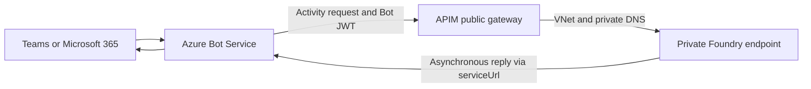
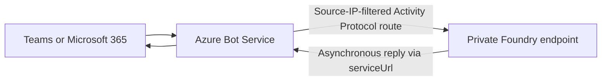

# Private Foundry → Microsoft Teams Bridge

This sample connects **private, VNet-isolated Foundry agents** to **Microsoft Teams** and
**Microsoft 365 Copilot**. Two inbound options are supported: Foundry's built-in
`enable_m365_public_endpoint` setting, which needs **no bridge**, or an API Management Standard v2
bridge that accepts the public Bot Service callback and forwards the Activity Protocol request to the
private Foundry endpoint through VNet integration. Separate agent samples demonstrate delegated
SharePoint retrieval.

## How it works



[deploy.ps1](deploy.ps1) provisions the bridge using [infra/main.bicep](infra/main.bicep).
[scripts/Publish-AgentToTeams.ps1](scripts/Publish-AgentToTeams.ps1) creates or updates the Azure Bot,
points it at APIM, and calls Foundry's Microsoft 365 publish API. See the
[private-network publishing guidance](https://learn.microsoft.com/azure/foundry/agents/how-to/publish-copilot-virtual-network).

- **INBOUND (the bridge).** **One templated APIM operation**
  (`/api/projects/{project}/agents/{agent}/...`) serves **every** agent — configured once.
  Foundry stays private; only APIM's gateway is public. The bridge is **auth-transparent** and
  **version-agnostic** (preserves each bot's `api-version`, injecting a fallback only if missing).
- **OUTBOUND (optional).** A hosted agent can call out to an **[OBO gateway](foundryagents/hostedagent/sharepoint-copilot-retrieval/pathA/obo-gateway/README.md)**
  via a Toolbox OAuth2 identity-passthrough connection to reach **SharePoint per-user** through the Copilot
  Retrieval API. This is a **separate leg** from the bridge and only used by the
  `sharepoint-copilot-retrieval/pathA` sample; the Work IQ / Databricks samples use Microsoft-hosted
  MCP endpoints instead. Adding the inbound bridge does **not** validate this outbound integration;
  private-network Path A operation requires separate end-to-end validation.

---

## Inbound options

Foundry can admit Microsoft 365 and Teams traffic to a private agent **without any bridge**, by setting
`agent_endpoint.protocol_configuration.activity.enable_m365_public_endpoint`. Foundry applies
service-managed source IP filtering to **only** the Activity Protocol route; `responses`,
`invocations`, `a2a`, `mcp`, and the project APIs stay private, and the account keeps
`publicNetworkAccess=Disabled`.



| | `enable_m365_public_endpoint` | APIM bridge |
| --- | --- | --- |
| Extra Azure resources | None | APIM Standard v2, `/27+` subnet, private DNS |
| Public surface | Foundry-managed; Activity Protocol route only | Your APIM gateway |
| Source IP filtering | Foundry-managed Bot Service and Microsoft 365 ranges | Yours to configure |
| Configure with | [scripts/Enable-M365PublicEndpoint.ps1](scripts/Enable-M365PublicEndpoint.ps1) | [deploy.ps1](deploy.ps1) |
| Publish with | `Publish-AgentToTeams.ps1 -UseM365PublicEndpoint` | `Publish-AgentToTeams.ps1 -ApimName <APIM_NAME>` |
| Use when | Teams or Microsoft 365 is the only reason for the bridge | Custom public-to-private ingress, non-Teams surfaces, or API management |

The setting changes **network reachability only**. Keep `BotServiceRbac` or `BotServiceTenant` in
`authorization_schemes`; source IP filtering does **not** replace token validation, tenant checks, or
RBAC. `PATCH /agents/{agent}` **replaces** the whole `protocol_configuration` and
`authorization_schemes` bags, so
[scripts/Enable-M365PublicEndpoint.ps1](scripts/Enable-M365PublicEndpoint.ps1) reads the agent first,
re-sends every protocol and scheme it already had, and then verifies that nothing was dropped.

Teams and Microsoft 365 remain **public-network products**. No Foundry setting makes the channel
itself private.

---

### Bridge behavior

- **Private Foundry endpoint** — the inbound route uses private DNS and VNet integration.
- **REST-API publish** — creates the bot,
  points it at the bridge, and publishes to Microsoft 365 / Teams in one command.
- **Scales to many agents** — single templated operation; new agents need only publishing.
- **Idempotent onboarding reconciler** — repoints new bots; safe to re-run or schedule.
- **Infrastructure as Code** — Bicep modules + `.bicepparam`.
- **Auth-transparent** — Bot Framework JWT forwarded unchanged; Foundry validates it.

---

## Prerequisites

1. An existing **private Azure AI Foundry** deployment with end-to-end networking
  (VNet + private endpoints + private DNS), provisioned from the official
  **private network standard agent setup** template:
  [foundry-samples/infrastructure-setup-bicep/15-private-network-standard-agent-setup](https://github.com/microsoft-foundry/foundry-samples/tree/main/infrastructure/infrastructure-setup-bicep/15-private-network-standard-agent-setup).
  This bridge assumes that deployment already exists; it does **not** create the Foundry
  account, project, VNet, or private endpoints.
2. Azure CLI with **Contributor** on the resource group and **PowerShell 7+**. If enabling role
  assignments, the deploying identity also needs role-assignment rights at the target scope.
3. A **free /27+ subnet block** in the Foundry VNet for APIM integration and private DNS resolution
  of the Foundry host from that network.
4. An agent with a publishable identity, required endpoint authorization, and Microsoft 365/Teams
  app-publishing permissions. Tenant-wide publication requires admin approval.
5. For retrieval samples, the selected path's delegated permissions, user licensing, and separate
  runtime roles: **Foundry Agent Consumer** for invocation and **Foundry User** for model access.

> **Note — no Foundry project name parameter.** The bridge is project- and agent-agnostic.
> The APIM operation uses `{project}` and `{agent}` as path wildcards
> (`/api/projects/{project}/agents/{agent}/...`), so a single deployment serves **every**
> project and agent in the Foundry account. You only configure `foundryHost` (the account
> host); the project and agent are supplied per-request from each bot's endpoint path.

---

### Repository components

| Component | Purpose |
| --- | --- |
| [deploy.ps1](deploy.ps1) | Bridge deployment and bot onboarding |
| [infra/main.bicep](infra/main.bicep) | Network and APIM infrastructure |
| [infra/bot-service.bicep](infra/bot-service.bicep) | Azure Bot registration and Teams channel |
| [APIM policy](apim-policies/foundry-activity-policy.xml) | Activity routing and API-version handling |
| [Publisher](scripts/Publish-AgentToTeams.ps1) | Publish the agent through the bridge or the Microsoft 365 public endpoint |
| [Microsoft 365 endpoint switch](scripts/Enable-M365PublicEndpoint.ps1) | Admit Microsoft 365 / Teams traffic to a private agent without a bridge |
| [Endpoint patch helpers](scripts/M365AgentEndpoint.psm1) | Build the merge patch without dropping protocols or schemes |
| [Onboarding reconciler](scripts/Onboard-Agents.ps1) | Repoint existing bots to APIM |
| [Gateway app registration](scripts/Register-GatewayApp.ps1) | Entra setup for delegated MCP calls |
| [Routing checks](tests/test_bridge.py) | Connectivity and routing diagnostics |
| [Endpoint patch checks](tests/Test-M365AgentEndpoint.ps1) | Offline regression tests for the merge patch |

---

### Optional agent samples

The bridge is agent-agnostic — it carries **any** agent's Teams traffic. This repo also ships
**agent samples** under [foundryagents/](foundryagents/). To add an agent, start with
the one-page decision matrix [guides/agent-tool-support-matrix.md](guides/agent-tool-support-matrix.md),
then follow the matching sample's prerequisites and deployment instructions:

- **Hosted + Teams + per-user + one SharePoint site** → [SharePoint retrieval](foundryagents/hostedagent/sharepoint-copilot-retrieval/README.md): **Path A** for the native auto-bot + interactive tool OAuth consent; **Path B** for a shared bot, multiagent routing, and Teams SSO with explicit token forwarding.
- **Hosted + Teams, broad M365 (no site scoping)** → [sharepoint-agent-workiq](foundryagents/hostedagent/sharepoint-agent-workiq/README.md)
- **Prompt agent, site-scoped (not hosted)** → [sharepoint-agent-grounding-tool](foundryagents/promptagent/sharepoint-agent-grounding-tool/README.md)

Path A's starting configuration uses a **public** Foundry project; tool OAuth consent is **not**
silent Teams SSO. For Path B, a private-networked account with `publicNetworkAccess=Enabled` does
not establish private-only operation. Validate the complete selected route using the
[two-user checklist](guides/per-user-sharepoint-obo-teams-decision-matrix.md#verify-per-user-isolation-either-path).
These preview retrieval samples do not certify production readiness or every network combination.

Placeholders used below: `<RESOURCE_GROUP>`, `<AGENT_NAME>`, `<FOUNDRY_ACCOUNT>`, `<PROJECT>`,
`<APIM_NAME>`.

---

## Deploy

### 1. Configure

Edit [infra/main.parameters.bicepparam](infra/main.parameters.bicepparam):

```bicep
param location = 'swedencentral'
param vnetName = 'contoso-foundry-vnet'
param apimSubnetPrefix = '10.20.3.0/27'
param apimName = '<APIM_NAME>'
param apimPublisherEmail = 'platform@example.com'
param foundryHost = 'https://<FOUNDRY_ACCOUNT>.services.ai.azure.com'
param foundryApiVersion = '2025-11-15-preview'
```

Replace the example VNet name, subnet range, region, and publisher email with your values. Ensure
the subnet range is unused. Set `resourceGroupName` and `location` in
[infra/resourcegroup.config.json](infra/resourcegroup.config.json).

### 2. Deploy

```powershell
az login
```

Preview Bicep changes and bot onboarding before applying them:

```powershell
./deploy.ps1 -WhatIf
```

Deploy the bridge and onboard existing bots:

```powershell
./deploy.ps1
```

APIM provisioning takes ~10 minutes on first deploy.

## Publish to Teams

Create the agent's bot and publish it via the REST flow, from the repository root:

```powershell
./scripts/Publish-AgentToTeams.ps1 `
    -ResourceGroup <RESOURCE_GROUP> `
    -AgentName <AGENT_NAME> `
    -ProjectEndpoint https://<FOUNDRY_ACCOUNT>.services.ai.azure.com/api/projects/<PROJECT> `
    -ApimName <APIM_NAME>
```

This creates the Azure Bot (endpoint pointed at the APIM bridge), enables the Teams
channel, and calls Foundry's Microsoft 365 publish API. Use `-PublishScope Tenant` for
org-wide publishing (needs Microsoft 365 admin approval); increment `-AppVersion` to change
user-facing metadata on republish. Add `-WhatIf` to preview.

If an Azure Bot already uses the agent identity, pass its name with `-BotName`; do not create a
second bot for the same identity. The publishing scope does not replace endpoint authorization checks.

> **Reconcile existing bots.** If a bot was created outside this repo (e.g. still pointing
> at the private Foundry host), repoint it to the bridge with `./deploy.ps1 -OnboardOnly`.

---

### Validate your deployment

1. Confirm the bot endpoint targets APIM and preserves the agent/project route and `api-version`.
2. Confirm APIM resolves the Foundry host to the private endpoint and can reach it with the intended
  public-access policy. See the [routing-check instructions](tests/README.md).
3. An unsigned request can return **401** when authentication is enforced. This alone does **not**
  prove the backend route or a complete conversation; use diagnostics to identify the responding hop.
4. Send an authenticated Teams message and confirm the final reply, not only an HTTP `202` receipt.
5. For SharePoint retrieval, run the [two-user validation checklist](guides/per-user-sharepoint-obo-teams-decision-matrix.md#verify-per-user-isolation-either-path)
  for the selected path and network configuration.

---

### Security boundaries

| Hop | Credential | Validated by |
| --- | --- | --- |
| Teams → Bot Service | Channel registration (internal) | Bot Service |
| Bot Service → APIM | Bot Framework JWT (aud = bot App ID) | *(passed through)* |
| APIM → Foundry | Same JWT, forwarded unchanged | **Foundry** |
| Foundry → Bot Service (reply) | Foundry-managed bot credentials | Entra / Bot Service |

**Recommended hardening** (see commented block in the policy):

- Enable `validate-jwt` in APIM to reject non-Bot-Framework tokens at the edge.
- Restrict inbound traffic to approved Bot Service sources using a supported network control;
  maintain the allowed ranges if implementing IP filtering in APIM policy.

---

## Troubleshooting

| Symptom | Cause / fix |
| --- | --- |
| `403` in Bot Service Web Chat | Bot endpoint still points at the private host — run `./deploy.ps1 -OnboardOnly` |
| `500` | APIM cannot resolve/reach Foundry (DNS/VNet) or wrong `foundryHost` |
| `400` | Wrong path suffix or missing `api-version` |
| `202`, no reply | `202` acknowledges receipt only. Check agent execution and the asynchronous reply route to Bot Service `serviceUrl`. |

> Foundry-published bots are **not** listed by `az bot list`. Use
> `az resource list --resource-type Microsoft.BotService/botServices`.

---

## Acknowledgements

Thanks to **Piotr Karpala**, **Mauro Minella**, and **Genady Belenky** for their technical guidance
and reference implementations that informed this repository's Teams integration and
delegated-access approach:

- **Piotr Karpala** — technical collaboration and guidance on Foundry agents in Teams,
  delegated authentication, and authorization requirements. See the
  [Foundry hosted agent for Microsoft Teams](https://github.com/msft-mfg-ai/ai-foundry-deployment-options/tree/main/options-infra/foundry-teams-hosted)
  reference in **msft-mfg-ai/ai-foundry-deployment-options**, covering Teams integration,
  APIM routing, and hosted-agent authentication patterns.
- **[Mauro Minella](https://github.com/maurominella)** —
  [hosted_agents](https://github.com/maurominella/hosted_agents): Foundry hosted-agent,
  bot, and client examples, including Teams and delegated Microsoft Graph access patterns.
- **[Genady Belenky](https://github.com/gbelenky)** —
  [HostedOBOAgent](https://github.com/gbelenky/HostedOBOAgent): a hosted Graph OBO agent
  demonstrating separate caller authentication and user-assertion forwarding with private connectivity.

## Next steps

- [SharePoint route selection](guides/per-user-sharepoint-obo-teams-decision-matrix.md)
- [Azure API Management v2 tiers](https://learn.microsoft.com/azure/api-management/v2-service-tiers-overview)
- [APIM VNet outbound integration](https://learn.microsoft.com/azure/api-management/integrate-vnet-outbound)
- [Azure AI Foundry](https://learn.microsoft.com/azure/ai-foundry/)
