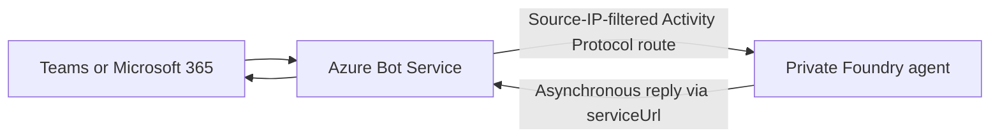
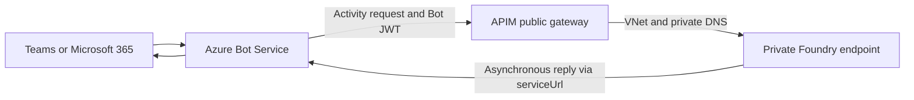

# Foundry Agents on a Private Network — Teams and Microsoft 365

Publish **private, VNet-isolated Microsoft Foundry agents** to **Microsoft Teams** and **Microsoft 365
Copilot**, and ground them in per-user enterprise data. Foundry admits Microsoft 365 channel traffic
natively, so **no gateway, proxy, or API Management bridge is required**.

## Quickstart

**1. Deploy an agent.** New to this repo? Start with the
[basic agent](foundryagents/hostedagent/basic-agent/README.md) — a minimal hosted agent with no tools
or connections:

```powershell
cd foundryagents/hostedagent/basic-agent
azd up
```

**2. Publish it to Teams.** From the repository root:

```powershell
./scripts/Publish-AgentToTeams.ps1 `
    -ResourceGroup <RESOURCE_GROUP> `
    -AgentName contoso-support-agent `
    -ProjectEndpoint https://<FOUNDRY_ACCOUNT>.services.ai.azure.com/api/projects/<PROJECT> `
    -UseM365PublicEndpoint
```

This creates the Azure Bot and Teams channel, admits Microsoft 365 traffic to the agent's Activity
Protocol route, and publishes it to the agent store. Open the agent in Teams and send it a message.

Already have an agent? Skip step 1 and pass its name instead. Add `-WhatIf` to preview without
changing anything. Full walkthrough: [Deploy](#deploy).

## How it works



Setting `agent_endpoint.protocol_configuration.activity.enable_m365_public_endpoint` tells Foundry to
accept Microsoft 365 channel traffic on **only** the Activity Protocol route. The `responses`,
`invocations`, `a2a`, and `mcp` protocols and the project APIs stay private, and the account keeps
`publicNetworkAccess=Disabled`. Foundry owns the public entry point, TLS, and source IP filtering, so
you deploy no public ingress of your own.

This changes **network reachability only** — keep `BotServiceRbac` or `BotServiceTenant` in
`authorization_schemes` so callers are still authorized. Teams and Microsoft 365 are themselves
public-network products; no Foundry setting makes the channel private.

**Verified 2026-09-23 (`swedencentral`).** With `publicNetworkAccess=Disabled`, a Teams message
reached the agent and got a reply, while the Responses protocol and the management API both returned
`403` from the public internet.

**Still need API Management?** Keep it for custom public-to-private ingress, non-Teams surfaces, or
API-management concerns such as quotas and request shaping. See
[Appendix — API Management bridge](#appendix--api-management-bridge).

---

## Prerequisites

1. An existing **private Microsoft Foundry** deployment with end-to-end networking
   (VNet + private endpoints + private DNS), provisioned from the official
   **private network standard agent setup** template:
   [foundry-samples/infrastructure-setup-bicep/15-private-network-standard-agent-setup](https://github.com/microsoft-foundry/foundry-samples/tree/main/infrastructure/infrastructure-setup-bicep/15-private-network-standard-agent-setup).
   This repo assumes that deployment already exists; it does **not** create the Foundry account,
   project, VNet, or private endpoints.
2. **Azure CLI** signed in and **PowerShell 7+**, with permission to create an Azure Bot in the target
   resource group (**Azure Bot Service Contributor**, **Contributor**, or **Owner**).
3. **Foundry User** on the Foundry project, to create, manage, and publish agents.
4. An agent with a publishable identity (`instance_identity`) and Microsoft 365 / Teams
   app-publishing permissions. Tenant-wide publication requires Microsoft 365 admin approval.
5. A client that can reach the project endpoint. Management and publish calls stay governed by the
   project's network rules even after the Microsoft 365 route is open.
6. For the retrieval samples, the selected path's delegated permissions, user licensing, and runtime
   roles: **Foundry Agent Consumer** to invoke the agent and **Foundry User** for model access.

Placeholders used below: `<RESOURCE_GROUP>`, `<AGENT_NAME>`, `<FOUNDRY_ACCOUNT>`, `<PROJECT>`,
`<APIM_NAME>`.

---

## Agent samples

Publishing is agent-agnostic — any agent in the project can go to Teams. This repo also ships **agent
samples** under [foundryagents/](foundryagents/). Start with the one-page decision matrix in
[guides/agent-tool-support-matrix.md](guides/agent-tool-support-matrix.md), then follow the sample's
own prerequisites and deployment steps.

| Sample | What it shows |
| --- | --- |
| [Basic agent](foundryagents/hostedagent/basic-agent/README.md) | Minimal hosted agent, no tools — the fastest path to a working Teams publish. **Start here.** |
| [SharePoint retrieval](foundryagents/hostedagent/sharepoint-copilot-retrieval/README.md) | Per-user, site-scoped SharePoint through the Copilot Retrieval API, using the native auto-bot with Toolbox OAuth consent. |
| [Work IQ](foundryagents/hostedagent/sharepoint-agent-workiq/README.md) | Broad Microsoft 365 grounding through the Microsoft-hosted Work IQ MCP server, without site scoping. |
| [Databricks](foundryagents/hostedagent/databricks-agent/README.md) | Databricks Genie through a Foundry Toolbox MCP connection. |
| [SharePoint grounding tool](foundryagents/promptagent/sharepoint-agent-grounding-tool/README.md) | Site-scoped grounding on a prompt agent rather than a hosted container. |
| [Agent audit logging](observability/foundry-agent-audit/README.md) | Per-agent attribution in Log Analytics. |

Sign-in for the retrieval sample is **interactive tool OAuth consent**, not silent Teams SSO: each
user approves once, then the agent retrieves as them. Validate the route you choose with the
[two-user checklist](guides/verify-per-user-isolation.md).
These preview retrieval samples do not certify production readiness or every network combination.

---

## Repository components

| Component | Purpose |
| --- | --- |
| [foundryagents/hostedagent/basic-agent](foundryagents/hostedagent/basic-agent/README.md) | Minimal hosted agent to deploy first |
| [scripts/Publish-AgentToTeams.ps1](scripts/Publish-AgentToTeams.ps1) | Create the bot, open the Microsoft 365 route, and publish |
| [scripts/Enable-M365PublicEndpoint.ps1](scripts/Enable-M365PublicEndpoint.ps1) | Admit or revoke Microsoft 365 / Teams traffic on an existing agent |
| [infra/bot-service.bicep](infra/bot-service.bicep) | Azure Bot registration and Teams channel |
| [tests/Test-M365AgentEndpoint.ps1](tests/Test-M365AgentEndpoint.ps1) | Offline regression tests for the endpoint patch |
| [deploy.ps1](deploy.ps1), [infra/main.bicep](infra/main.bicep), [APIM policy](apim-policies/foundry-activity-policy.xml), [scripts/Onboard-Agents.ps1](scripts/Onboard-Agents.ps1), [tests/test_bridge.py](tests/test_bridge.py) | Optional API Management bridge — see the [appendix](#appendix--api-management-bridge) |

Each agent sample documents its own setup scripts.

---

## Deploy

### 1. Publish the agent

From the repository root:

```powershell
az login
```

```powershell
./scripts/Publish-AgentToTeams.ps1 `
    -ResourceGroup <RESOURCE_GROUP> `
    -AgentName <AGENT_NAME> `
    -ProjectEndpoint https://<FOUNDRY_ACCOUNT>.services.ai.azure.com/api/projects/<PROJECT> `
    -UseM365PublicEndpoint
```

The script creates the Azure Bot with its endpoint on the agent's own Activity Protocol route, enables
the Teams channel, sets `enable_m365_public_endpoint`, and calls Foundry's Microsoft 365 publish API.

- `-PublishScope Tenant` publishes org-wide and requires Microsoft 365 admin approval. `Shared`
  (the default) publishes to you only.
- The scope selects the authorization scheme: `Tenant` → `BotServiceTenant`, `Shared` or `Personal`
  → `BotServiceRbac`.
- Increment `-AppVersion` to change user-facing metadata on republish; republishing an existing
  version is rejected.
- If an Azure Bot already uses the agent identity, pass its name with `-BotName`. Do not create a
  second bot for the same identity.

### 2. Change an existing agent

To open or close the Microsoft 365 route without touching the bot or republishing:

```powershell
./scripts/Enable-M365PublicEndpoint.ps1 `
    -AgentName <AGENT_NAME> `
    -ProjectEndpoint https://<FOUNDRY_ACCOUNT>.services.ai.azure.com/api/projects/<PROJECT>
```

Add `-Disable` to revoke it, or `-WhatIf` to print the merge patch and change nothing. The script
re-sends every protocol and authorization scheme the agent already had, then verifies none were lost.

### 3. Verify

Open the agent in Microsoft Teams or Microsoft 365 Copilot and send it a message. `Shared` agents
appear under **Your agents**; `Tenant` agents appear under **Built by your org** after admin
approval. The store cache refreshes roughly hourly.

Run the offline checks at any time:

```powershell
pwsh tests/Test-M365AgentEndpoint.ps1
```

---

## Troubleshooting

| Symptom | Cause / fix |
| --- | --- |
| Bot deployment fails with `The bot name is already registered to another bot application` | Azure Bot names are **globally unique**. The script derives one from the agent name; pass a unique `-BotName` instead. |
| Channel adapter receives `403 NetworkAccessDenied` | `enable_m365_public_endpoint` is unset or `false`, or the request did not originate from an Azure Bot Service / Microsoft 365 range. Run `Enable-M365PublicEndpoint.ps1`. |
| A direct public request to the Activity route returns `403` | Expected. Only Microsoft 365 and Bot Service ranges are admitted — test through Teams. |
| Requests arrive but are rejected | No Bot Service authorization scheme is configured, or the caller is outside the project tenant. Guest users cannot call these agents. |
| Agent missing from the store | The cache refreshes roughly hourly; `Tenant` scope also needs Microsoft 365 admin approval. |
| Publish fails with `version already exists` | Increment `-AppVersion`. |
| Publish fails `403` on `Microsoft.BotService/botServices/write` | Assign **Azure Bot Service Contributor** on the resource group. |
| Publishing from the portal returns `403` | Public network access is disabled. Use this REST-based flow from a client that can reach the project. |
| Conversation stuck, or `no tool output found` | Reset it: send `/foundry_new_preview` in Teams, or start a new chat in Copilot. |
| Management call returns `403 Virtual Network/Firewall` | The client is outside the project's network rules. The scripts retry transient denials. |

---

## Validate your deployment

1. Confirm the agent reports `enable_m365_public_endpoint: true` and still lists every protocol it
   needs. `Enable-M365PublicEndpoint.ps1 -WhatIf` prints the current state without changing it.
2. Confirm a Bot Service authorization scheme (`BotServiceRbac` or `BotServiceTenant`) is present.
   The network exception does **not** authorize callers.
3. Send an authenticated Teams message and confirm the **final reply**, not just an HTTP `202`
   receipt. `202` acknowledges delivery only.
4. Confirm the private protocols stayed private: `responses` and the project APIs must remain
   unreachable from outside your network rules.
5. For SharePoint retrieval, run the
   [two-user validation checklist](guides/verify-per-user-isolation.md)
   for the selected path and network configuration.

---

## Security boundaries

| Hop | Credential | Validated by |
| --- | --- | --- |
| Teams → Bot Service | Channel registration (internal) | Bot Service |
| Bot Service → Foundry Activity route | Bot Framework JWT (aud = bot App ID) | **Foundry** |
| Foundry → Bot Service (reply) | Foundry-managed bot credentials | Entra / Bot Service |

Foundry determines the source IP at the service edge and replaces client-supplied source-IP metadata,
so a caller cannot gain access by setting a forwarding header. Source IP filtering is **defense in
depth only** — Bot Service and Microsoft 365 ranges are shared across tenants, so every request must
still pass token validation and the configured tenant or RBAC checks.

With the [APIM bridge](#appendix--api-management-bridge) the same JWT is forwarded unchanged through
your gateway, and Foundry validates it at the same boundary.

---

## Appendix — API Management bridge

The bridge predates `enable_m365_public_endpoint` and is **no longer required for Teams or Microsoft
365**. Keep it for custom public-to-private ingress, non-Teams surfaces, or API-management concerns
such as quotas and request shaping.



One templated APIM operation (`/api/projects/{project}/agents/{agent}/...`) serves **every** project
and agent in the account, so you configure only `foundryHost`. The bridge is auth-transparent — the
Bot Framework JWT is forwarded unchanged and Foundry validates it — and it preserves each bot's
`api-version`. It also needs a free **/27+ subnet** in the Foundry VNet, and APIM Standard v2 takes
about 10 minutes to provision.

Configure [infra/main.parameters.bicepparam](infra/main.parameters.bicepparam):

```bicep
param location = 'swedencentral'
param vnetName = 'contoso-foundry-vnet'
param apimSubnetPrefix = '10.20.3.0/27'
param apimName = '<APIM_NAME>'
param apimPublisherEmail = 'platform@example.com'
param foundryHost = 'https://<FOUNDRY_ACCOUNT>.services.ai.azure.com'
param foundryApiVersion = '2025-11-15-preview'
```

Set `resourceGroupName` and `location` in
[infra/resourcegroup.config.json](infra/resourcegroup.config.json), then preview and deploy:

```powershell
./deploy.ps1 -WhatIf
```

```powershell
./deploy.ps1
```

Publish through the bridge with `-ApimName` in place of `-UseM365PublicEndpoint`:

```powershell
./scripts/Publish-AgentToTeams.ps1 `
    -ResourceGroup <RESOURCE_GROUP> `
    -AgentName <AGENT_NAME> `
    -ProjectEndpoint https://<FOUNDRY_ACCOUNT>.services.ai.azure.com/api/projects/<PROJECT> `
    -ApimName <APIM_NAME>
```

Repoint bots created outside this repo with `./deploy.ps1 -OnboardOnly`, and check routing with
[tests/test_bridge.py](tests/test_bridge.py).

---

### Bridge troubleshooting

| Symptom | Cause / fix |
| --- | --- |
| `403` in Bot Service Web Chat | Bot endpoint still points at the private host — run `./deploy.ps1 -OnboardOnly` |
| `500` | APIM cannot resolve/reach Foundry (DNS/VNet) or wrong `foundryHost` |
| `400` | Wrong path suffix or missing `api-version` |
| `202`, no reply | `202` acknowledges receipt only. Check agent execution and the asynchronous reply route to Bot Service `serviceUrl`. |

**Recommended hardening** (see the commented block in the policy):

- Enable `validate-jwt` in APIM to reject non-Bot-Framework tokens at the edge.
- Restrict inbound traffic to approved Bot Service sources using a supported network control;
  maintain the allowed ranges if implementing IP filtering in APIM policy.

> Foundry-published bots are **not** listed by `az bot list`. Use
> `az resource list --resource-type Microsoft.BotService/botServices`.

---

## Acknowledgements

Thanks to **Piotr Karpala**, **Mauro Minella**, and **Genady Belenky** for their technical guidance
and reference implementations that informed this repository's Teams integration and
delegated-access approach:

- **Piotr Karpala** — technical collaboration and guidance on Foundry agents in Teams,
  delegated authentication, and authorization requirements. See the
  [Foundry hosted agent for Microsoft Teams](https://github.com/msft-mfg-ai/ai-foundry-deployment-options/tree/main/options-infra/foundry-teams-hosted)
  reference in **msft-mfg-ai/ai-foundry-deployment-options**, covering Teams integration,
  APIM routing, and hosted-agent authentication patterns.
- **[Mauro Minella](https://github.com/maurominella)** —
  [hosted_agents](https://github.com/maurominella/hosted_agents): Foundry hosted-agent,
  bot, and client examples, including Teams and delegated Microsoft Graph access patterns.
- **[Genady Belenky](https://github.com/gbelenky)** —
  [HostedOBOAgent](https://github.com/gbelenky/HostedOBOAgent): a hosted Graph OBO agent
  demonstrating separate caller authentication and user-assertion forwarding with private connectivity.

## Next steps

- Pick an agent sample — [guides/agent-tool-support-matrix.md](guides/agent-tool-support-matrix.md)
- Verify per-user isolation before rollout — [guides/verify-per-user-isolation.md](guides/verify-per-user-isolation.md)
- Audit agent usage — [observability/foundry-agent-audit/README.md](observability/foundry-agent-audit/README.md)
- Microsoft Learn — [Allow Microsoft 365 traffic to a private-network agent](https://learn.microsoft.com/azure/foundry/agents/how-to/configure-agent#allow-microsoft-365-traffic-to-a-private-network-agent) and [Publish agents by using the REST API](https://learn.microsoft.com/azure/foundry/agents/how-to/publish-copilot-virtual-network)
- [Microsoft Foundry documentation](https://learn.microsoft.com/azure/ai-foundry/)
- API Management bridge only — [v2 service tiers](https://learn.microsoft.com/azure/api-management/v2-service-tiers-overview) and [VNet outbound integration](https://learn.microsoft.com/azure/api-management/integrate-vnet-outbound)
