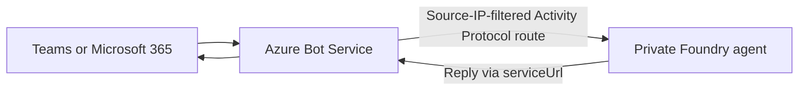

# Foundry Agents on a Private Network — Teams and Microsoft 365

Publish **private, VNet-isolated Microsoft Foundry agents** to **Microsoft Teams** and **Microsoft 365
Copilot**, and ground them in enterprise data **as the signed-in user**. Foundry admits Microsoft 365
channel traffic natively, so **no gateway, proxy, or API Management bridge is required**.

## Samples

| Sample | What it shows |
| --- | --- |
| [Basic agent](foundryagents/hostedagent/basic-agent/README.md) | Minimal hosted agent with no tools. **Start here.** |
| [SharePoint knowledge base](foundryagents/hostedagent/sharepoint-knowledge-base/README.md) | Per-user SharePoint through a Foundry IQ knowledge base. **Recommended** SharePoint route. |
| [Databricks Genie](foundryagents/hostedagent/databricks-agent/README.md) | Per-user Databricks data through the managed Genie MCP server, enforced by Unity Catalog. |
| [Work IQ](foundryagents/hostedagent/sharepoint-agent-workiq/README.md) | Broad Microsoft 365 grounding through the Microsoft-hosted Work IQ MCP server. |
| [SharePoint retrieval (OBO MCP)](foundryagents/hostedagent/sharepoint-copilot-retrieval/README.md) | Custom OBO MCP server calling the Copilot Retrieval API. Superseded by the knowledge base. |
| [SharePoint grounding tool](foundryagents/promptagent/sharepoint-agent-grounding-tool/README.md) | Site-scoped grounding on a prompt agent. |

Choose a sample with the [agent tool support matrix](guides/agent-tool-support-matrix.md), then
validate it with the [two-user isolation checklist](guides/verify-per-user-isolation.md).

## How it works


```mermaid
flowchart LR
  T[Teams or Microsoft 365] --> B[Azure Bot Service]
  B -->|Source-IP-filtered Activity Protocol route| F[Private Foundry agent]
  F -->|Reply via serviceUrl| B
  B --> T
```

Setting `enable_m365_public_endpoint` on an agent admits Microsoft 365 channel traffic on **only** the
Activity Protocol route. The `responses`, `invocations`, `a2a`, and `mcp` protocols and the project
APIs stay private. This changes **network reachability only**: callers are still authorized by the Bot
Service scheme (`BotServiceRbac` or `BotServiceTenant`), which the scripts set and preserve.

## Prerequisites

- A private Microsoft Foundry deployment, for example from the
  [private network standard agent setup](https://github.com/microsoft-foundry/foundry-samples/tree/main/infrastructure/infrastructure-setup-bicep/15-private-network-standard-agent-setup)
  template. This repo does **not** create the account, project, or network.
- Azure CLI, Azure Developer CLI (`azd`), and PowerShell 7+.
- **Foundry User** on the project, and **Azure Bot Service Contributor** (or Contributor) on the
  resource group for the bot.
- A client that can reach the project endpoint.

## Quickstart

Deploy the basic agent:

```powershell
cd foundryagents/hostedagent/basic-agent
azd up
```

Publish it to Teams from the repository root:

```powershell
./scripts/Publish-AgentToTeams.ps1 `
    -ResourceGroup <RESOURCE_GROUP> `
    -AgentName <AGENT_NAME> `
    -ProjectEndpoint https://<FOUNDRY_ACCOUNT>.services.ai.azure.com/api/projects/<PROJECT> `
    -UseM365PublicEndpoint
```

The script creates the Azure Bot and Teams channel, opens the Microsoft 365 route, and publishes the
agent. Open it in Teams under **Your agents** and send a message.

- `-PublishScope Tenant` publishes org-wide after Microsoft 365 admin approval. The default, `Shared`,
  publishes to you only.
- Increment `-AppVersion` when republishing.
- Pass `-BotName` to reuse an existing bot. Bot names are globally unique.
- Add `-WhatIf` to preview without changing anything.

To open or close the Microsoft 365 route on an existing agent without republishing, run
[Enable-M365PublicEndpoint.ps1](scripts/Enable-M365PublicEndpoint.ps1) with `-AgentName` and
`-ProjectEndpoint`. Add `-Disable` to revoke it.

## Repository layout

| Path | Purpose |
| --- | --- |
| [foundryagents/](foundryagents/) | Agent samples |
| [scripts/Publish-AgentToTeams.ps1](scripts/Publish-AgentToTeams.ps1) | Create the bot, open the Microsoft 365 route, and publish |
| [scripts/Enable-M365PublicEndpoint.ps1](scripts/Enable-M365PublicEndpoint.ps1) | Admit or revoke Microsoft 365 traffic on an existing agent |
| [scripts/Register-McpServerApp.ps1](scripts/Register-McpServerApp.ps1) | Entra app for the OBO MCP server sample |
| [infra/bot-service.bicep](infra/bot-service.bicep) | Azure Bot registration and Teams channel |
| [tests/](tests/README.md) | Offline tests for the endpoint patch: `pwsh tests/Test-M365AgentEndpoint.ps1` |
| [guides/](guides/) | Tool support matrix and per-user isolation checklist |
| [deprecated/](deprecated/) | Retired approaches, kept for reference only |

## Learn more

- [Allow Microsoft 365 traffic to a private-network agent](https://learn.microsoft.com/azure/foundry/agents/how-to/configure-agent#allow-microsoft-365-traffic-to-a-private-network-agent)
- [Publish agents by using the REST API](https://learn.microsoft.com/azure/foundry/agents/how-to/publish-copilot-virtual-network)
- [Microsoft Foundry documentation](https://learn.microsoft.com/azure/ai-foundry/)

## Acknowledgements

Thanks to the Microsoft Foundry product team, especially **Mahya Gheini** and **Linda Li**, for
their support and guidance. The SharePoint knowledge base sample builds on Mahya's samples.

Thanks also to **[Piotr Karpala](https://github.com/karpikpl)**, **[Mauro Minella](https://github.com/maurominella)**,
and **[Genady Belenky](https://github.com/gbelenky)** for technical guidance and reference
implementations:

- [Foundry hosted agent for Microsoft Teams](https://github.com/msft-mfg-ai/ai-foundry-deployment-options/tree/main/options-infra/foundry-teams-hosted)
- [hosted_agents](https://github.com/maurominella/hosted_agents)
- [HostedOBOAgent](https://github.com/gbelenky/HostedOBOAgent)
