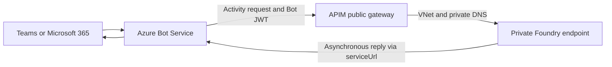

# API Management bridge (archived)

> [!IMPORTANT]
> This bridge is **archived and no longer required**. It predates Foundry's
> `enable_m365_public_endpoint` setting, which admits Microsoft 365 and Teams traffic to a
> private agent natively. Publish with
> [`scripts/Publish-AgentToTeams.ps1 -UseM365PublicEndpoint`](../../scripts/Publish-AgentToTeams.ps1)
> instead — see the [repository README](../../README.md).
>
> Kept for reference only: custom public-to-private ingress, non-Teams surfaces, or API-management
> concerns such as quotas and request shaping. It is not maintained or validated against current
> Foundry API versions.

## How it worked



One templated APIM operation (`/api/projects/{project}/agents/{agent}/...`) served **every** project
and agent in the account, so only `foundryHost` needed configuring. The bridge was auth-transparent —
the Bot Framework JWT was forwarded unchanged and Foundry validated it — and it preserved each bot's
`api-version`. It required a free **/27+ subnet** in the Foundry VNet, and APIM Standard v2 takes
about 10 minutes to provision.

## Contents

| Path | Purpose |
| --- | --- |
| [deploy.ps1](deploy.ps1) | Deploy the bridge infrastructure and onboard published bots |
| [infra/main.bicep](infra/main.bicep) | Subnet + NSG, APIM Standard v2, templated API and policy |
| [infra/modules/](infra/modules/) | APIM, network, and role-assignment modules |
| [apim-policies/foundry-activity-policy.xml](apim-policies/foundry-activity-policy.xml) | The forwarding policy |
| [scripts/Onboard-Agents.ps1](scripts/Onboard-Agents.ps1) | Repoint existing Foundry bots at the gateway |
| [tests/test_bridge.py](tests/test_bridge.py) | Routing checks against a deployed bridge |

`infra/bot-service.bicep` is **not** here — it stays in the repository root because the native
publish path still uses it.

## Deploy

Configure [infra/main.parameters.bicepparam](infra/main.parameters.bicepparam):

```bicep
param location = 'swedencentral'
param vnetName = 'contoso-foundry-vnet'
param apimSubnetPrefix = '10.20.3.0/27'
param apimName = '<APIM_NAME>'
param apimPublisherEmail = 'platform@example.com'
param foundryHost = 'https://<FOUNDRY_ACCOUNT>.services.ai.azure.com'
param foundryApiVersion = '2025-11-15-preview'
```

Set `resourceGroupName` and `location` in
[infra/resourcegroup.config.json](infra/resourcegroup.config.json), then preview and deploy from this
directory:

```powershell
./deploy.ps1 -WhatIf
```

```powershell
./deploy.ps1
```

Publish through the bridge with `-ApimName` in place of `-UseM365PublicEndpoint`:

```powershell
../../scripts/Publish-AgentToTeams.ps1 `
    -ResourceGroup <RESOURCE_GROUP> `
    -AgentName <AGENT_NAME> `
    -ProjectEndpoint https://<FOUNDRY_ACCOUNT>.services.ai.azure.com/api/projects/<PROJECT> `
    -ApimName <APIM_NAME>
```

Repoint bots created outside this repo with `./deploy.ps1 -OnboardOnly`, and check routing with
[tests/test_bridge.py](tests/test_bridge.py).

## Troubleshooting

| Symptom | Cause / fix |
| --- | --- |
| `403` in Bot Service Web Chat | Bot endpoint still points at the private host — run `./deploy.ps1 -OnboardOnly` |
| `500` | APIM cannot resolve/reach Foundry (DNS/VNet) or wrong `foundryHost` |
| `400` | Wrong path suffix or missing `api-version` |
| `202`, no reply | `202` acknowledges receipt only. Check agent execution and the asynchronous reply route to Bot Service `serviceUrl`. |

**Recommended hardening** (see the commented block in the policy):

- Enable `validate-jwt` in APIM to reject non-Bot-Framework tokens at the edge.
- Restrict inbound traffic to approved Bot Service sources using a supported network control;
  maintain the allowed ranges if implementing IP filtering in APIM policy.

> Foundry-published bots are **not** listed by `az bot list`. Use
> `az resource list --resource-type Microsoft.BotService/botServices`.

## Security boundary

The Bot Framework JWT is forwarded unchanged through the gateway, and Foundry validates it at the
same boundary as the native route — the bridge adds network reachability, not authorization.

## Next steps

- [Publish natively instead](../../README.md) — the supported route
- [APIM v2 service tiers](https://learn.microsoft.com/azure/api-management/v2-service-tiers-overview)
- [APIM VNet outbound integration](https://learn.microsoft.com/azure/api-management/integrate-vnet-outbound)
