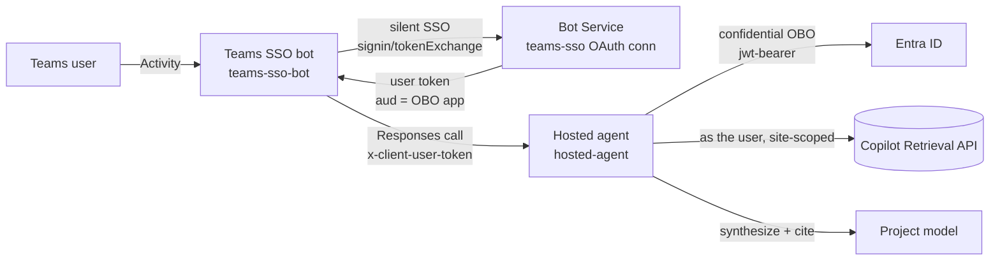

# Path B — Shared Teams bot with in-code OBO

> [!IMPORTANT]
> **Deprecated — not part of the supported flow.** Use
> [SharePoint retrieval](../../foundryagents/hostedagent/sharepoint-copilot-retrieval/README.md), which is
> verified end to end for per-user SharePoint retrieval in Teams and needs no custom bot.
>
> Path B is kept for reference only. It documents two things Path A does not provide: **silent Teams
> SSO** (Path A shows an interactive consent card) and **one shared bot routing to many agents**. It
> is no longer maintained or validated, and its deployed resources may hold rotated credentials.

The **shared-bot alternative** for multiagent routing or explicit user-token control. A single shared
Teams **bot** does Teams SSO, then forwards the signed-in
user's token to a Foundry **hosted agent** on the `x-client-user-token` header. The agent does the
On-Behalf-Of exchange **in its own code** and calls the Microsoft 365 Copilot Retrieval API **as the
user**, site-scoped — so results are permission-trimmed per caller.

## How it works

### Components

| Folder | Role |
| --- | --- |
| [Teams SSO bot](teams-sso-bot/README.md) | A Bot Framework endpoint that handles Teams SSO and forwards the user's token. |
| [Hosted agent](hosted-agent/README.md) | Reads `x-client-user-token`, performs in-code OBO, calls Copilot Retrieval, and synthesizes a cited answer. |

**Why two components:** this design obtains the Teams SSO token at a real Bot endpoint, then the
hosted agent uses that token for OBO. Path A instead uses Foundry-managed tool OAuth; it does not
need this header or bot. This path does **not** use an OBO MCP server.

### Scaling to many agents and tools

Two things scale independently — the number of **agents** and the number of **tools** — because one
Teams-SSO token (`aud` = the OBO app) can be exchanged into resource-specific tokens only where
the downstream supports the delegated OBO flow and the app has the necessary consented permissions.
The **one shared bot fronts many agents** using its configured allow-list; this sample implements
SharePoint retrieval, not arbitrary downstream integrations.

### Workflow

1. The shared bot requests a Teams SSO user token (`aud` = OBO app); Bot Service manages the token.
  Consent, Conditional Access, or session expiry can require interactive sign-in.
2. The bot routes to the chosen agent, forwarding the token on `x-client-user-token`.
3. Per tool, the agent does an **OBO exchange** — user token → the tool's resource token — and calls
   the tool **as the user**; each downstream trims to the user's permissions.
4. A multi-tool turn = several OBO exchanges in the same turn.

### Two implementation patterns

| Pattern | Where OBO runs | Best when |
| --- | --- | --- |
| **In-code per agent** (what this sample does) | Each agent embeds [obo.py](hosted-agent/agent/src/sharepoint-obo-responses/obo.py) | A handful of agents |
| **Shared OBO broker / gateway** (future adaptation) | One service all agents call, using the [OBO MCP server](../../foundryagents/hostedagent/sharepoint-copilot-retrieval/obo-mcp-server/README.md) pattern with explicit per-user token forwarding | Many agents/tools — centralizes the secret, permissions, per-user token cache, and audit |

As agents and tools grow, **evolve from in-code OBO to a shared broker**: move the `obo.py` logic
behind one service so the OBO app secret, downstream permissions, token caching, and per-user audit
live in **one place**. That broker uses Path A's gateway **shape**, but would need an explicit
token-transport integration and its own two-user validation. This adaptation is not implemented by
the sample and is not required to deploy either path.

### Adding an agent vs. a tool

| To add… | Do this (one-time) |
| --- | --- |
| **An agent** (same tools) | Deploy it; grant the bot MI **Foundry Agent Consumer** on the agent and the agent instance identity **Foundry User** on the project; register it in the bot's routing. Reuse the bot, OBO app, and SSO connection. |
| **A tool** | Confirm the API supports delegated OBO; add only its required permissions and consent, implement the exchange and API call, then validate identity and authorization separately. |

### Constraints

- **One Entra tenant** — cross-tenant OBO is not supported.
- **Each downstream must support delegated (OBO) access** — pure app-only APIs don't fit.
- **OBO app blast radius** — one app accruing many delegated permissions is a concentration risk;
  rotate its secret, prefer workload-identity federation (no secret), and scope least-privilege.
- **Bot tier durability** — the single front-door bot only scales to multiple replicas with **durable
  shared Bot Framework storage** (not `MemoryStorage`), or pin it to one replica.

## Prerequisites

1. A Foundry project and model deployment, plus a same-tenant SharePoint site.
2. Microsoft 365 Copilot licenses or applicable Retrieval API pay-as-you-go entitlement, including
  its tenant license prerequisite.
3. One Entra app configured for the bot, Teams SSO, and confidential-client OBO, with delegated
  Graph permissions and admin consent.
4. **Foundry Agent Consumer** for the bot managed identity on each allowed agent; **Foundry User**
  for each agent instance identity on the project for model calls.
5. A bot host reachable by Azure Bot Service, with network access to Foundry. The hosted agent
  needs Entra and Graph egress. Private-only operation requires separate validation with
  `publicNetworkAccess=Disabled`; a private endpoint with public access enabled is insufficient.

## Deploy

1. Configure and deploy the [hosted agent](hosted-agent/README.md).
2. Deploy the [shared Teams SSO bot](teams-sso-bot/README.md) and configure its allowed agents.
3. Keep the bot on one replica while it uses `MemoryStorage`; use durable shared storage before scaling out.

## Publish to Teams

Use the [custom bot's Teams package instructions](teams-sso-bot/README.md#publish-to-teams), not
the Foundry-managed bot publisher. Complete the
[two-user validation checklist](../../guides/verify-per-user-isolation.md)
for each allowed agent. The token-forwarding mechanism does not by itself certify session isolation.

## Troubleshooting

| Symptom | Cause / fix |
| --- | --- |
| SSO does not return a token | Match the OAuth connection and manifest resource to `api://botid-<APP_ID>`; check consent and Conditional Access. |
| Foundry returns an authorization error | Check the bot managed identity's **Foundry Agent Consumer** grant on the selected agent. |
| User selection disappears after restart | The sample uses in-memory bot state; provide durable storage for persistence. |
| No retrieval results | Check the query, site filter, entitlement, and the actual user's document permissions. |

## Next steps

- [Path comparison](../per-user-sharepoint-obo-teams-decision-matrix.md)
- [SharePoint retrieval: Foundry-managed tool consent](../../foundryagents/hostedagent/sharepoint-copilot-retrieval/README.md)
