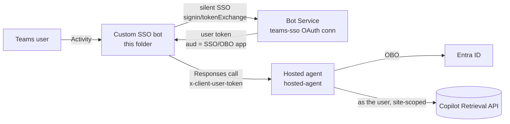

# Shared Teams SSO bot for delegated SharePoint retrieval

A Microsoft Teams **custom SSO bot** (middle tier) authenticates each Teams user with Teams SSO
and relays their turn to the [hosted agent](../hosted-agent/README.md), forwarding the user's token as
`x-client-user-token`. The hosted agent does the On-Behalf-Of exchange and calls the Microsoft 365
Copilot Retrieval API **as the user**, site-scoped — so results are permission-trimmed to each caller.

## How it works

The supported [SharePoint retrieval sample](../../../foundryagents/hostedagent/sharepoint-copilot-retrieval/README.md) publishes on the **Foundry auto-bot** via an OAuth2
identity-passthrough connection and **interactive tool OAuth consent**. This bot instead provides
**shared multiagent routing, Teams SSO, and explicit user-token forwarding**. SSO can be silent when
consent and tenant policies permit; an interactive fallback may be required.

> Trade-off: this replaces the Foundry auto-bot with a **custom bot** you deploy and register; it is
> not the only working per-user route. `x-ms-user-identity` alone is
> session **isolation**, not a per-user OAuth token selector — see
> [Microsoft Q&A 12912519](https://learn.microsoft.com/answers/a/12912519).



The [bot handler](bot/bot.py) processes sign-in and routing; the
[agent client](bot/agent_client.py) calls the selected Foundry agent with the bot's own credential
and forwards the user's assertion separately.

### One app for bot identity, SSO, and OBO

Use a **single Entra app** as the bot identity **and** the Teams SSO target **and** the OBO client —
one app, one secret. The Teams SSO token's audience is that app, which is exactly the assertion the
hosted agent's OBO needs, so the agent's `OBO_CLIENT_ID`, the bot's `MicrosoftAppId`, and the
`teams-sso` connection's client id are **the same app**.

The agent's `OBO_CLIENT_ID`, `OBO_CLIENT_SECRET`, and `OBO_TENANT_ID` and this bot's
`MicrosoftAppId`, `MicrosoftAppPassword`, and `MicrosoftAppTenantId` refer to this app. Protect and
rotate its confidential-client secret; user tokens must not be stored in configuration.

## Prerequisites

1. The per-user [`x-client-user-token` hosted-agent variant](../hosted-agent/README.md) deployed with
  `OBO_*` set to the one app above.
2. An **Azure Bot** registration (SingleTenant) using that app as `msaAppId` — either a dedicated one,
  or an existing registration deliberately repointed to this bot's `/api/messages` endpoint.
3. A **Bot Service OAuth Connection Setting** named `teams-sso` (Azure AD v2): client id = the app,
  `tokenExchangeUrl = api://botid-<APP_ID>`, scopes `api://botid-<APP_ID>/access_as_user offline_access`.
4. The bot's identity granted **Foundry Agent Consumer** on the agent (to call it).
5. **Python 3.12+**, and Microsoft 365 Copilot licenses or Retrieval API pay-as-you-go entitlement
   for users. Pay-as-you-go requires at least one Microsoft 365 Copilot license in the tenant.
6. Delegated Graph `Files.Read.All` and `Sites.Read.All` permissions with admin consent on the app,
   plus the intended users' SharePoint access. Admin consent does not grant document access.
7. A public HTTPS bot endpoint reachable by Azure Bot Service and a route from the bot host to
   Foundry. For private-only Foundry, validate DNS and routing with public access disabled; the
   presence of a private endpoint while `publicNetworkAccess=Enabled` is insufficient.

Placeholders used below: `<APP_ID>`, `<BOT_NAME>`, `<RESOURCE_GROUP>`, `<TENANT_ID>`.
Provide `BOT_CLIENT_SECRET` through a secure local environment variable, not literal command history.

## Deploy

### Configure the app and OAuth connection

From the repository root, configure the shared app's Teams SSO resource and preauthorized clients:

```powershell
./scripts/Configure-TeamsSso-App.ps1 -AppId <APP_ID> -AdminConsent
```

Separately grant the Graph delegated permissions listed above and admin consent. Configure the
Azure Bot's `teams-sso` connection after its registration exists:

```powershell
az bot authsetting create -n <BOT_NAME> -g <RESOURCE_GROUP> -c teams-sso `
  --client-id <APP_ID> --client-secret $env:BOT_CLIENT_SECRET --service Aadv2 `
  --provider-scope-string "api://botid-<APP_ID>/access_as_user offline_access" `
  --parameters tenantID=<TENANT_ID> "tokenExchangeUrl=api://botid-<APP_ID>"
```

### Configure the bot

Copy [bot/.env.example](bot/.env.example) to a local environment file and fill in the Bot registration, the
`teams-sso` connection name, and the hosted agent's project endpoint + `AGENT_NAME`.

| Variable | Purpose |
| --- | --- |
| `MicrosoftAppId` / `MicrosoftAppPassword` / `MicrosoftAppTenantId` | Shared app identity and credential |
| `MicrosoftAppType` | `SingleTenant` |
| `OAUTH_CONNECTION_NAME` | `teams-sso` |
| `FOUNDRY_PROJECT_ENDPOINT` | Target project endpoint |
| `AGENT_NAME` | Default agent |
| `AGENTS` | Comma-separated allow-list of additional agent names |
| `FOUNDRY_SCOPE` | `https://ai.azure.com/.default` for bot authentication to Foundry |

### Run locally

From this README's folder, use a configured Python environment:

```powershell
Set-Location bot
```

```powershell
python -m pip install -r requirements.txt
```

```powershell
python app.py
```

The server listens on port `3978`, with `/api/messages` as its messaging route. For local Teams
development, expose that route through an approved HTTPS tunnel and update the Bot registration's
messaging endpoint. Sign in locally with an identity that can invoke the agent.

### Host in Azure

Build the image from [bot/Dockerfile](bot/Dockerfile) for Container Apps or App Service, configure the
same environment variables using secret-store references, and point the Bot registration to the
host's HTTPS `/api/messages` URL. Enable the bot host's managed identity and grant it **Foundry Agent
Consumer** on each allowed agent. Keep the Azure Bot **Teams channel** enabled.

The sample [application](bot/app.py) uses **MemoryStorage** for conversation and user state. Keep it
on **one replica**; state is lost on restart. Implement durable shared Bot Framework storage before
scaling out. Do not assume token forwarding also provides application-level session isolation.

### Reuse across agents

**No per-agent bot registration.** One Azure Bot + one app + one Teams app fronts **every** agent; the
bot routes to the target agent at runtime:

- Set `AGENT_NAME` (default) and optionally `AGENTS=agent-a,agent-b,…` (the allow-list this bot can
  reach). Users switch with **`/use <name>`** and list with **`/agents`**.
- The bot's identity (**Foundry Agent Consumer**) can invoke **any** agent it is granted on. All agents
  deployed with the **same** `OBO_CLIENT_ID` (the one app) accept the same SSO token, so the SSO
  audience is intentionally shared across those agents. Runtime configuration and model
  authorization remain per-agent: each agent still needs its own settings and **Foundry User** at
  project scope for model synthesis.
- **Reused across all agents:** the single SSO/OBO app, the `teams-sso` OAuth connection, this bot
  image, the Azure Bot registration, and the Teams app. **Per-agent:** just the agent existing in the
  project (and, if you want it selectable, its name in `AGENTS`).

You'd only add a second Azure Bot / Teams app if the client wants an agent to appear as a *separate*
installable Teams app (a UX choice, not a requirement).

**The Foundry auto-bot is NOT reused automatically.** Publishing an agent to Teams creates an auto-bot
pointing at the agent's `…/activityprotocol` (the shared/no-SSO relay). This custom bot is a *separate*
messaging endpoint; users install the **custom bot's** Teams app for the per-user path.

## Publish to Teams

Use [the package generator](../hosted-agent/teams-app/New-TeamsAppPackage.ps1) from this README's folder:

```powershell
../hosted-agent/teams-app/New-TeamsAppPackage.ps1 -AppId <APP_ID>
```

The [manifest template](../hosted-agent/teams-app/manifest.template.json) binds `bots[0].botId` and
`webApplicationInfo.id` to the shared app, with resource `api://botid-<APP_ID>` and
`token.botframework.com` in `validDomains`. Review app metadata, then upload the package under
your organization's Teams approval policy. Install the **custom bot's** app, not the Foundry auto-bot app.

Complete the [two-user validation checklist](../../../guides/verify-per-user-isolation.md)
with separate user profiles and conversations, including `/agents` and `/use` routing. User A should
receive the permitted document; User B must receive no protected content or summary. An empty result
or denial is only meaningful after a successful positive control and independent permission checks.

## Troubleshooting

| Symptom | Cause / fix |
| --- | --- |
| `resourcematchfailed` | Match app identifier URI, OAuth token-exchange URL, and Teams manifest resource to `api://botid-<APP_ID>`. |
| Sign-in requires a card | Check consent, Conditional Access, and session state; silent SSO is conditional, not guaranteed. |
| No token after sign-in | Check the OAuth connection name, client secret, scope, and delivery of `signin/tokenExchange` / `signin/verifyState` to this bot. |
| Foundry rejects a routed agent | Check the allow-list and bot identity's **Foundry Agent Consumer** grant on that agent. |
| Conversation or selection state disappears | `MemoryStorage` resets on restart and is not shared across replicas. |
| Retrieval returns `403` | Check permissions, consent, licensing, and the actual delegated user; do not assume every `403` is SharePoint trimming. |

## Next steps

- [Hosted agent setup](../hosted-agent/README.md)
- [Path comparison and customer validation](../../per-user-sharepoint-obo-teams-decision-matrix.md)
