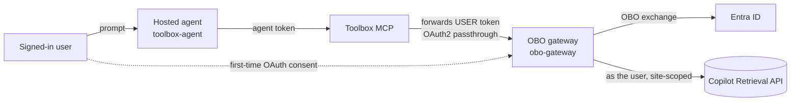
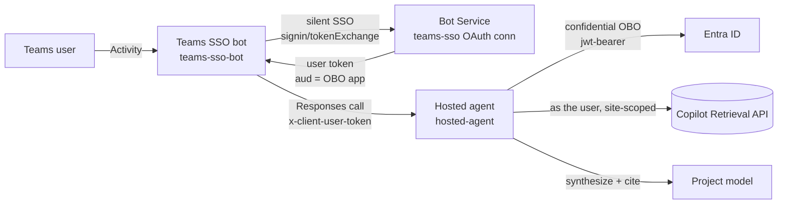

# Per-user SharePoint OBO from a Teams-published Foundry hosted agent — decision matrix

> [!IMPORTANT]
> **Deprecated — kept for reference.** This compares Path A with the retired Path B, so there is no
> longer a decision to make. Path A is the supported route. For the verification steps that used to
> live here, use [guides/verify-per-user-isolation.md](../guides/verify-per-user-isolation.md).

**Problem.** You want a Foundry **hosted agent** published to **Microsoft Teams** to answer from
SharePoint **trimmed to each signed-in user's permissions** (true On-Behalf-Of). A hosted container's
own identity is not the user's delegated token. Choose between Foundry-brokered tool OAuth through
Toolbox and a shared Teams SSO bot that forwards a user token for in-code OBO. These are preview
samples; validate authorization and networking in your environment before rollout.

The two paths share the same downstream (Microsoft 365 **Copilot Retrieval API**, site-scoped).
Path A uses an **MCP-OBO gateway**; Path B performs OBO **inside the agent**, without that gateway.
They differ in **how the user's identity reaches the retrieval call**.

---

## Path A — Foundry Toolbox OAuth identity-passthrough (Foundry-managed sign-in)

Hosted agent (Agent Framework) → a **Foundry Toolbox** wrapping an **OAuth2 identity-passthrough
connection** → the **MCP-OBO gateway** → Copilot Retrieval. Foundry renders an *"Open sign-in link"*
consent card in Teams and brokers the user's token server-side. Keeps the **Foundry auto-bot** (no
custom bot). The agent uses **`FoundryToolbox` + `ResponsesHostServer`**, not
`x-client-user-token` or a local OBO fallback. The documented starting configuration is a **public**
Foundry project. Private-network operation requires separate end-to-end validation; opening the
inbound Microsoft 365 route does not establish outbound Toolbox-to-gateway connectivity.

- Setup: [Toolbox agent](../foundryagents/hostedagent/sharepoint-copilot-retrieval/README.md)
and [MCP-OBO gateway](../foundryagents/hostedagent/sharepoint-copilot-retrieval/obo-gateway/README.md).

**Tool OAuth consent is not silent Teams SSO.** Tool approval settings and tenant admin consent
are separate controls; neither proves which delegated user reaches the gateway.

## Path B — Shared Teams bot + `x-client-user-token` (in-code OBO)

A single **shared Teams bot** (App Service, real Bot Framework endpoint) does **Teams SSO**, then calls
the hosted agent forwarding the user's token on the **`x-client-user-token`** header (the Foundry
gateway passes any `x-client-*` header through unchanged). The agent reads it and does a
**confidential-client OBO in code** → Copilot Retrieval as the user → a model synthesizes a cited
answer. The Toolbox is bypassed.

- Setup: [Hosted agent](pathB/hosted-agent/README.md)
and [shared Teams SSO bot](pathB/teams-sso-bot/README.md).

SSO may require interactive sign-in for consent, Conditional Access, or expired sessions. A
private-networked account with `publicNetworkAccess=Enabled` is not a private-only deployment;
validate the bot-to-Foundry route with the intended public-access settings.

---

## Decision matrix

| Dimension | Path A — Toolbox passthrough | Path B — Shared bot + `x-client-user-token` |
| --- | --- | --- |
| Teams sign-in | Foundry-managed interactive **tool OAuth consent** | Teams SSO with interactive fallback |
| Delegated retrieval | Gateway exchanges the OAuth-passthrough user token | Agent exchanges the explicitly forwarded user token |
| Isolation requirement | Validate authenticated tool identity, retrieval outputs, and user sessions | Validate token handling, retrieval outputs, and user sessions |
| Network boundary | Public-project starting configuration; private-network integration requires separate validation | Bot must reach Foundry; private-only routing requires separate validation |
| Caller authorization | **Foundry Agent Consumer** for callers at the narrowest supported agent/project scope; verify endpoint policy rather than assuming `BotServiceRbac` removes grants | Bot MI has **Foundry Agent Consumer** on each allowed agent; user token is separate |
| Custom bot registration | **None** (Foundry auto-bot) | **One shared** bot (never per-agent) |
| APIM required | **No** — a private agent admits Teams traffic with `enable_m365_public_endpoint` | Not for OBO; bot still needs an authorized network route to Foundry |
| Agent style | Agent Framework container (`FoundryToolbox` + `ResponsesHostServer`) + gateway | Bring-your-own container (in-code OBO) |
| Other downstream tools | Validate each connection and provider's delegated-auth behavior separately | Requires a compatible delegated flow and additional implementation |
| Token handling | Foundry brokers tool credentials; gateway handles OBO tokens | Bot Service manages sign-in; bot forwards the assertion and agent handles OBO tokens |
| Output quality | Native Agent Framework **inline citations** | Model synthesis + **Sources** footer |
| Setup complexity | Lower (connection + toolbox) | Higher (bot + Bot OAuth connection + manifest) |
| Moving parts to operate | Foundry connection, Toolbox, gateway, auto-bot | App Service bot, Bot registration, Teams manifest, OBO app |

## Pros / cons

### Path A — Toolbox passthrough

- **Pros:** keeps the Foundry auto-bot; centralizes OBO in a reusable gateway; no custom Teams bot.
- **Cons:** interactive tool consent; gateway operation and OAuth connection provisioning;
  separate validation for private networks and endpoint authorization policy.

### Path B — Shared bot with in-code OBO

- **Pros:** one bot routes to multiple agents; explicit delegated-token transport; Teams SSO integration.
- **Cons:** you operate the bot, OAuth connection, manifest, and confidential-client credentials.
  Teams SSO requires matching `api://botid-<APP_ID>` resource configuration. The sample bot uses
  `MemoryStorage`: keep one replica or implement durable shared storage before scaling out.

## Recommendation

- Choose **Path A** when the **native auto-bot + tool OAuth consent** experience is suitable.
- Choose **Path B** for **one shared bot, multiagent routing, or explicit user-token control**,
  including custom integrations that need application-managed delegated tokens.
- For **either path**, repeat identity, negative-access, session-isolation, and networking checks in
  the target environment. A sign-in card or a successful two-user test alone is not a security audit.

### Operational requirements

- Both paths require delegated Graph permissions, admin consent, SharePoint access, and user
  entitlement to the **Retrieval API**. Retrieval API pay-as-you-go requires at least one Microsoft
  365 Copilot license in the tenant; Work IQ billing is not interchangeable with Retrieval API billing.
- Grant **Foundry User** to the agent instance identity at project scope for model access, separately
  from **Foundry Agent Consumer** for agent invocation. Do not broaden caller roles to solve a model error.
- `x-ms-user-identity` is session context, **not** a delegated OAuth token. The platform passes
  `x-client-user-token` through without authenticating its contents; the application owns that boundary.
- Keep tokens out of prompts, chat history, logs, and source control. Review secret storage,
  rotation, token-cache isolation, and request/session ownership before rollout.
- Do not assume Responses streaming or progress events map to Teams UX. These samples do not
  implement Code Interpreter file upload/download or a `/files`-to-Activity bridge.

## Verify per-user isolation (either path)

1. Select **User A** with access and **User B** without access to a known document in the configured
  site. Verify those permissions directly in SharePoint. Give both users the required service
  licenses so licensing differences do not mask authorization behavior.
2. Use separate signed-in browser/Teams profiles and separate new conversations. Record the agent
  version, project, site filter, public-access setting, consent flow, and caller role scopes.
  Never reuse a conversation or response ID across users.
3. For Path A, have each user complete tool consent as needed and invoke `whoami`; compare the
  **actual tool output** with the expected account. For Path B, inspect the authenticated user's
  identity through trusted, access-controlled diagnostics. Never display bearer tokens or send
  them to the model. A model's identity claim is not authentication evidence.
4. Ask the same document-specific question and request a summary as each user. User A should receive
  relevant extracts and citations. User B must receive **no protected extracts, summary, or content**.
  Zero hits or access denial can be valid outcomes; a `403` alone is inconclusive because permissions,
  consent, and licensing can also cause it. If User A receives no hits, fix the positive control first.
5. Inspect retrieval outputs and sanitized service diagnostics, not only final answers or citation-link
  access. Correlate requests using available call/session IDs. Gateway-direct or direct-agent harness
  checks are useful controls, but repeat the full **Teams** route as well.
6. Alternate users, repeat after sign-out/sign-in, and exercise each allowed agent. Verify missing or
  invalid credentials fail closed and that changing agents does not expose another user's context.
  In a non-production environment, validate permission changes after expected propagation delays.
7. For private-only deployment, repeat with public access disabled and the intended DNS/egress routes.
  Validate Toolbox/gateway reachability separately from the inbound Teams route. A public-path pass
  is not evidence for private-only operation.
8. Stop rollout on unexpected identities or content. Revalidate after changes to permissions,
  consent, SDKs, agent versions, session handling, token caches, or networking. Passing this checklist
  is not a security certification or a guarantee that all isolation defects are absent.
