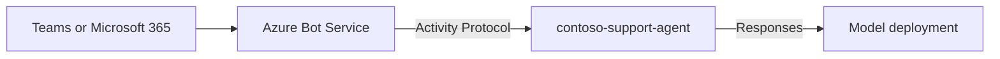

# Basic agent — deploy, then publish to Teams

A minimal **Agent Framework** hosted agent with no tools and no connections. Deploy it, publish it to
Microsoft Teams, and confirm the end-to-end path works before you add a retrieval sample on top.

This is the agent used to verify the [native Microsoft 365 publishing route](../../../README.md).

## How it works



[main.py](src/contoso-support-agent/main.py) builds one `Agent` over a `FoundryChatClient` and serves
it with `ResponsesHostServer`. [azure.yaml](azure.yaml) declares the model deployment and the
container.

## Prerequisites

1. A Foundry project, and a **`gpt-4.1`** model deployment (or edit the deployment in
   [azure.yaml](azure.yaml)).
2. **Azure CLI** and **Azure Developer CLI** 1.27.1+ with the Foundry extension:
   `azd ext install microsoft.foundry`.
3. **Foundry User** on the project. The agent identity also needs **Foundry User** for model access.
4. **Python 3.12+** only if you want to run the agent locally.

Placeholders used below: `<FOUNDRY_ACCOUNT>`, `<PROJECT>`, `<RESOURCE_GROUP>`.

## Deploy

From this folder:

```powershell
az login
```

```powershell
azd up
```

`azd` provisions the model deployment if it is missing, builds the container in ACR, and registers
the agent version. To target an existing project, set its endpoint first:

```powershell
azd env set AZURE_AI_PROJECT_ENDPOINT https://<FOUNDRY_ACCOUNT>.services.ai.azure.com/api/projects/<PROJECT>
```

Confirm it answers before publishing:

```powershell
azd ai agent invoke --agent contoso-support-agent --message "Reply with the single word: ping"
```

## Publish to Teams

From the **repository root**:

```powershell
./scripts/Publish-AgentToTeams.ps1 -ResourceGroup <RESOURCE_GROUP> `
  -AgentName contoso-support-agent `
  -ProjectEndpoint https://<FOUNDRY_ACCOUNT>.services.ai.azure.com/api/projects/<PROJECT> -UseM365PublicEndpoint
```

Open the agent in Teams and send it a message. Drop `-UseM365PublicEndpoint` when the project allows
public network access — the publish API enables the activity protocol on its own.

## Troubleshooting

| Symptom | Cause / fix |
| --- | --- |
| `azd up` cannot find the model | The deployment name in [azure.yaml](azure.yaml) does not exist in the project. Edit it, or let `azd` create it. |
| Agent returns an authorization error | Grant the agent identity **Foundry User** at project scope for model access. |
| No reply in Teams | See the [publishing troubleshooting table](../../../README.md#troubleshooting). |

## Next steps

- Publish and verify — [repository README](../../../README.md)
- Add per-user SharePoint retrieval — [sharepoint-copilot-retrieval](../sharepoint-copilot-retrieval/README.md)
- Pick a tool-grounded sample — [guides/agent-tool-support-matrix.md](../../../guides/agent-tool-support-matrix.md)
- A hardened variant of this host (tolerates transient history failures) — [Path A agent](../sharepoint-copilot-retrieval/pathA/toolbox-agent/agent-framework-agent-with-foundry-toolbox-responses/src/agent-framework-agent-sharepoint-copilot-retrieval/main.py)
