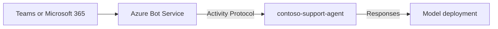

# Basic agent

A minimal **Microsoft Agent Framework** agent with no tools or connections, running on **hosted
agents in Foundry Agent Service**. Deploy it and publish it to Microsoft Teams to confirm the
end-to-end path works before you add tools.

## How it works


```mermaid
flowchart LR
  T[Teams or Microsoft 365] --> B[Azure Bot Service]
  B -->|Activity Protocol| A[contoso-support-agent]
  A -->|Responses| M[Model deployment]
```

[main.py](src/contoso-support-agent/main.py) builds one `Agent` over a `FoundryChatClient` and serves
it with `ResponsesHostServer`. [azure.yaml](azure.yaml) declares the model deployment and container.

## Prerequisites

- A Foundry project with a `gpt-4.1` deployment, or edit the deployment in [azure.yaml](azure.yaml).
- Azure CLI and Azure Developer CLI 1.27.1+ with `azd ext install microsoft.foundry`.
- **Foundry User** on the project for you and for the agent identity. Users who only chat with the
  agent need **Foundry Agent Consumer**.

## Deploy

From this folder:

```powershell
az login
azd up
```

By default `azd up` creates a new resource group, Foundry account, and project. To use an existing
project, run this first:

```powershell
azd ai agent init --project-id <PROJECT_ARM_ID>
```

The first deploy can outlast `azd`'s 20-minute wait while the agent keeps activating. If it times
out, run `azd deploy --timeout 2400`.

Test it:

```powershell
azd ai agent invoke --agent contoso-support-agent --message "Reply with the single word: ping"
```

## Publish to Teams

From the repository root:

```powershell
./scripts/Publish-AgentToTeams.ps1 -ResourceGroup <RESOURCE_GROUP> `
  -AgentName contoso-support-agent -BotName <UNIQUE_BOT_NAME> `
  -ProjectEndpoint https://<FOUNDRY_ACCOUNT>.services.ai.azure.com/api/projects/<PROJECT> -UseM365PublicEndpoint
```

Drop `-UseM365PublicEndpoint` if the project allows public network access.

## Learn more

- [Add per-user SharePoint with a knowledge base](../sharepoint-knowledge-base/README.md)
- [Agent tool support matrix](../../../guides/agent-tool-support-matrix.md)
