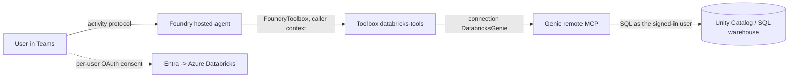

# Databricks Genie hosted agent (OAuth identity passthrough)

An Agent Framework **hosted agent** that answers analytical questions over an Azure Databricks
**Genie** space, reached through a Foundry **toolbox** wrapping the Genie **remote MCP** server.
The connection uses a custom **OAuth2 identity-passthrough** flow: on first use each signed-in user
consents to Azure Databricks, and Foundry calls Genie with that user's token.

Each Teams user's Genie queries run under **their own** Databricks identity — see
[Verify](#verify).

## How it works



The agent container never handles a user token. It consumes the toolbox through **`FoundryToolbox`**
([main.py](agent-framework-agent-databricks/src/agent-framework-agent-databricks/main.py)), which
carries the caller's context so Foundry can resolve that user's Databricks token server-side.

Two details worth knowing:

- **Use `FoundryToolbox`.** It forwards the Foundry per-request call ID, which is how Foundry knows
  which user a tool call belongs to. A hand-built MCP client that only attaches the agent's own
  credential loses that, and every caller inherits whoever consented first.
- This is the **custom** OAuth2 connection route, not the managed Databricks catalog connector
  (`foundrydatabricksmcp`). Managed-provider connections expose no `scopes` field, so
  `offline_access` cannot be requested and the token is never refreshed.

## Prerequisites

1. A Foundry project with a `gpt-4.1` (or equivalent) model deployment.
2. An Azure Databricks workspace with a **Genie space** and a running SQL warehouse.
3. Each test user needs `CAN_RUN` on the Genie space, `CAN_USE` on the warehouse, and
   `USE_CATALOG` / `USE_SCHEMA` / `SELECT` on the underlying tables.
4. `az login` in the correct tenant, and `azd >= 1.27.1` with `azd ext install microsoft.foundry`.
5. Permission to create Entra app registrations.

Placeholders used below: `<SUBSCRIPTION_ID>`, `<RESOURCE_GROUP>`, `<FOUNDRY_ACCOUNT>`, `<PROJECT>`,
`<DATABRICKS_HOST>`, `<GENIE_SPACE_ID>`, `<path-to-repo>`.

## Deploy

**1. Create the Entra app, connection and toolbox**

```powershell
./setup/Create-Connection-And-Toolbox.ps1 `
    -ProjectEndpoint https://<FOUNDRY_ACCOUNT>.services.ai.azure.com/api/projects/<PROJECT> `
    -SubscriptionId <SUBSCRIPTION_ID> -ResourceGroup <RESOURCE_GROUP> `
    -AccountName <FOUNDRY_ACCOUNT> -ProjectName <PROJECT> `
    -DatabricksHost <DATABRICKS_HOST> -GenieSpaceId <GENIE_SPACE_ID>
```

**2. Initialize and deploy the hosted agent**

Confirm the agent, model, connection and toolbox all belong to the **same project** before deploying.

`azd ai agent init` **adopts** the sample into a new project directory, so run it from an **empty
directory** and pass an absolute path to the sample's `azure.yaml`.

```powershell
$PROJECT_ID = "/subscriptions/<SUBSCRIPTION_ID>/resourceGroups/<RESOURCE_GROUP>/providers/Microsoft.CognitiveServices/accounts/<FOUNDRY_ACCOUNT>/projects/<PROJECT>"
$SAMPLE = "<path-to-repo>/foundryagents/hostedagent/databricks-agent/agent-framework-agent-databricks"

New-Item -ItemType Directory -Force -Path ./deploy | Out-Null
Set-Location ./deploy

azd ai agent init -m "$SAMPLE/azure.yaml" `
  --project-id $PROJECT_ID --model-deployment gpt-4.1 --no-prompt --force -e databricks-genie
```

That scaffolds `./agent-framework-agent-databricks` with `azure.yaml`, `toolbox.yaml` and `src/`.
Deploy from there:

```powershell
Set-Location ./agent-framework-agent-databricks
azd env set enableHostedAgentVNext true -e databricks-genie
# Model deployment the agent uses (read by azure.yaml)
azd env set AZURE_AI_MODEL_DEPLOYMENT_NAME gpt-4.1 -e databricks-genie
azd up -e databricks-genie
```

**3. Invoke it**

```powershell
azd ai agent invoke --new-session "Show the top 10 customers by total spend." --timeout 120
```

The first call returns an **OAuth consent** URL. Approve it as a user who has `CAN_RUN` on the Genie
space, then re-invoke.

## Publish to Teams

Foundry removes the one-click publish button for projects with private networking. Use the repo
script, which points the bot at the agent's own Activity Protocol route — no APIM bridge:

```powershell
<path-to-repo>/scripts/Publish-AgentToTeams.ps1 `
    -ResourceGroup <RESOURCE_GROUP> -AgentName agent-framework-agent-databricks `
    -ProjectEndpoint https://<FOUNDRY_ACCOUNT>.services.ai.azure.com/api/projects/<PROJECT> `
    -UseM365PublicEndpoint -PublishScope Tenant -AppVersion 1.0.0
```

`-UseM365PublicEndpoint` sets `enable_m365_public_endpoint`, so Foundry admits Microsoft 365 / Teams
source IPs on **only** that route while the account keeps `publicNetworkAccess=Disabled`. Tenant
scope needs Microsoft 365 admin approval before the agent appears under **Built by your org**.

## Verify

Verified with hosted agent + toolbox + OAuth identity passthrough + direct bot endpoint, with
`publicNetworkAccess` both `Disabled` and `Enabled`.

Have two users each ask about a **different** slice of the data from Teams, so attribution is
unambiguous, then read Databricks **query history**, which reports the identity that executed the SQL:

```
BRONZE  user-a@...   <- user A asked
SILVER  user-b@...   <- user B asked
```

Each user is prompted for their **own** Databricks OAuth consent on first use, and their queries run
under their own identity, so Unity Catalog permissions and lineage apply per user. Later sessions
reuse each user's stored token without prompting again.

## Learn more

- [Verify per-user isolation](../../../guides/verify-per-user-isolation.md)
- [Toolbox authentication](https://learn.microsoft.com/azure/foundry/agents/how-to/tools/tool-authentication)
- [Microsoft Foundry Toolbox (`FoundryToolbox`)](https://learn.microsoft.com/agent-framework/integrations/by-component/tools/foundry-toolbox)

## Acknowledgements

Thanks to **Mahya Gheini** and **Linda Li** from the Microsoft Foundry product and engineering team
for their guidance on toolbox OAuth identity passthrough and for helping validate this sample.
