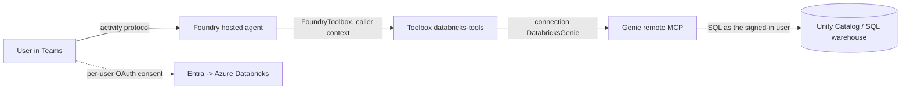

# Databricks Genie hosted agent (OAuth identity passthrough)

An Agent Framework **hosted agent** that answers analytical questions over an Azure Databricks
**Genie** space, reached through a Foundry **toolbox** wrapping the Genie **remote MCP** server.
The connection uses a custom **OAuth2 identity-passthrough** flow: on first use each signed-in user
consents to Azure Databricks, and Foundry calls Genie with that user's token.

Per-user identity propagation is **verified working** in Teams — see
[Verifying per-user identity](#verifying-per-user-identity).

## How it works



The agent container never handles a user token. It consumes the toolbox through **`FoundryToolbox`**
([main.py](agent-framework-agent-databricks/src/agent-framework-agent-databricks/main.py)), which
carries the caller's context so Foundry can resolve that user's Databricks token server-side.

Three details worth knowing:

- **Use `FoundryToolbox`.** Building the MCP client by hand (for example `MCPStreamableHTTPTool` with
  an `httpx.Auth` that attaches the agent's own credential) sends the **agent identity** on every
  toolbox call. Per-user identity is then lost and every caller inherits whoever consented first.
  See [Troubleshooting](#troubleshooting).
- This is the **custom** OAuth2 connection route, not the managed Databricks catalog connector
  (`foundrydatabricksmcp`). Managed-provider connections expose no `scopes` field (`scopes: null`)
  and no authorize/token endpoints, so `offline_access` cannot be requested and the token is never
  refreshed.
- A hosted container **can** complete this OAuth consent flow, unlike Entra `UserEntraToken`
  passthrough, which requires an interactive client.
- A hosted container **can** complete this OAuth consent flow, unlike Entra `UserEntraToken`
  passthrough, which requires an interactive client.

## Prerequisites

1. A Foundry project with a `gpt-4.1` (or equivalent) model deployment.
2. An Azure Databricks workspace with a **Genie space** and a running SQL warehouse.
3. Each test user needs `CAN_RUN` on the Genie space, `CAN_USE` on the warehouse, and
   `USE_CATALOG` / `USE_SCHEMA` / `SELECT` on the underlying tables.
4. `az login` in the correct tenant, and `azd >= 1.27.1` with `azd ext install microsoft.foundry`.
5. Permission to create Entra app registrations.

Placeholders used below: `<SUBSCRIPTION_ID>`, `<RESOURCE_GROUP>`, `<FOUNDRY_ACCOUNT>`, `<PROJECT>`,
`<DATABRICKS_HOST>`, `<GENIE_SPACE_ID>`.

## Deploy

**1. Create the Entra app, connection and toolbox**

```powershell
./setup/Create-Connection-And-Toolbox.ps1 `
    -ProjectEndpoint https://<FOUNDRY_ACCOUNT>.services.ai.azure.com/api/projects/<PROJECT> `
    -SubscriptionId <SUBSCRIPTION_ID> -ResourceGroup <RESOURCE_GROUP> `
    -AccountName <FOUNDRY_ACCOUNT> -ProjectName <PROJECT> `
    -DatabricksHost <DATABRICKS_HOST> -GenieSpaceId <GENIE_SPACE_ID>
```

**2. Initialize and deploy the hosted agent**

Confirm the agent, model, connection and toolbox all belong to the **same project** before deploying.

`azd ai agent init` **adopts** the sample into a new project directory, so run it from an **empty
directory** and pass an absolute path to the sample's `azure.yaml`. Running it from the sample folder
itself fails with `a project azure.yaml already exists ... cannot be adopted there`.

```powershell
$PROJECT_ID = "/subscriptions/<SUBSCRIPTION_ID>/resourceGroups/<RESOURCE_GROUP>/providers/Microsoft.CognitiveServices/accounts/<FOUNDRY_ACCOUNT>/projects/<PROJECT>"
$SAMPLE = "<path-to-repo>/foundryagents/hostedagent/databricks-agent/agent-framework-agent-databricks"

New-Item -ItemType Directory -Force -Path ./deploy | Out-Null
Set-Location ./deploy

azd ai agent init -m "$SAMPLE/azure.yaml" `
  --project-id $PROJECT_ID --model-deployment gpt-4.1 --no-prompt --force -e databricks-genie
```

That scaffolds `./agent-framework-agent-databricks` with `azure.yaml`, `toolbox.yaml` and `src/`.
Deploy from there:

```powershell
Set-Location ./agent-framework-agent-databricks
azd env set enableHostedAgentVNext true -e databricks-genie
# init's --model-deployment does not populate this; azure.yaml reads it and the agent exits without it
azd env set AZURE_AI_MODEL_DEPLOYMENT_NAME gpt-4.1 -e databricks-genie
# If a scaffolded agent.yaml contains ${{VAR}}, replace it with single-brace ${VAR}
azd up -e databricks-genie
```

**3. Invoke it**

```powershell
azd ai agent invoke --new-session "Show the top 10 customers by total spend." --timeout 120
```

The first call returns an **OAuth consent** URL. Approve it as a user who has `CAN_RUN` on the Genie
space, then re-invoke.

## Publish to Teams

Foundry removes the one-click publish button for projects with private networking. Use the repo
script, which points the bot at the agent's own Activity Protocol route — no APIM bridge:

```powershell
../../../scripts/Publish-AgentToTeams.ps1 `
    -ResourceGroup <RESOURCE_GROUP> -AgentName agent-framework-agent-databricks `
    -ProjectEndpoint https://<FOUNDRY_ACCOUNT>.services.ai.azure.com/api/projects/<PROJECT> `
    -UseM365PublicEndpoint -PublishScope Tenant -AppVersion 1.0.0
```

`-UseM365PublicEndpoint` sets `enable_m365_public_endpoint`, so Foundry admits Microsoft 365 / Teams
source IPs on **only** that route while the account keeps `publicNetworkAccess=Disabled`. Tenant
scope needs Microsoft 365 admin approval before the agent appears under **Built by your org**.

> The Teams app short name is truncated at **30 characters**, so a long `-DisplayName` loses its tail.

## Verifying per-user identity

**Verified** on hosted agent + toolbox + OAuth identity passthrough + direct bot endpoint, with both
`publicNetworkAccess=Disabled` (2026-09-28) and `Enabled` (2026-09-30).

Have two users each ask about a **different** slice of the data from Teams, so attribution is
unambiguous, then read Databricks **query history** (not the Genie monitoring view — monitoring
reports the Genie-space caller, query history reports the identity that executed the SQL):

```
2026-09-30 (UTC)
14:52:59  BRONZE  testuser@...   <- testuser asked
14:54:28  BRONZE  testuser@...   <- testuser asked
14:54:33  SILVER  admin@...      <- admin asked
14:54:40  SILVER  admin@...      <- admin asked
```

Each user is prompted for their **own** Databricks OAuth consent on first use, and their queries run
under their own identity, so Unity Catalog permissions and lineage apply per user. Later sessions
reuse each user's stored token without prompting again.

> **`user.id` is not a per-user signal.** In Application Insights, Foundry emitted a single constant
> `user.id` for both callers even when attribution was correct, and `user_Id` /
> `user_AuthenticatedId` were empty on every record. Use Databricks query history to verify
> identity, not the telemetry `user.id`.

## Troubleshooting

| Symptom | Cause / fix |
| --- | --- |
| **All users' queries run as whoever consented first** | The agent is not using `FoundryToolbox`. A hand-built MCP client that attaches the agent's own credential sends the agent identity on every toolbox call, so Foundry never sees the caller. Use `tools=FoundryToolbox(credential)`. |
| Second user is never prompted for Databricks consent | Same cause as above. Each user should get their own consent card on first use. |
| Consent fails with `redirect_uri mismatch` | The Foundry reply URL is not on the app. Re-run `setup/Create-Connection-And-Toolbox.ps1`; step 3 registers and verifies it. |
| `azd ai agent init` fails with `a project azure.yaml already exists ... cannot be adopted there` | `init` adopts the sample into a new directory. Run it from an empty directory and pass an absolute path to the sample's `azure.yaml`. |
| Response fails with `The ConnectorGateway connection name exceeds the maximum allowed length of 96 characters` | Foundry derives a longer per-user name from the connection name. Keep the connection name short: `DatabricksGenie` (15) and `DatabricksGenieV2` (17) work, `AzureDatabricksGeniePassthrough` (31) fails. The setup script caps it at 20. |
| Agent exits at startup with `Set AZURE_AI_MODEL_DEPLOYMENT_NAME.` | `azd ai agent init --model-deployment` does not set this azd variable. Run `azd env set AZURE_AI_MODEL_DEPLOYMENT_NAME <deployment>` before `azd up`. |
| Data-plane calls return `500 InternalServerError: Unable to get resource information.` | The Foundry account is mid-update. Check `provisioningState` on the account — while it is `Accepted`, agent and toolbox APIs are unavailable. Avoid issuing a second `publicNetworkAccess` PATCH before the first reports `Succeeded`. |
| `HTTP 401 invalid_token` in chat after ~a day | The access token expired and was not refreshed. Confirm `offline_access` is in the connection `scopes`; managed-provider connections cannot set it. |
| Agent replies "there was an issue retrieving…" then works on retry | Either the SQL warehouse auto-started from stopped, or the model called `poll_response` before `query_space`. The agent instructions in `main.py` pin that ordering. |
| Teams app shows a truncated name | Teams caps the app short name at 30 characters. |
| `404` from the toolbox endpoint | `TOOLBOX_NAME` does not match a toolbox in the project, or its default version was not published. |
| Queries attributed to the wrong user | See the first row — check that `FoundryToolbox` is used. |

## Next steps

- [Agent tool support matrix](../../../guides/agent-tool-support-matrix.md) — which tools support per-user identity.
- [Verify per-user isolation](../../../guides/verify-per-user-isolation.md) — how to prove permission trimming.
- [SharePoint Copilot retrieval sample](../sharepoint-copilot-retrieval/README.md) — the same passthrough pattern against a custom MCP server.
- [Publish to a virtual network](https://learn.microsoft.com/azure/foundry/agents/how-to/publish-copilot-virtual-network) — Microsoft Learn.
- [Set up tracing in Microsoft Foundry](https://learn.microsoft.com/azure/foundry/observability/how-to/trace-agent-setup) — enabling the `user.id` telemetry used above.
