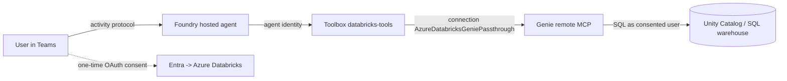

# Databricks Genie hosted agent (OAuth identity passthrough)

An Agent Framework **hosted agent** that answers analytical questions over an Azure Databricks
**Genie** space, reached through a Foundry **toolbox** wrapping the Genie **remote MCP** server.
The connection uses a custom **OAuth2 identity-passthrough** flow: on first use the signed-in user
consents to Azure Databricks, and Foundry calls Genie with that user's token.

This sample also documents a **verified identity-propagation defect** on the Teams channel — see
[Known issue](#known-issue-identity-does-not-propagate-per-user-on-teams). Use it to reproduce and
validate.

## How it works



The agent container never handles a user token. It authenticates to the toolbox with its **own agent
identity** ([main.py](agent-framework-agent-databricks/src/agent-framework-agent-databricks/main.py)),
and Foundry supplies the per-user Databricks token server-side from the connection.

Two details worth knowing:

- This is the **custom** OAuth2 connection route, not the managed Databricks catalog connector
  (`foundrydatabricksmcp`). Managed-provider connections expose no `scopes` field (`scopes: null`)
  and no authorize/token endpoints, so `offline_access` cannot be requested and the token is never
  refreshed.
- A hosted container **can** complete this OAuth consent flow, unlike Entra `UserEntraToken`
  passthrough, which requires an interactive client.

## Prerequisites

1. A Foundry project with a `gpt-4.1` (or equivalent) model deployment.
2. An Azure Databricks workspace with a **Genie space** and a running SQL warehouse.
3. Each test user needs `CAN_RUN` on the Genie space, `CAN_USE` on the warehouse, and
   `USE_CATALOG` / `USE_SCHEMA` / `SELECT` on the underlying tables.
4. `az login` in the correct tenant, and `azd >= 1.27.1` with `azd ext install microsoft.foundry`.
5. Permission to create Entra app registrations.

Placeholders used below: `<SUBSCRIPTION_ID>`, `<RESOURCE_GROUP>`, `<FOUNDRY_ACCOUNT>`, `<PROJECT>`,
`<DATABRICKS_HOST>`, `<GENIE_SPACE_ID>`.

## Deploy

**1. Create the Entra app, connection and toolbox**

```powershell
./setup/Create-Connection-And-Toolbox.ps1 `
    -ProjectEndpoint https://<FOUNDRY_ACCOUNT>.services.ai.azure.com/api/projects/<PROJECT> `
    -SubscriptionId <SUBSCRIPTION_ID> -ResourceGroup <RESOURCE_GROUP> `
    -AccountName <FOUNDRY_ACCOUNT> -ProjectName <PROJECT> `
    -DatabricksHost <DATABRICKS_HOST> -GenieSpaceId <GENIE_SPACE_ID>
```

**2. Deploy the hosted agent**

```powershell
cd agent-framework-agent-databricks
azd ai agent deploy
```

## Publish to Teams

Foundry removes the one-click publish button for projects with private networking. Use the repo
script, which points the bot at the agent's own Activity Protocol route — no APIM bridge:

```powershell
../../../scripts/Publish-AgentToTeams.ps1 `
    -ResourceGroup <RESOURCE_GROUP> -AgentName agent-framework-agent-databricks `
    -ProjectEndpoint https://<FOUNDRY_ACCOUNT>.services.ai.azure.com/api/projects/<PROJECT> `
    -UseM365PublicEndpoint -PublishScope Tenant -AppVersion 1.0.0
```

`-UseM365PublicEndpoint` sets `enable_m365_public_endpoint`, so Foundry admits Microsoft 365 / Teams
source IPs on **only** that route while the account keeps `publicNetworkAccess=Disabled`. Tenant
scope needs Microsoft 365 admin approval before the agent appears under **Built by your org**.

> The Teams app short name is truncated at **30 characters**, so a long `-DisplayName` loses its tail.

## Known issue: identity does not propagate per-user on Teams

**Verified 2026-09-28** against this exact configuration — hosted agent + toolbox + OAuth identity
passthrough + direct bot endpoint + `publicNetworkAccess=Disabled`.

Foundry binds the **first user who consents** and reuses that identity for every later caller on the
Teams channel. Later users are never prompted, and their Genie queries execute as the first
consenter. Queries **succeed**, so the substitution is silent.

Two users, same agent, same Genie space, minutes apart:

| Evidence source | testuser session (10:39–10:42Z) | admin session (10:43–10:45Z) |
| --- | --- | --- |
| App Insights `user.id` | `779301c0-…` (509 events) | `779301c0-…` (449 events) — **same** |
| Foundry data-plane audit | agent instance identity only | agent instance identity only |
| Databricks query history | ran as `testuser` | ran as **`testuser`** |

The single `user.id` resolves to **no Entra directory object** — it is neither user nor the agent.
`user_Id` and `user_AuthenticatedId` are empty on all 1,274 telemetry records. In the Foundry audit
log every call in the window comes from the agent's instance identity, with **no user principal
anywhere in the request chain**.

The same prompt issued from the **Foundry portal** attributes correctly, so the gap is specific to
the Teams channel, not to Databricks — any delegated tool behind that channel inherits it.

**Impact.** Unity Catalog lineage and query history name the wrong user. Where the first consenter's
grants exceed a later caller's, that caller receives data they are not entitled to.

**Workaround.** None. Portal-only use defeats the scenario.

To reproduce: have user A consent in Teams, then have user B ask a question in Teams, and compare
Databricks **query history** (not just the Genie monitoring view) for the executing identity.

## Troubleshooting

| Symptom | Cause / fix |
| --- | --- |
| Consent fails with `redirect_uri mismatch` | The Foundry reply URL is not on the app. Re-run `setup/Create-Connection-And-Toolbox.ps1`; step 3 registers and verifies it. |
| `HTTP 401 invalid_token` in chat after ~a day | The access token expired and was not refreshed. Confirm `offline_access` is in the connection `scopes`; managed-provider connections cannot set it. |
| Agent replies "there was an issue retrieving…" then works on retry | The SQL warehouse was stopped and auto-started. Expect one slow first query. |
| Teams app shows a truncated name | Teams caps the app short name at 30 characters. |
| `404` from the toolbox endpoint | `TOOLBOX_NAME` does not match a toolbox in the project, or its default version was not published. |
| Queries attributed to the wrong user | The defect above — not a configuration error. |

## Next steps

- [Agent tool support matrix](../../../guides/agent-tool-support-matrix.md) — which tools support per-user identity.
- [Verify per-user isolation](../../../guides/verify-per-user-isolation.md) — how to prove permission trimming.
- [SharePoint Copilot retrieval sample](../sharepoint-copilot-retrieval/README.md) — the same passthrough pattern against a custom MCP server.
- [Publish to a virtual network](https://learn.microsoft.com/azure/foundry/agents/how-to/publish-copilot-virtual-network) — Microsoft Learn.
- [Set up tracing in Microsoft Foundry](https://learn.microsoft.com/azure/foundry/observability/how-to/trace-agent-setup) — enabling the `user.id` telemetry used above.
