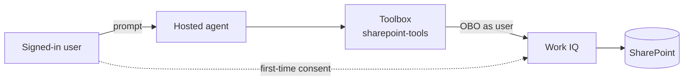

# SharePoint agent with Work IQ

An agent on **hosted agents in Foundry Agent Service** that grounds answers in **SharePoint and other
Microsoft 365 content as the signed-in user** through the Microsoft-hosted **Work IQ** MCP server,
published to Teams on the Foundry-managed bot.

## How it works



The agent calls a **Foundry Toolbox** over a `user-entra-token` (identity passthrough) connection.
Foundry performs the On-Behalf-Of exchange per user, so results are permission-trimmed. See
[main.py](agent-framework-agent-with-foundry-toolbox-responses/src/agent-framework-agent-sharepoint/main.py).

## Prerequisites

- Foundry project, SharePoint site, and users in the **same Entra tenant**.
- A **Microsoft 365 Copilot** licence per user, or
  [Copilot Credits](https://learn.microsoft.com/microsoft-365/copilot/usage-based-billing-overview-copilot-credits)
  connected to the Work IQ API.
- A Foundry project with a `gpt-4.1` deployment, and `azd` 1.27.1+ with
  `azd ext install microsoft.foundry`.
- **Foundry User** for you and the agent identity, **Foundry Project Manager** to create the
  connection, and a **Global Administrator** for the one-time tenant setup.

## Deploy

1. Provision the Work IQ service principal in your tenant (once, Global Administrator):

   ```powershell
   az ad sp create --id fdcc1f02-fc51-4226-8753-f668596af7f7
   ```

2. Create the connection and toolbox:

   ```powershell
   azd ai project set https://<FOUNDRY_ACCOUNT>.services.ai.azure.com/api/projects/<PROJECT>

   azd ai connection create sharepoint-workiq-conn `
     --kind remote-tool `
     --target https://agent365.svc.cloud.microsoft/agents/servers/mcp_SharePointRemoteServer `
     --auth-type user-entra-token `
     --audience ea9ffc3e-8a23-4a7d-836d-234d7c7565c1

   cd agent-framework-agent-with-foundry-toolbox-responses
   azd ai toolbox create sharepoint-tools --from-file toolbox.yaml
   cd ..
   ```

3. Deploy the agent:

   ```powershell
   $PROJECT_ID = "/subscriptions/<SUBSCRIPTION_ID>/resourceGroups/<RESOURCE_GROUP>/providers/Microsoft.CognitiveServices/accounts/<FOUNDRY_ACCOUNT>/projects/<PROJECT>"

   azd ai agent init -m agent-framework-agent-with-foundry-toolbox-responses/azure.yaml `
     --project-id $PROJECT_ID --model-deployment gpt-4.1 --no-prompt --force -e sharepoint
   azd env set enableHostedAgentVNext true -e sharepoint
   azd up -e sharepoint
   ```

   In the scaffolded `agent.yaml`, replace any `${{VAR}}` with `${VAR}` before `azd up`.

4. Test it. The first call returns a consent URL; sign in as a licensed user, then call again:

   ```powershell
   azd ai agent invoke --new-session "Summarize the latest document in the <SITE_NAME> site." --timeout 120
   ```

## Publish to Teams

From the repository root:

```powershell
./scripts/Publish-AgentToTeams.ps1 -ResourceGroup <RESOURCE_GROUP> `
  -AgentName agent-framework-agent-sharepoint `
  -ProjectEndpoint https://<FOUNDRY_ACCOUNT>.services.ai.azure.com/api/projects/<PROJECT> -UseM365PublicEndpoint
```

If your agent subnet denies egress by default, allow `agent365.svc.cloud.microsoft`,
`workiq.svc.cloud.microsoft`, `login.microsoftonline.com`, `*.consent.azure-apim.net`, and
`graph.microsoft.com`.

## Learn more

- [Connect agents to Microsoft 365 with Work IQ](https://learn.microsoft.com/azure/foundry/agents/how-to/tools/work-iq)
- [Use a toolbox with a hosted agent](https://learn.microsoft.com/azure/foundry/agents/how-to/tools/use-toolbox-hosted-agent)
- [Verify per-user isolation](../../../guides/verify-per-user-isolation.md)
