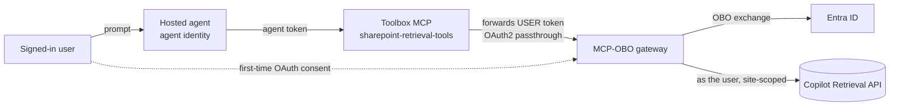

# Per-user SharePoint retrieval from a Teams-published Foundry hosted agent

A Foundry **hosted agent** that answers questions grounded in **one SharePoint site**, trimmed to each
signed-in user's permissions, and publishable to Microsoft Teams on the Foundry auto-bot — no custom
bot. It reaches SharePoint through the repo's **[OBO gateway](obo-gateway/README.md)**.
Agent Framework, Responses protocol.

**Verified 2026-09-23 (`swedencentral`, private project).** The steps below were run end to end from a
clean start — a new gateway app registration, gateway, connection, Toolbox, and agent — then published
to Teams over the [native Microsoft 365 route](../../../README.md) with **no API Management** in the
path, on a project whose account, Storage, Search, and Cosmos DB are all reached over private
endpoints. Two users asked the same agent the same question: the one with site access received the
document and its source link; the one without access received no results, and `whoami` returned each
signed-in user. That run used its own connection and Toolbox names to avoid colliding with existing
resources — the names in this README are the setup script's defaults, not requirements.

## How it works

A hosted container's **own agent identity** is distinct from the user's delegated credentials.
This agent uses the official **`FoundryToolbox`**, **`FoundryChatClient`**, and **`ResponsesHostServer`**
with resilient tasks. It calls a Toolbox wrapping an **OAuth2 identity-passthrough** connection:
Foundry brokers the user's token server-side, the gateway does the **On-Behalf-Of** exchange and calls
the **Microsoft 365 Copilot Retrieval API** as the user (site-scoped via `filterExpression`). See
[agent-framework-agent-with-foundry-toolbox-responses/src/agent-framework-agent-sharepoint-copilot-retrieval/main.py](agent-framework-agent-with-foundry-toolbox-responses/src/agent-framework-agent-sharepoint-copilot-retrieval/main.py).

The Toolbox URL is built explicitly from `FOUNDRY_PROJECT_ENDPOINT` and `TOOLBOX_NAME`; a stale
`TOOLBOX_ENDPOINT` cannot select a different project. There is **no local OBO fallback**, no
`x-client-user-token` requirement, and no `APP_OBO_*` secret in this agent. The gateway still needs
its OBO configuration.



The sign-in experience is **interactive tool OAuth consent**, not silent Teams SSO, and each agent
gets its own auto-bot. A retired sample showing silent SSO and one shared bot across agents is kept
for reference in [deprecated/pathB](../../../deprecated/pathB/README.md).

### Private networking

Two legs carry traffic and they lock down independently:

- **Inbound** — Teams reaches the agent over the Microsoft 365 route. This survives
  `publicNetworkAccess=Disabled`: with the route enabled, Teams replied normally while direct public
  calls to the same project returned `403`. See the [deployment guide](../../../README.md).
- **Outbound** — Foundry's Toolbox calls your gateway. This is egress from the project, so inbound
  restrictions do not affect it; what matters is that the gateway is reachable from Foundry. The
  sample's gateway is a Container App with external ingress. If you move it behind Private Link or an
  internal-only ingress, give the project outbound access to it — enabling the Microsoft 365 route
  does **not** establish gateway reachability.

## Prerequisites

1. The **MCP-OBO gateway deployed** and reachable from your Foundry project — see
   [gateway setup](obo-gateway/README.md); register its Entra app with
   [scripts/Register-GatewayApp.ps1](../../../scripts/Register-GatewayApp.ps1).
2. An existing Foundry project with a model deployment (e.g. `gpt-4.1`).
3. **Python 3.12+**, PowerShell 7+, Azure CLI, and Azure Developer CLI with the Foundry extension.
4. **Additional Azure resources:** an OAuth2 identity-passthrough connection and a Toolbox that wraps
   it — created with the setup script under Option 1 (defaults `SharePointRetrievalOBO` and
   `sharepoint-retrieval-tools`).
5. **Roles (RBAC):** grant callers **Foundry Agent Consumer** at the narrowest supported agent scope;
   use project scope only when required. Verify endpoint authorization rather than assuming tenant
   publishing or `BotServiceRbac` removes caller RBAC. Grant the agent identity **Foundry User** at
   project scope for model access; do not broaden caller roles to solve model authorization errors.
6. **Licensing:** a **Microsoft 365 Copilot** license for the users, or **Retrieval API pay-as-you-go**
   (which needs ≥1 Copilot license in the tenant) — otherwise the tool returns `403 … valid license`.

Placeholders used below: `<SUBSCRIPTION_ID>`, `<RESOURCE_GROUP>`, `<FOUNDRY_ACCOUNT>`, `<PROJECT>`,
`<GATEWAY_HOST>` (deployed gateway host), `<GATEWAY_APP_ID>`, `<TENANT_ID>`. Supply the gateway
secret through a secure local environment variable
named `GATEWAY_CLIENT_SECRET`; do not paste credentials into documentation or command history.

## Option 1: Azure Developer CLI (`azd`)

Use a current `azd` release compatible with the installed Foundry extension (at least 1.27.1;
extension versions may require newer releases).

```powershell
azd ext install microsoft.foundry
```

```powershell
azd auth login --tenant-id <TENANT_ID>
```

```powershell
az login --tenant <TENANT_ID>
```

### Create the connection + toolbox (once)

[setup/Create-Connection-And-Toolbox.ps1](setup/Create-Connection-And-Toolbox.ps1) creates the OAuth2
identity-passthrough connection, registers Foundry's reply URL on the gateway app, and creates the
toolbox — the *MCP OAuth Identity Passthrough* scenario from the
[foundry-samples guide](https://github.com/microsoft-foundry/foundry-samples/blob/main/samples/python/hosted-agents/SUPPORTED_TOOLBOX_SCENARIOS/tools/mcp-oauth-custom.md):

```powershell
./setup/Create-Connection-And-Toolbox.ps1 `
  -ProjectEndpoint https://<FOUNDRY_ACCOUNT>.services.ai.azure.com/api/projects/<PROJECT> `
   -GatewayHost <GATEWAY_HOST> -GatewayAppId <GATEWAY_APP_ID> -GatewayClientSecret $env:GATEWAY_CLIENT_SECRET `
  -SubscriptionId <SUBSCRIPTION_ID> -ResourceGroup <RESOURCE_GROUP> `
  -AccountName <FOUNDRY_ACCOUNT> -ProjectName <PROJECT>
```

> Prefer the portal? Create the connection (Tools → custom MCP → OAuth2, Custom OAuth) and the toolbox
> in the Foundry Toolkit instead. Either way, Foundry's per-connection reply URL **must** be registered
> on the gateway app or the first consent fails with a `redirect_uri` mismatch (the script does this).

To run alongside existing resources, pass `-ConnectionName` and `-ToolboxName`. If you rename the
toolbox, set `TOOLBOX_NAME` in
[azure.yaml](agent-framework-agent-with-foundry-toolbox-responses/azure.yaml) to match — the agent
resolves its Toolbox from that value, so a mismatch surfaces as an agent with no tools.
### Initialize and deploy the agent

Before deployment, verify the selected environment's project endpoint: agent, model, connection,
and Toolbox must belong to the **same intended project**. Run initialization only for a new local
deployment environment; do not overwrite a configured project unintentionally.

The [requirements](agent-framework-agent-with-foundry-toolbox-responses/src/agent-framework-agent-sharepoint-copilot-retrieval/requirements.txt)
pin `agent-framework-foundry==1.13.0`, `agent-framework-core==1.18.0`,
and `agent-framework-foundry-hosting==1.0.0b260910`. The manifest uses Responses protocol `2.0.0`;
do not reuse older hosting pins from unrelated samples.

```powershell
$PROJECT_ID = "/subscriptions/<SUBSCRIPTION_ID>/resourceGroups/<RESOURCE_GROUP>/providers/Microsoft.CognitiveServices/accounts/<FOUNDRY_ACCOUNT>/projects/<PROJECT>"
```

```powershell
azd ai agent init -m agent-framework-agent-with-foundry-toolbox-responses/azure.yaml `
  --project-id $PROJECT_ID --model-deployment gpt-4.1 --no-prompt --force -e sharepoint-retrieval
```

Run subsequent commands from the initialized project directory:

```powershell
azd env set enableHostedAgentVNext true -e sharepoint-retrieval
```

Check generated environment substitutions use the syntax expected by `azd` (`${VAR}`).

```powershell
azd up -e sharepoint-retrieval
```

### Invoke the deployed agent

```powershell
azd ai agent invoke --new-session "What does our onboarding guide say about MFA setup?" --timeout 120
```

The first call returns an **OAuth consent** URL — approve as a Copilot-licensed user with access to the
site, then re-invoke. To confirm per-user trimming, ask as a user *without* access to a document and
verify it isn't returned.

## Option 2: VS Code (Foundry Toolkit)

1. Install the **Foundry Toolkit** VS Code extension and `az login`.
2. Open the [agent project](agent-framework-agent-with-foundry-toolbox-responses/), configure a local
   Python environment with its pinned requirements and project/model/Toolbox settings, then run
   `azd ai agent run` and chat via **Foundry Toolkit: Open Agent Inspector**.
3. Run **Foundry Toolkit: Deploy Hosted Agent** to build, register the version, and assign RBAC.

(The connection + toolbox from Option 1 are still required — create them first.)

## Publish to Teams

The Foundry auto-bot is preserved. Run this from the **repository root**:

```powershell
./scripts/Publish-AgentToTeams.ps1 -ResourceGroup <RESOURCE_GROUP> `
  -AgentName agent-framework-agent-sharepoint-copilot-retrieval `
  -ProjectEndpoint https://<FOUNDRY_ACCOUNT>.services.ai.azure.com/api/projects/<PROJECT> -UseM365PublicEndpoint
```

For a **public** project, omit `-UseM365PublicEndpoint` — the publish API enables the activity
protocol on its own. If the project still fronts Foundry with API Management, pass
`-ApimName <APIM_NAME>` instead; see the
[API Management appendix](../../../README.md#appendix--api-management-bridge). For private
deployment, validate the inbound Teams route, Toolbox reachability, and gateway egress independently
before rollout. If the identity already has a bot, reuse its name with `-BotName`. Tenant publication
requires admin approval.

Open the agent in Teams, complete consent as required, and ask.

Repeat the [two-user checks](../../../guides/verify-per-user-isolation.md)
with fresh, separate conversations in the target environment before rollout.

## Troubleshooting

| Symptom | Cause / fix |
| --- | --- |
| Agent returns no tools | Toolbox name/`TOOLBOX_NAME` mismatch, or no default version. Check `azd ai toolbox show sharepoint-retrieval-tools`. |
| Consent URL every call | Consent not completed, or the connection token expired. Complete the consent URL. |
| `401` at the gateway | Forwarded token isn't OBO-able — check the connection scope (`api://<GATEWAY_APP_ID>/access_as_user`) and that the gateway app issues v2 tokens. |
| `403 … Files.Read.All/Sites.Read.All` | Gateway app missing/ungranted Graph delegated permissions — re-run `Register-GatewayApp.ps1`. |
| `403 … valid license` | User isn't Copilot-licensed and Retrieval API paygo isn't enabled — a licensing gate, not code. |
| Startup / readiness fails | Ensure `enableHostedAgentVNext=true` and `AZURE_AI_MODEL_DEPLOYMENT_NAME` matches a real deployment. |
| Tool calls ask for `x-client-user-token` | Wrong/old local-OBO implementation deployed. This sample uses `FoundryToolbox`; explicit header forwarding belonged to the retired shared-bot sample. |
| Wrong project or Toolbox selected | Check `FOUNDRY_PROJECT_ENDPOINT` and `TOOLBOX_NAME` together; the agent deliberately ignores `TOOLBOX_ENDPOINT` and `ENABLE_TOOLBOX`. |

## Next steps

- [OBO gateway setup](obo-gateway/README.md)
- [Verify per-user isolation](../../../guides/verify-per-user-isolation.md)
- [Toolbox wiring checks](agent-framework-agent-with-foundry-toolbox-responses/tests/test_toolbox_wiring.py)
- [Microsoft 365 Copilot Retrieval API](https://learn.microsoft.com/microsoft-365/copilot/extensibility/api/ai-services/retrieval/overview)
- [Use a toolbox with a hosted agent](https://learn.microsoft.com/azure/foundry/agents/how-to/tools/use-toolbox-hosted-agent)
- Sibling samples: [Work IQ](../sharepoint-agent-workiq/README.md) · [Databricks](../databricks-agent/README.md)
