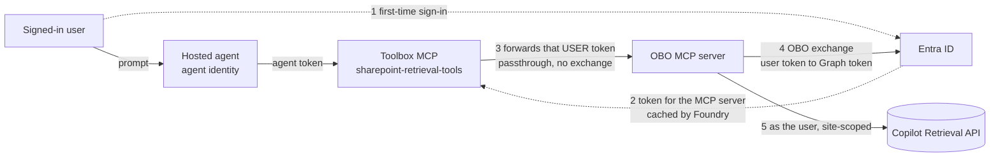

# What this sample demonstrates

A Foundry **hosted agent** that answers questions grounded in **one or more SharePoint sites**,
trimmed to each signed-in user's permissions, and publishes to Microsoft Teams on the Foundry-managed
bot — no custom bot. It reaches SharePoint through this repo's
**[OBO MCP server](obo-mcp-server/README.md)**. Verified end-to-end against a private Foundry
project. Agent Framework, Responses protocol.

## How it works

A hosted container authenticates to Foundry with its **own agent identity** (app-only), which cannot
read a user's SharePoint content. So the agent calls a **Foundry Toolbox** wrapping an **OAuth2
identity-passthrough** connection. Two distinct things happen, and it is worth separating them:

- **Passthrough (Foundry → MCP server).** The user signs in to **Entra** once, which issues a token
  whose audience is the MCP server's own app. Foundry caches that token and forwards it **unchanged**.
  Nothing is exchanged here.
- **Exchange (MCP server → Graph).** That token is only valid for the MCP server, so the server runs a
  real **On-Behalf-Of** exchange (`acquire_token_on_behalf_of`) to obtain a Graph token, then calls the
  **Microsoft 365 Copilot Retrieval API** as that user, scoped by `filterExpression`.

See [`main.py`](agent-framework-agent-with-foundry-toolbox-responses/src/agent-framework-agent-sharepoint-copilot-retrieval/main.py)
and [`obo.py`](obo-mcp-server/server/obo.py).



Sign-in is **interactive tool OAuth consent**, not silent Teams SSO, and each agent gets its own
Foundry-managed bot. In Teams the user sees two prompts on first use: a Foundry sign-in for the agent itself,
then the tool consent above. Publishing uses the repo's native Microsoft 365 route — no bridge
required.

**Private networking.** The two legs lock down independently. Inbound, the Teams route survives
`publicNetworkAccess=Disabled`. Outbound, the Toolbox call to the MCP server is egress, so enabling
the Microsoft 365 route does **not** by itself make the server reachable. The MCP server can run with
no public endpoint at all — see
[hosting it without a public endpoint](obo-mcp-server/README.md#host-it-without-a-public-endpoint).

## Prerequisites

1. The **[OBO MCP server](obo-mcp-server/README.md) deployed** and reachable from your Foundry
   project, with its Entra app registered via
   [`scripts/Register-McpServerApp.ps1`](../../../scripts/Register-McpServerApp.ps1). The
   **SharePoint site(s) this agent can read are set there**, via `SHAREPOINT_SITE_URL` — one URL or
   several separated by commas. The agent passes only a query, so the scope is operator-controlled.
2. An existing Foundry project with a model deployment (e.g. `gpt-4.1`); **Python 3.12+**,
   PowerShell 7+, Azure CLI.
3. **Roles (RBAC):** **Foundry Agent Consumer** at the narrowest supported scope is **sufficient for
   callers** — verified end to end with `Foundry User` removed from the caller at both account and
   project scope. The agent identity separately needs **Foundry User** at project scope for its model
   calls. Do not broaden caller roles to fix a model authorization error.
4. **Licensing:** a **Microsoft 365 Copilot** license per user, or **Retrieval API pay-as-you-go**
   (needs ≥1 Copilot license in the tenant) — otherwise the tool returns `403 … valid license`.
5. **Additional Azure resources:** the `SharePointRetrievalOBO` connection + `sharepoint-retrieval-tools`
   toolbox — created in Option 1.

Placeholders: `<TENANT_ID>`, `<SUBSCRIPTION_ID>`, `<RESOURCE_GROUP>`, `<FOUNDRY_ACCOUNT>`,
`<PROJECT>`, `<GATEWAY_HOST>`, `<GATEWAY_APP_ID>`. Pass the MCP server's client secret from a local
environment variable; never paste it into a command line you keep.

## Option 1: Azure Developer CLI (`azd`)

**Install:** `azd` 1.27.1+, then `azd ext install microsoft.foundry`; sign in with
`azd auth login --tenant-id <TENANT_ID>` and `az login --tenant <TENANT_ID>`.

### Create the connection + toolbox (once)

[`setup/Create-Connection-And-Toolbox.ps1`](setup/Create-Connection-And-Toolbox.ps1) creates the
OAuth2 identity-passthrough connection, registers Foundry's reply URL on the MCP server's app, and
creates the toolbox — the *MCP OAuth Identity Passthrough* scenario from the
[foundry-samples guide](https://github.com/microsoft-foundry/foundry-samples/blob/main/samples/python/hosted-agents/SUPPORTED_TOOLBOX_SCENARIOS/tools/mcp-oauth-custom.md):

```powershell
./setup/Create-Connection-And-Toolbox.ps1 `
  -ProjectEndpoint https://<FOUNDRY_ACCOUNT>.services.ai.azure.com/api/projects/<PROJECT> `
  -GatewayHost <GATEWAY_HOST> -GatewayAppId <GATEWAY_APP_ID> -GatewayClientSecret $env:GATEWAY_CLIENT_SECRET `
  -SubscriptionId <SUBSCRIPTION_ID> -ResourceGroup <RESOURCE_GROUP> `
  -AccountName <FOUNDRY_ACCOUNT> -ProjectName <PROJECT>
```

> Prefer the portal? Create the connection (Tools → custom MCP → OAuth2, Custom OAuth) and the toolbox
> in the Foundry Toolkit instead. Either way Foundry's per-connection reply URL **must** be registered
> on the app, or the first consent fails with a `redirect_uri` mismatch (the script does this).

To run alongside existing resources, pass `-ConnectionName` and `-ToolboxName`. If you rename the
toolbox, set `TOOLBOX_NAME` in
[`azure.yaml`](agent-framework-agent-with-foundry-toolbox-responses/azure.yaml) to match — a mismatch
surfaces as an agent with no tools.

### Initialize and deploy the agent

Confirm the agent, model, connection, and Toolbox all belong to the **same project** before deploying.

```powershell
$PROJECT_ID = "/subscriptions/<SUBSCRIPTION_ID>/resourceGroups/<RESOURCE_GROUP>/providers/Microsoft.CognitiveServices/accounts/<FOUNDRY_ACCOUNT>/projects/<PROJECT>"

azd ai agent init -m agent-framework-agent-with-foundry-toolbox-responses/azure.yaml `
  --project-id $PROJECT_ID --model-deployment gpt-4.1 --no-prompt --force -e sharepoint-retrieval
azd env set enableHostedAgentVNext true -e sharepoint-retrieval
# In the scaffolded agent.yaml, replace any ${{VAR}} with single-brace ${VAR}
azd up -e sharepoint-retrieval
```

### Invoke the deployed agent

```powershell
azd ai agent invoke --new-session "What does our onboarding guide say about MFA setup?" --timeout 120
```

The first call returns an **OAuth consent** URL — approve as a Copilot-licensed user with access to
the site, then re-invoke. To confirm per-user trimming, ask as a user *without* access to a document
and verify it isn't returned.

## Option 2: VS Code (Foundry Toolkit)

1. Install the **Foundry Toolkit** VS Code extension and `az login`.
2. Open `agent-framework-agent-with-foundry-toolbox-responses/`, configure a local Python environment
   with its pinned requirements, then run `azd ai agent run` and chat via **Foundry Toolkit: Open
   Agent Inspector**.
3. Run **Foundry Toolkit: Deploy Hosted Agent** to build, register the version, and assign RBAC.

(The connection + toolbox from Option 1 are still required first.)

## Publish to Teams

The Foundry-managed bot is preserved; publish over the native Microsoft 365 route:

```powershell
./scripts/Publish-AgentToTeams.ps1 -ResourceGroup <RESOURCE_GROUP> `
  -AgentName agent-framework-agent-sharepoint-copilot-retrieval `
  -ProjectEndpoint https://<FOUNDRY_ACCOUNT>.services.ai.azure.com/api/projects/<PROJECT> -UseM365PublicEndpoint
```

For a **public** project, omit `-UseM365PublicEndpoint` — the publish API enables the activity
protocol on its own. If this project still fronts Foundry with API Management, pass
`-ApimName <APIM_NAME>` instead; see the
[archived bridge](../../../deprecated/apim-bridge/README.md). If the identity
already has a bot, reuse its name with `-BotName`. Tenant publication requires admin approval.

Open the agent in Teams, complete consent, and ask. Then repeat the
[two-user checks](../../../guides/verify-per-user-isolation.md) in fresh, separate conversations
before rollout.

## Troubleshooting

| Symptom | Cause / fix |
| --- | --- |
| Agent returns no tools | Toolbox name/`TOOLBOX_NAME` mismatch, or no default version. Check `azd ai toolbox show sharepoint-retrieval-tools`. |
| `HTTP 404` enumerating tools | The MCP server is unreachable from Foundry — if it's on an internal Container Apps environment, its ingress must be `external`. See [private hosting](obo-mcp-server/README.md#host-it-without-a-public-endpoint). |
| Consent URL every call | Consent not completed, or the connection token expired. Complete the consent URL. |
| `401` at the MCP server | Forwarded token isn't OBO-able — check the connection scope (`api://<GATEWAY_APP_ID>/access_as_user`) and that the app issues v2 tokens. |
| `403 … Files.Read.All/Sites.Read.All` | App missing/ungranted Graph delegated permissions — re-run `Register-McpServerApp.ps1`. |
| `403 … valid license` | User isn't Copilot-licensed and Retrieval API paygo isn't enabled — a licensing gate, not code. |
| Startup / readiness fails | Ensure `enableHostedAgentVNext=true` and `AZURE_AI_MODEL_DEPLOYMENT_NAME` matches a real deployment. |
| Still calling the old host after a change | Foundry calls the URL on the **connection**; updating only the toolbox leaves the old address in use. |

## Next steps

- [OBO MCP server setup](obo-mcp-server/README.md) · [without a public endpoint](obo-mcp-server/README.md#host-it-without-a-public-endpoint)
- [Verify per-user isolation](../../../guides/verify-per-user-isolation.md)
- [Microsoft 365 Copilot Retrieval API](https://learn.microsoft.com/microsoft-365/copilot/extensibility/api/ai-services/retrieval/overview)
- [Use a toolbox with a hosted agent](https://learn.microsoft.com/azure/foundry/agents/how-to/tools/use-toolbox-hosted-agent) · [How toolbox authentication works](https://learn.microsoft.com/azure/foundry/agents/how-to/tools/tool-authentication)
- Sibling sample: [Work IQ](../sharepoint-agent-workiq/README.md)
