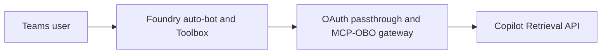

# Per-user SharePoint retrieval from a Teams-published Foundry hosted agent

This sample uses the Microsoft 365 Copilot Retrieval API to answer from a SharePoint site with
**delegated user permissions**, from a Foundry hosted agent on the Responses protocol.

## How it works

| Path | User authentication | Components to operate |
| --- | --- | --- |
| [Path A](pathA/README.md) | Interactive **tool OAuth consent**, brokered by Foundry | Hosted agent, Toolbox connection, MCP-OBO gateway; Foundry auto-bot |

Path A uses [FoundryToolbox](pathA/toolbox-agent/agent-framework-agent-with-foundry-toolbox-responses/src/agent-framework-agent-sharepoint-copilot-retrieval/main.py).
Neither a managed identity nor a user ID alone supplies delegated SharePoint authorization.

> A retired shared-bot variant that used Teams SSO and explicit `x-client-user-token` forwarding is
> kept for reference in [deprecated/pathB](../../../deprecated/pathB/README.md). It is the only
> sample that showed silent SSO and one shared bot across agents, and it is no longer maintained.

## Prerequisites

1. A Foundry project with hosted agents enabled and an available model deployment.
2. A SharePoint site and two user accounts with different access to a known document.
3. Microsoft 365 Copilot licenses or applicable **Retrieval API pay-as-you-go** entitlement. Pay-as-you-go requires at least one Microsoft 365 Copilot license in the tenant.
4. A same-tenant Entra application with delegated Graph permissions and admin consent, as described in the selected path. Admin consent does not grant users additional SharePoint permissions.
5. **Foundry Agent Consumer** for the invoking principal at the narrowest supported agent scope (project scope only when needed); **Foundry User** for the agent identity's project model access.
6. Network access for every hop. The documented starting configuration targets a public Foundry project; private-network operation requires separate validation, and a private endpoint with `publicNetworkAccess=Enabled` does not establish private-only operation.

## Deploy

1. Follow [Path A](pathA/README.md) for component setup and Teams publishing.
2. Complete the [two-user validation checklist](../../../guides/verify-per-user-isolation.md) before rollout. These preview samples are not production certification.

## Troubleshooting

| Symptom | Cause / fix |
| --- | --- |
| Sign-in succeeds but retrieval fails | Check downstream permissions, admin consent, user entitlement, and SharePoint access separately. |
| Foundry rejects the invocation | Check the invoking principal's **Foundry Agent Consumer** assignment; tenant publishing or `BotServiceRbac` is not a substitute for verifying authorization. |
| A user receives another user's content | Stop rollout; inspect authenticated tool identities, retrieval outputs, and user/session separation. Do not rely on citation-link access as the authorization check. |
| Private endpoint exists but traffic uses public access | Validate DNS, routing, and each dependency with the intended public-access settings. |

## Next steps

- [Verify per-user isolation](../../../guides/verify-per-user-isolation.md)
- [Other grounding options](../../../guides/agent-tool-support-matrix.md)
