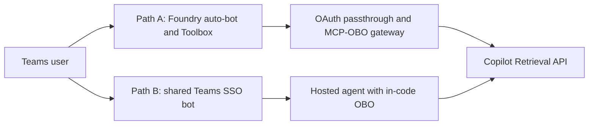

# Per-user SharePoint retrieval from a Teams-published Foundry hosted agent

These samples use the Microsoft 365 Copilot Retrieval API to answer from a SharePoint site with
**delegated user permissions**. Both use a Foundry hosted agent and the Responses protocol; they
differ in how the user's token reaches the retrieval service.

## How it works

| Path | User authentication | Components to operate |
| --- | --- | --- |
| [Path A](pathA/README.md) | Interactive **tool OAuth consent**, brokered by Foundry | Hosted agent, Toolbox connection, MCP-OBO gateway; Foundry auto-bot |
| [Path B](pathB/README.md) | Teams SSO with interactive fallback; explicit `x-client-user-token` forwarding | Hosted agent and one shared Teams bot with multiagent routing |

Path A uses [FoundryToolbox](pathA/toolbox-agent/agent-framework-agent-with-foundry-toolbox-responses/src/agent-framework-agent-sharepoint-copilot-retrieval/main.py).
Path B performs the [OBO exchange inside the hosted agent](pathB/hosted-agent/agent/src/sharepoint-obo-responses/obo.py).
Neither a managed identity nor a user ID alone supplies delegated SharePoint authorization.

## Prerequisites

1. A Foundry project with hosted agents enabled and an available model deployment.
2. A SharePoint site and two user accounts with different access to a known document.
3. Microsoft 365 Copilot licenses or applicable **Retrieval API pay-as-you-go** entitlement. Pay-as-you-go requires at least one Microsoft 365 Copilot license in the tenant.
4. A same-tenant Entra application with delegated Graph permissions and admin consent, as described in the selected path. Admin consent does not grant users additional SharePoint permissions.
5. **Foundry Agent Consumer** for the invoking principal at the narrowest supported agent scope (project scope only when needed); **Foundry User** for the agent identity's project model access.
6. Network access for every hop. Path A targets a public Foundry project; private-network integration requires separate validation. For Path B, a private endpoint with `publicNetworkAccess=Enabled` does not establish private-only operation.

## Deploy

1. Choose [Path A](pathA/README.md) for the Foundry auto-bot and tool consent, or [Path B](pathB/README.md) for shared routing and explicit control of delegated tokens.
2. Follow that path's component setup and Teams publishing instructions.
3. Complete the [two-user validation checklist](../../../guides/per-user-sharepoint-obo-teams-decision-matrix.md#verify-per-user-isolation-either-path) before rollout. These preview samples are not production certification.

## Troubleshooting

| Symptom | Cause / fix |
| --- | --- |
| Sign-in succeeds but retrieval fails | Check downstream permissions, admin consent, user entitlement, and SharePoint access separately. |
| Foundry rejects the invocation | Check the invoking principal's **Foundry Agent Consumer** assignment; tenant publishing or `BotServiceRbac` is not a substitute for verifying authorization. |
| A user receives another user's content | Stop rollout; inspect authenticated tool identities, retrieval outputs, and user/session separation. Do not rely on citation-link access as the authorization check. |
| Private endpoint exists but traffic uses public access | Validate DNS, routing, and each dependency with the intended public-access settings. |

## Next steps

- [Path selection and customer validation](../../../guides/per-user-sharepoint-obo-teams-decision-matrix.md)
- [Other grounding options](../../../guides/agent-tool-support-matrix.md)
