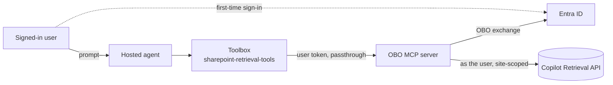

# SharePoint retrieval through an OBO MCP server

> [!NOTE]
> This is a **custom setup** that you host and maintain. For new work, use the
> [SharePoint knowledge base](../sharepoint-knowledge-base/README.md) sample, the recommended route.

An agent on **hosted agents in Foundry Agent Service** that answers from **one or more SharePoint
sites as the signed-in user**, through this
repo's [OBO MCP server](obo-mcp-server/README.md) and the **Microsoft 365 Copilot Retrieval API**.
Published to Teams on the Foundry-managed bot.

## How it works


```mermaid
flowchart LR
    U[Signed-in user] -->|prompt| A[Hosted agent]
    A --> TB[Toolbox<br/>sharepoint-retrieval-tools]
    U -.->|first-time sign-in| E[Entra ID]
    TB -->|user token, passthrough| GW[OBO MCP server]
    GW -->|OBO exchange| E
    GW -->|as the user, site-scoped| RET[(Copilot Retrieval API)]
```

1. The user signs in once. Foundry caches a token for the MCP server's app and forwards it unchanged.
2. The MCP server runs an **On-Behalf-Of** exchange for a Graph token, then calls the Retrieval API as
   the user, scoped to the configured sites.

See [main.py](agent-framework-agent-with-foundry-toolbox-responses/src/agent-framework-agent-sharepoint-copilot-retrieval/main.py)
and [obo.py](obo-mcp-server/server/obo.py).

## Prerequisites

- The [OBO MCP server](obo-mcp-server/README.md) deployed and reachable from Foundry. Its
  `SHAREPOINT_SITE_URL` setting controls which sites the agent can read.
- A Foundry project with a `gpt-4.1` deployment, `azd` 1.27.1+ with
  `azd ext install microsoft.foundry`, and PowerShell 7+.
- **Foundry Agent Consumer** for users, and **Foundry User** for the agent identity.
- A **Microsoft 365 Copilot** licence per user, or Retrieval API pay-as-you-go.

## Deploy

1. Create the OAuth2 identity-passthrough connection and toolbox with
   [Create-Connection-And-Toolbox.ps1](setup/Create-Connection-And-Toolbox.ps1). It also registers
   Foundry's redirect URI on the MCP server's app:

   ```powershell
   ./setup/Create-Connection-And-Toolbox.ps1 `
     -ProjectEndpoint https://<FOUNDRY_ACCOUNT>.services.ai.azure.com/api/projects/<PROJECT> `
     -GatewayHost <GATEWAY_HOST> -GatewayAppId <GATEWAY_APP_ID> -GatewayClientSecret $env:GATEWAY_CLIENT_SECRET `
     -SubscriptionId <SUBSCRIPTION_ID> -ResourceGroup <RESOURCE_GROUP> `
     -AccountName <FOUNDRY_ACCOUNT> -ProjectName <PROJECT>
   ```

   If you rename the toolbox with `-ToolboxName`, set `TOOLBOX_NAME` in
   [azure.yaml](agent-framework-agent-with-foundry-toolbox-responses/azure.yaml) to match.

2. Deploy the agent:

   ```powershell
   $PROJECT_ID = "/subscriptions/<SUBSCRIPTION_ID>/resourceGroups/<RESOURCE_GROUP>/providers/Microsoft.CognitiveServices/accounts/<FOUNDRY_ACCOUNT>/projects/<PROJECT>"

   azd ai agent init -m agent-framework-agent-with-foundry-toolbox-responses/azure.yaml `
     --project-id $PROJECT_ID --model-deployment gpt-4.1 --no-prompt --force -e sharepoint-retrieval
   azd env set enableHostedAgentVNext true -e sharepoint-retrieval
   azd up -e sharepoint-retrieval
   ```

   In the scaffolded `agent.yaml`, replace any `${{VAR}}` with `${VAR}` before `azd up`.

3. Test it. The first call returns a consent URL; approve as a licensed user, then call again:

   ```powershell
   azd ai agent invoke --new-session "What does our onboarding guide say about MFA setup?" --timeout 120
   ```

## Publish to Teams

From the repository root:

```powershell
./scripts/Publish-AgentToTeams.ps1 -ResourceGroup <RESOURCE_GROUP> `
  -AgentName agent-framework-agent-sharepoint-copilot-retrieval `
  -ProjectEndpoint https://<FOUNDRY_ACCOUNT>.services.ai.azure.com/api/projects/<PROJECT> -UseM365PublicEndpoint
```

In Teams, users see a Foundry sign-in and then the tool consent on first use. Run the
[two-user checklist](../../../guides/verify-per-user-isolation.md) before rollout.

## Learn more

- [OBO MCP server](obo-mcp-server/README.md)
- [Microsoft 365 Copilot Retrieval API](https://learn.microsoft.com/microsoft-365/copilot/extensibility/api/ai-services/retrieval/overview)
- [How toolbox authentication works](https://learn.microsoft.com/azure/foundry/agents/how-to/tools/tool-authentication)
