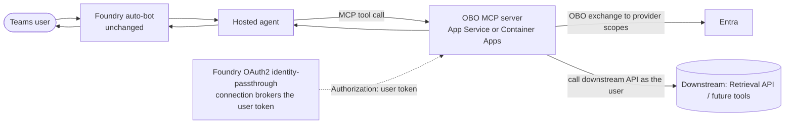

# OBO MCP server for delegated SharePoint retrieval

A **lightweight, provider‑pluggable MCP server** that gives a **hosted** Foundry agent **per‑user
(OBO)** access to downstream APIs while **keeping the Foundry auto‑published Teams bot** (no custom
bot to build or maintain). Foundry brokers the user's token through an **OAuth2 identity-passthrough**
connection, and the gateway exchanges it for a delegated Microsoft Graph token. The included provider
calls the **Copilot Retrieval API**, using a configured SharePoint site filter.

## How it works



1. Foundry forwards the **user's OAuth token** to the gateway as `Authorization` (identity passthrough).
2. The gateway **verifies** that token (audience = gateway app, tenant issuer, `access_as_user` scope)
   before any tool runs — a token minted for another resource is rejected.
3. On each tool call it does **OBO** → a downstream token for the scopes that provider needs.
4. The provider calls the downstream API **as the user** (permission-trimmed) and returns results.

The [server entry point](server/app.py) enforces inbound token verification before calling the
[OBO client](server/obo.py). The [retrieval provider](server/providers/copilot_retrieval.py) supplies
the downstream scopes and site filter. Other providers require their own delegated-access and
authorization review; behavior of unrelated connections is not implied.

### Extending the gateway

Implement the [provider contract](server/providers/base.py) in a provider module and add its name
to `ENABLED_PROVIDERS`. Use `register(mcp, exchange)` and request trusted, resource-specific scopes
through `exchange`; do not accept arbitrary downstream scopes or destinations from model input.
Add only necessary delegated permissions to the app, obtain admin consent, and repeat two-user
validation for each new provider.

## Prerequisites

1. A same-tenant Entra app exposing `access_as_user` and issuing version-2 access tokens for the
  gateway audience. Use [scripts/Register-McpServerApp.ps1](../../../../scripts/Register-McpServerApp.ps1)
  to configure the app; review its parameters before running it.
2. Delegated Microsoft Graph **Files.Read.All** and **Sites.Read.All** permissions with tenant
  admin consent. Admin consent does not grant additional SharePoint access to users.
3. A confidential-client credential: a securely stored client secret, or a configured managed-identity
  federated credential. These credentials authenticate the gateway, not the end user.
4. Microsoft 365 Copilot licenses for users or **Retrieval API pay-as-you-go** entitlement, which
  requires at least one Microsoft 365 Copilot license in the tenant.
5. A host reachable by the Foundry Toolbox service over HTTPS, and gateway egress to Entra and Graph.
  A host in the agent's VNet is not sufficient by itself to prove Toolbox reachability. Private-only
  gateway/Foundry integration requires separate network validation.
6. A SharePoint site and two users with different access to a known document for customer validation.

Placeholders used below: `<GATEWAY_HOST>`, `<TENANT_ID>`, `<GATEWAY_APP_ID>`.

## Deploy

### Configure and host the server

Use [server/Dockerfile](server/Dockerfile) and [server/requirements.txt](server/requirements.txt) to
build the server image for App Service or Container Apps. Configure the host's ingress for port
`8000` (or `PORT`) and publish the HTTPS MCP endpoint at `/mcp/`. Keep secrets in the host's secret
store or Key Vault references; do not embed them in the image or source control.

| Variable | Value / purpose |
| --- | --- |
| `GATEWAY_TENANT_ID` / `GATEWAY_CLIENT_ID` | Gateway app tenant and client ID |
| `GATEWAY_CLIENT_SECRET` | Secret-store reference for confidential-client OBO; leave empty only for configured federation |
| `GATEWAY_MI_CLIENT_ID` | User-assigned managed identity client ID for federation; omit to use the host's default identity |
| `VERIFY_TOKENS` | Keep `true` for deployed endpoints |
| `REQUIRED_SCOPES` | `access_as_user` |
| `SERVER_URL` | `https://<GATEWAY_HOST>` for protected-resource metadata |
| `ENABLED_PROVIDERS` | `whoami,copilot_retrieval`; restrict diagnostics to authorized users |
| `SHAREPOINT_SITE_URL` | One site URL, or several separated by commas; leaving it empty removes the site filter |
| `RETRIEVAL_API_URL` | `https://graph.microsoft.com/v1.0/copilot/retrieval` |
| `MAX_RESULTS` | Retrieval result cap; default `10` |

### Scoping retrieval to one or more sites

`SHAREPOINT_SITE_URL` accepts a comma-separated list. The provider joins the entries with KQL `OR`,
so one agent can span several sites through a **single** tool, connection, and consent prompt:

```bash
SHAREPOINT_SITE_URL=https://contoso.sharepoint.com/sites/HR,https://contoso.sharepoint.com/sites/Policies
```

The tool accepts only a query, so the scope stays operator-controlled — a prompt cannot widen it.
The gateway logs its effective scope on startup; watch for this line, because an empty value is
valid and silently searches every site the signed-in user can access:

```text
copilot_retrieval scope: NO site filter - retrieval spans every SharePoint site ...
```

Path filters break silently if a site is renamed or moved, returning no results rather than an
error. Where that matters, filter on site IDs instead — see the
[filterExpression reference](https://learn.microsoft.com/microsoft-365/copilot/extensibility/api/ai-services/retrieval/copilotroot-retrieval#examples).

### Host it without a public endpoint

Agent Service supports
[private MCP server endpoints](https://learn.microsoft.com/azure/foundry/agents/how-to/tools/model-context-protocol#public-and-private-mcp-server-endpoints),
so this server can run with no public entry point. It needs Standard Agent Setup with
[private networking](https://learn.microsoft.com/azure/foundry/agents/how-to/virtual-networks). The
commands below were verified end to end against a project with `publicNetworkAccess=Disabled`;
substitute `<VNET>`, `<RESOURCE_GROUP>`, and your own names.

A **dedicated MCP subnet**, separate from the agent subnet:

```bash
az network vnet subnet create -n mcp-subnet --vnet-name <VNET> -g <RESOURCE_GROUP> \
  --address-prefixes 192.168.4.0/23 --delegations Microsoft.App/environments
```

A Container Apps environment **injected into that subnet**. A VNet is fixed at environment creation,
so an existing public environment cannot be converted — create a new one:

```bash
az containerapp env create -n cae-mcp-private -g <RESOURCE_GROUP> --location <REGION> \
  --infrastructure-subnet-resource-id <MCP_SUBNET_ID> --internal-only true
```

**Private DNS** so the agent subnet resolves the environment's default domain. Azure does not create
this for you:

```bash
az network private-dns zone create -g <RESOURCE_GROUP> -n <ENV_DEFAULT_DOMAIN>
az network private-dns record-set a add-record -g <RESOURCE_GROUP> -z <ENV_DEFAULT_DOMAIN> -n '*' -a <ENV_STATIC_IP>
az network private-dns link vnet create -g <RESOURCE_GROUP> -z <ENV_DEFAULT_DOMAIN> \
  -n link-agent-vnet -v <VNET> -e false
```

Then deploy the server with **`--ingress external`** on that internal environment:

```bash
az containerapp create -n obo-mcp-server -g <RESOURCE_GROUP> --environment cae-mcp-private \
  --image <ACR>/obo-mcp-server:v1 --target-port 8000 --ingress external \
  --system-assigned --registry-server <ACR> --registry-identity system
```

> [!IMPORTANT]
> On an internal environment, `--ingress external` means **VNet-facing, not internet-facing** — the
> environment's load balancer holds a private IP in your subnet and the FQDN stays absent from public
> DNS. Use `--ingress internal` and the app is reachable only from *inside* the environment's own
> service mesh: Foundry sits outside it, so tool discovery fails with `HTTP 404` from the load
> balancer while the container reports healthy and serves correctly on localhost.

`--ingress external` also drops the `.internal.` label from the FQDN. Point `SERVER_URL`, the
connection `target`, and the toolbox `server_url` at the final name, and remember Foundry calls the
URL on the **connection** — updating only the toolbox leaves the old address in use.

The server still needs **egress** to `login.microsoftonline.com` for the OBO exchange and to the
Retrieval API. Consent is unaffected: the connection's authorize and token URLs point at Entra ID, so
no browser ever needs to reach this server.

| Symptom | Cause / fix |
| --- | --- |
| `HTTP 404` enumerating tools, container healthy | App on `--ingress internal`; switch to `external` |
| Connection/DNS error from Foundry | Missing private DNS zone, wildcard record, or VNet link |
| Still calling the old host after a change | Connection `target` not updated; the toolbox alone is not enough |

### Create the connection and Toolbox

Follow the [agent setup](../README.md) to create the OAuth2
identity-passthrough connection and register its generated redirect URI on the gateway app.

| Connection field | Value |
| --- | --- |
| MCP endpoint | `https://<GATEWAY_HOST>/mcp/` |
| Authorization URL | `https://login.microsoftonline.com/<TENANT_ID>/oauth2/v2.0/authorize` |
| Token URL | `https://login.microsoftonline.com/<TENANT_ID>/oauth2/v2.0/token` |
| OAuth client | Gateway app ID and securely supplied client secret |
| Scopes | `api://<GATEWAY_APP_ID>/access_as_user` and `offline_access` |

The [hosted agent](../README.md) uses **`FoundryToolbox` + `ResponsesHostServer`**,
not a raw MCP client or local header-based OBO. Its Toolbox configuration refers to
`SharePointRetrievalOBO`; the SDK forwards the platform call context and handles consent with the
hosting integration. Tool approval (`require_approval`) and OAuth consent are separate: setting
tool approval to `never` does **not** remove the user's OAuth consent requirement.

### Validate user identity and retrieval

Use the [two-user validation checklist](../../../../guides/verify-per-user-isolation.md).
As each user, call `whoami` and inspect the actual tool output, then call `sharepoint_retrieve`
with the same document-specific query. The no-access user must receive no protected extracts or summary.
The [per-user gateway client](client/validate_mcp_server_user.py) is a direct control; it does not
replace validation through Teams and Toolbox. Keep bearer tokens out of diagnostics.

### Operational safeguards

- Keep token verification enabled and reject invalid issuer, audience, expiry, or scopes.
- Review token-cache isolation and credential rotation; do not treat caching as proof of user isolation.
- For secretless gateway OBO, configure a federated credential matching the managed identity's token
  issuer, subject, and token-exchange audience. This does not remove the OAuth connection's own
  confidential-client credential requirement.
- Restrict diagnostic access, redact sensitive errors and headers, and add appropriate rate limiting
  and browser-origin protections for your hosting model.
- MCP/OAuth integrations include preview features. This sample requires security and operational review
  before production use.

## Publish to Teams

Publish the [hosted agent](../README.md#publish-to-teams), not the gateway. The auto-bot
can surface **tool OAuth consent**; this is not silent Teams SSO. Validate private-network changes
separately from the public-project starting configuration.

## Troubleshooting

| Symptom | Cause / fix |
| --- | --- |
| `401` before a tool runs | Check issuer, gateway audience, token version, expiry, and `access_as_user`. Do not disable token verification to bypass the error. |
| `AADSTS65001` | Check delegated permissions and tenant admin consent for the gateway app. |
| Redirect URI mismatch | Register the connection's exact generated redirect URI on the gateway app. |
| `403` from Graph | Check delegated scopes, consent, user entitlement, and SharePoint permissions separately; a `403` alone does not prove trimming. |
| No hits for either user | Check the configured site filter and use a query matching an indexed document. Establish a positive control first. |
| Toolbox cannot connect | Validate the service's route to the gateway plus gateway egress to Entra and Graph; APIM's inbound route is separate. |

## Next steps

- [Hosted agent](../README.md)
- [Verify per-user isolation](../../../../guides/verify-per-user-isolation.md)
- [Copilot Retrieval API](https://learn.microsoft.com/microsoft-365/copilot/extensibility/api/ai-services/retrieval/overview)
