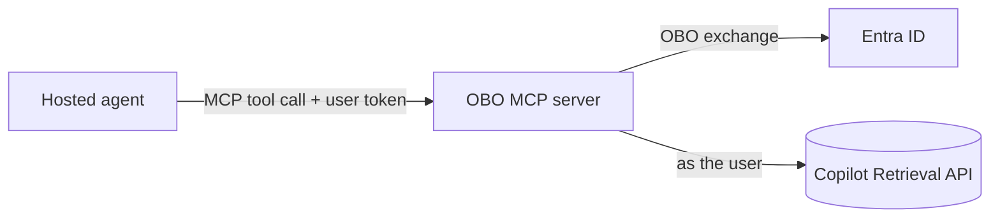

# OBO MCP server

A lightweight MCP server that gives a hosted Foundry agent **per-user (On-Behalf-Of)** access to
SharePoint through the **Copilot Retrieval API**. Used by the
[SharePoint retrieval](../README.md) sample.

## How it works


```mermaid
flowchart LR
    AG[Hosted agent] -->|MCP tool call + user token| GW[OBO MCP server]
    GW -->|OBO exchange| E[Entra ID]
    GW -->|as the user| D[(Copilot Retrieval API)]
```

1. Foundry forwards the user's token to the server through an OAuth2 identity-passthrough connection.
2. The server verifies it (audience, issuer, `access_as_user` scope) before any tool runs.
3. It exchanges the token for a delegated Graph token and calls the Retrieval API as the user.

Code: [app.py](server/app.py) (token verification), [obo.py](server/obo.py) (exchange), and
[copilot_retrieval.py](server/providers/copilot_retrieval.py) (retrieval and site filter). To add a
provider, implement the [provider contract](server/providers/base.py) and add it to
`ENABLED_PROVIDERS`.

## Prerequisites

- An Entra app exposing `access_as_user` with v2 tokens, delegated Graph **Files.Read.All** and
  **Sites.Read.All**, and admin consent. Create it with
  [Register-McpServerApp.ps1](../../../../scripts/Register-McpServerApp.ps1).
- A client secret or managed-identity federated credential for the app.
- A **Microsoft 365 Copilot** licence per user, or Retrieval API pay-as-you-go.
- A host such as Azure Container Apps that Foundry can reach over HTTPS, with egress to Entra and Graph.

## Deploy

1. Build [server/Dockerfile](server/Dockerfile) and host it on port `8000`. The MCP endpoint is
   `https://<GATEWAY_HOST>/mcp/`. Keep secrets in the host's secret store.

2. Set these environment variables:

   | Variable | Value |
   | --- | --- |
   | `GATEWAY_TENANT_ID` / `GATEWAY_CLIENT_ID` | Gateway app tenant and client ID |
   | `GATEWAY_CLIENT_SECRET` | Secret reference; leave empty when using federation |
   | `GATEWAY_MI_CLIENT_ID` | User-assigned managed identity for federation (optional) |
   | `VERIFY_TOKENS` | `true` |
   | `REQUIRED_SCOPES` | `access_as_user` |
   | `SERVER_URL` | `https://<GATEWAY_HOST>` |
   | `ENABLED_PROVIDERS` | `whoami,copilot_retrieval` |
   | `SHAREPOINT_SITE_URL` | One or more site URLs, comma-separated. Empty searches every site the user can access. |
   | `RETRIEVAL_API_URL` | `https://graph.microsoft.com/v1.0/copilot/retrieval` |
   | `MAX_RESULTS` | Result cap, default `10` |

3. Create the Foundry connection and toolbox from the [SharePoint retrieval](../README.md) sample.
   The connection uses:

   | Field | Value |
   | --- | --- |
   | MCP endpoint | `https://<GATEWAY_HOST>/mcp/` |
   | Authorization URL | `https://login.microsoftonline.com/<TENANT_ID>/oauth2/v2.0/authorize` |
   | Token URL | `https://login.microsoftonline.com/<TENANT_ID>/oauth2/v2.0/token` |
   | Scopes | `api://<GATEWAY_APP_ID>/access_as_user offline_access` |

## Host it without a public endpoint

Agent Service supports
[private MCP server endpoints](https://learn.microsoft.com/azure/foundry/agents/how-to/tools/model-context-protocol#public-and-private-mcp-server-endpoints)
with Standard Agent Setup and
[private networking](https://learn.microsoft.com/azure/foundry/agents/how-to/virtual-networks).

1. Create a dedicated subnet for the server, separate from the agent subnet:

   ```bash
   az network vnet subnet create -n mcp-subnet --vnet-name <VNET> -g <RESOURCE_GROUP> \
     --address-prefixes 192.168.4.0/23 --delegations Microsoft.App/environments
   ```

2. Create an internal Container Apps environment in that subnet:

   ```bash
   az containerapp env create -n cae-mcp-private -g <RESOURCE_GROUP> --location <REGION> \
     --infrastructure-subnet-resource-id <MCP_SUBNET_ID> --internal-only true
   ```

3. Add private DNS for the environment's default domain and link it to the VNet:

   ```bash
   az network private-dns zone create -g <RESOURCE_GROUP> -n <ENV_DEFAULT_DOMAIN>
   az network private-dns record-set a add-record -g <RESOURCE_GROUP> -z <ENV_DEFAULT_DOMAIN> -n '*' -a <ENV_STATIC_IP>
   az network private-dns link vnet create -g <RESOURCE_GROUP> -z <ENV_DEFAULT_DOMAIN> \
     -n link-agent-vnet -v <VNET> -e false
   ```

4. Deploy the server with `--ingress external`:

   ```bash
   az containerapp create -n obo-mcp-server -g <RESOURCE_GROUP> --environment cae-mcp-private \
     --image <ACR>/obo-mcp-server:v1 --target-port 8000 --ingress external \
     --system-assigned --registry-server <ACR> --registry-identity system
   ```

> [!IMPORTANT]
> On an internal environment, `--ingress external` is **VNet-facing, not internet-facing**. With
> `--ingress internal`, Foundry cannot reach the app. Point `SERVER_URL` and the connection `target`
> at the final FQDN.

## Verify

Run the [two-user checklist](../../../../guides/verify-per-user-isolation.md). As each user, call
`whoami`, then `sharepoint_retrieve` with the same query. The user without access must receive no
content. [validate_mcp_server_user.py](client/validate_mcp_server_user.py) tests the server directly.

## Security notes

- Keep `VERIFY_TOKENS=true`. Invalid issuer, audience, expiry, or scope is rejected.
- The tool accepts only a query, so a prompt cannot widen the site scope.
- MCP OAuth integrations are in preview. Review the sample before production use.
