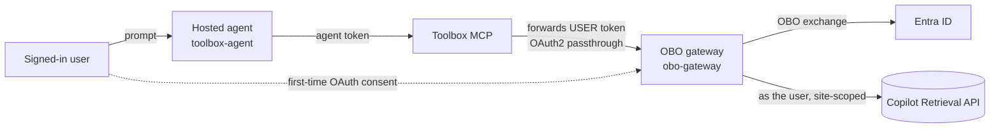

# Path A — Foundry Toolbox OAuth identity-passthrough (Foundry-managed sign-in)

The native auto-bot path. A Foundry **hosted agent** (Agent Framework) uses a **Foundry Toolbox**
wrapping an **OAuth2 identity-passthrough connection** to an **OBO gateway**. Foundry renders an
"Open sign-in link" consent card in Teams and brokers the token server-side; it keeps the Foundry
auto-bot (no custom bot). This is **tool OAuth consent**, not silent Teams SSO.

## How it works

The [agent source](toolbox-agent/agent-framework-agent-with-foundry-toolbox-responses/src/agent-framework-agent-sharepoint-copilot-retrieval/main.py)
uses the official **`FoundryToolbox` + `ResponsesHostServer`** integration. Path A does **not** use
`x-client-user-token` or a local OBO fallback in the hosted agent; the gateway owns the OBO exchange.

The connection is named `SharePointRetrievalOBO` and the Toolbox is `sharepoint-retrieval-tools`.
Keep the agent, connection, Toolbox, and model bound to the same intended project.

### Components

| Folder | Role |
| --- | --- |
| [toolbox-agent/](toolbox-agent/README.md) | The Foundry hosted agent (MAF) using a Toolbox OAuth2 identity-passthrough connection. |
| [obo-gateway/](obo-gateway/README.md) | The MCP-OBO gateway the Toolbox connection calls — does the OBO + Copilot Retrieval. |

## Prerequisites

1. An existing Foundry project, hosted-agent support, and a model deployment.
2. A reachable MCP-OBO gateway with token verification enabled and a site URL configured.
3. Delegated Graph `Files.Read.All` and `Sites.Read.All` permissions on the gateway app, with admin consent.
4. Microsoft 365 Copilot user licenses or Retrieval API pay-as-you-go entitlement, including its
  tenant license prerequisite.
5. **Foundry Agent Consumer** for callers at the narrowest supported agent/project scope, and
  **Foundry User** for the agent identity's model access at project scope. Do not assume
  tenant publication or `BotServiceRbac` removes caller authorization requirements.

## Deploy

1. Follow the [gateway setup](obo-gateway/README.md).
2. Create the connection and Toolbox, then deploy the [hosted agent](toolbox-agent/README.md).
3. Use a **public** Foundry project for the documented starting configuration. Private-network/APIM
  operation is outside this sample's validated scope and requires separate integration validation;
  the inbound APIM bridge does not establish outbound Toolbox-to-gateway reachability.

## Publish to Teams

Follow the [agent publishing instructions](toolbox-agent/README.md#publish-to-teams). Each user
completes tool OAuth consent as required. Tool approval settings do not replace consent.

Before rollout, complete the [two-user validation checklist](../../../../guides/per-user-sharepoint-obo-teams-decision-matrix.md#verify-per-user-isolation-either-path):
check actual tool identities, a positive retrieval control, and a no-access negative control in
separate user sessions. Gateway-direct checks alone do not validate the Teams/Toolbox path.

## Troubleshooting

| Symptom | Cause / fix |
| --- | --- |
| Consent fails | Check the connection's redirect URI, requested scope, and gateway app configuration. |
| Gateway cannot be reached | Check Toolbox service reachability separately from Teams-to-Foundry networking. |
| Tool identity or retrieved content does not match the caller | Stop rollout and inspect the consent account, authenticated tool identity, and session boundaries. |
| More tools or agents need OBO | Reuse the gateway only for APIs supporting delegated access; review each provider's permissions and user isolation. |

## Next steps

- Choose **Path A** when native auto-bot + tool consent is suitable; follow the
  [agent setup](toolbox-agent/README.md) and [gateway setup](obo-gateway/README.md).
- Choose **[Path B](../pathB/README.md)** for a shared bot, multiagent routing, or explicit user-token control.
- Repeat the [two-user checks](../../../../guides/per-user-sharepoint-obo-teams-decision-matrix.md#verify-per-user-isolation-either-path)
  in your target environment before rollout.
