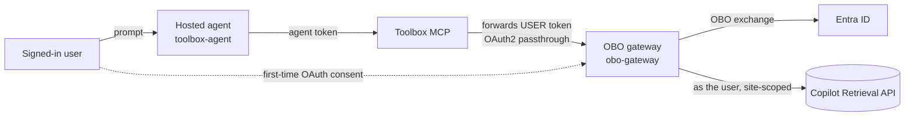

# Path A — Foundry Toolbox OAuth identity-passthrough (Foundry-managed sign-in)

The most "native" path. A Foundry **hosted agent** (Agent Framework) uses a **Foundry Toolbox**
wrapping an **OAuth2 identity-passthrough connection** to an **OBO gateway**. Foundry renders an
"Open sign-in link" consent card in Teams and brokers the token server-side; it keeps the Foundry
auto-bot (no custom bot) and publishes via the APIM bridge.

> ⚠️ **Not per-user in testing.** A `whoami` tool returned the **first-consented (admin)** identity
> even when a different user was chatting, so that user saw the admin's content. Treat this as a
> **shared-token** result until you verify per-user isolation for your tenant — see the ICM draft in
> [`docs/ICM-toolbox-shared-token.md`](../../../../docs/ICM-toolbox-shared-token.md).

## Architecture

## Components

| Folder | Role |
| --- | --- |
| [`toolbox-agent/`](toolbox-agent/README.md) | The Foundry hosted agent (MAF) using a Toolbox OAuth2 identity-passthrough connection. |
| [`obo-gateway/`](obo-gateway/README.md) | The MCP-OBO gateway the Toolbox connection calls — does the OBO + Copilot Retrieval. |

See the [decision matrix](../../../../guides/per-user-sharepoint-obo-teams-decision-matrix.md) for how
this compares to Path B.
