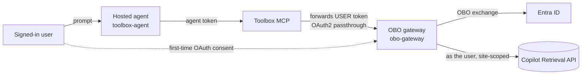

# Path A — Foundry Toolbox OAuth identity-passthrough (Foundry-managed sign-in)

The most "native" path. A Foundry **hosted agent** (Agent Framework) uses a **Foundry Toolbox**
wrapping an **OAuth2 identity-passthrough connection** to an **OBO gateway**. Foundry renders an
"Open sign-in link" consent card in Teams and brokers the token server-side; it keeps the Foundry
auto-bot (no custom bot) and publishes via the APIM bridge.

> ⚠️ **Not per-user in testing.** A `whoami` tool returned the **first-consented (admin)** identity
> even when a different user was chatting, so that user saw the admin's content. Treat this as a
> **shared-token** result until you verify per-user isolation for your tenant — see the
> [decision matrix](../../../../guides/per-user-sharepoint-obo-teams-decision-matrix.md) for the
> full comparison and the recommended per-user path (Path B).

## Architecture

## Components

| Folder | Role |
| --- | --- |
| [`toolbox-agent/`](toolbox-agent/README.md) | The Foundry hosted agent (MAF) using a Toolbox OAuth2 identity-passthrough connection. |
| [`obo-gateway/`](obo-gateway/README.md) | The MCP-OBO gateway the Toolbox connection calls — does the OBO + Copilot Retrieval. |

## Scaling to many agents and tools

The gateway is the **centralized OBO broker** shape you grow into when many agents and tools need
per-user OBO — it puts the OBO app secret, downstream permissions, token caching, and per-user audit
in one place. **Per-user is only preserved if the gateway receives the real signed-in user's token**
(Path B's `x-client-user-token`), not the Toolbox's first-consented token. For the full scaling model,
workflow, and the add-an-agent / add-a-tool steps, see the **Scaling** section in
[`../pathB`](../pathB/README.md#scaling-to-many-agents-and-tools).

## Roadmap — does Path A become verified per-user? (Sept 2026)

Foundry engineering (William Baumann) confirmed a **native Teams/M365 SSO flow is in progress — a top
priority, ~4–6 weeks out** — that "will naturally connect to tool OAuth." That is exactly what Path A
needs: a hosted agent published to Teams would get the **real signed-in user's** token flowing into the
Toolbox OAuth passthrough, **without a custom bot**. So Path A's core blocker is **expected to be
resolved** by this change — at which point Path B's custom bot becomes unnecessary for most cases.

**"Fully works" is not guaranteed by that one change**, though — these are separate, still-open items:

- **Token-sharing bug (ICM pending).** The first-consented/admin token we observed is a **bug**, not by
  design ("file an ICM if we're incorrectly caching tokens"). Tracked separately; the SSO work may fix
  it, but confirm with a two-user `whoami` check before relying on it.
- **RBAC still required in testing.** PG says role assignments should be avoidable with the
  **`BotServiceRbac`** (tenant-wide) auth policy, but in testing RBAC was **still required** even after
  setting `BotServiceRbac`/`BotServiceTenant` — unresolved, ICM pending.
- **Config gates remain regardless:** **admin consent** on the OBO/gateway app and a **Copilot /
  Retrieval API license** per user.

Until those close, **Path B is the verified per-user answer today**; re-test Path A once native SSO
ships. See the [decision-matrix roadmap](../../../../guides/per-user-sharepoint-obo-teams-decision-matrix.md#product-group-guidance--roadmap-sept-2026).

See the [decision matrix](../../../../guides/per-user-sharepoint-obo-teams-decision-matrix.md) for how
this compares to Path B.
