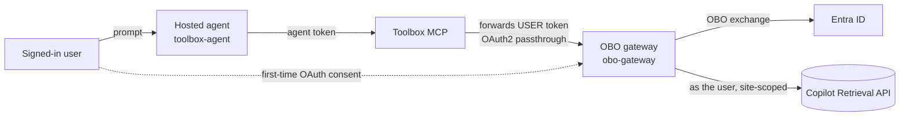
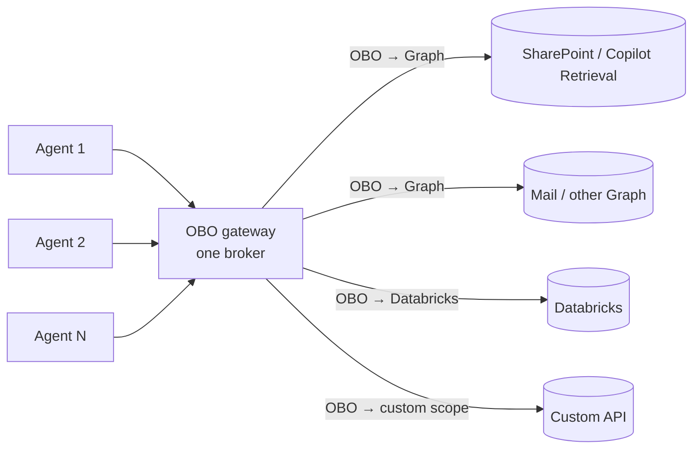

# Path A — Foundry Toolbox OAuth identity-passthrough (Foundry-managed sign-in)

The most "native" path. A Foundry **hosted agent** (Agent Framework) uses a **Foundry Toolbox**
wrapping an **OAuth2 identity-passthrough connection** to an **OBO gateway**. Foundry renders an
"Open sign-in link" consent card in Teams and brokers the token server-side; it keeps the Foundry
auto-bot (no custom bot) and publishes via the APIM bridge.

> ⚠️ **Not per-user in testing.** A `whoami` tool returned the **first-consented (admin)** identity
> even when a different user was chatting, so that user saw the admin's content. Treat this as a
> **shared-token** result until you verify per-user isolation for your tenant — see the
> [decision matrix](../../../../guides/per-user-sharepoint-obo-teams-decision-matrix.md) for the
> full comparison and the recommended per-user path (Path B).

## Architecture

## Components

| Folder | Role |
| --- | --- |
| [`toolbox-agent/`](toolbox-agent/README.md) | The Foundry hosted agent (MAF) using a Toolbox OAuth2 identity-passthrough connection. |
| [`obo-gateway/`](obo-gateway/README.md) | The MCP-OBO gateway the Toolbox connection calls — does the OBO + Copilot Retrieval. |

## Scaling to many agents and tools

The gateway is the **centralized OBO broker**: per-user token exchange lives in **one place** instead
of being re-implemented in every agent. Two things scale independently — the number of **agents** and
the number of **tools** — because one SSO token (`aud` = the OBO app) can be exchanged (OBO) into
**many** downstream tokens, as long as the OBO app holds each delegated permission (admin-consented
once).

### Workflow

1. The shared Teams bot (or Foundry sign-in) obtains the **user token** once (`aud` = OBO app).
2. Each agent forwards that token to the **gateway** (never re-implementing OBO itself).
3. Per tool, the gateway does an **OBO exchange** — user token → the tool's resource token — and calls
   the tool **as the user**; each downstream trims to the user's permissions.
4. A multi-tool turn = several OBO exchanges in the gateway, one per resource.

### Adding an agent vs. a tool

| To add… | Do this (one-time) |
| --- | --- |
| **An agent** (same tools) | Deploy it; point it at the gateway; grant the bot MI **Foundry Agent Consumer** on the agent and the agent instance identity **Foundry User** on the project. Reuse the gateway, OBO app, and SSO connection. |
| **A tool** (e.g. mail, Databricks, a custom API) | Add the downstream **delegated permission** to the OBO app and admin-consent it; add one OBO exchange + tool route in the gateway. Every agent attached to the gateway gets it. |

### What the gateway centralizes

- **Secrets** — one identity holds the OBO app credential (store in `Key Vault` + managed identity, or
  use workload-identity federation for **no** secret).
- **Permissions** — add a tool once, not in N agents.
- **Token caching** — a per-user MSAL cache → fewer Entra round-trips and lower latency.
- **Audit** — a single choke point to log per-user tool access.

### Constraints

- **Per-user is only real if the gateway receives the actual signed-in user's token.** In testing the
  Toolbox OAuth2 passthrough fed a **shared (first-consented)** token — so for **verified** per-user,
  forward the user token explicitly (the `x-client-user-token` mechanism from **Path B**) into this
  same gateway.
- **One Entra tenant** — cross-tenant OBO is not supported.
- **Each downstream must support delegated (OBO) access** — pure app-only APIs don't fit.
- **OBO app blast radius** — one app accruing many delegated permissions is a concentration risk;
  rotate its secret, prefer federated credentials, and scope least-privilege (or split gateways by
  data-sensitivity domain).
- **Long-term** — Microsoft's **native Teams/M365 SSO for hosted agents** will remove the shim bot;
  keep agents loosely coupled to the front door so it can slot in later.

See the [decision matrix](../../../../guides/per-user-sharepoint-obo-teams-decision-matrix.md) for how
this compares to Path B.
