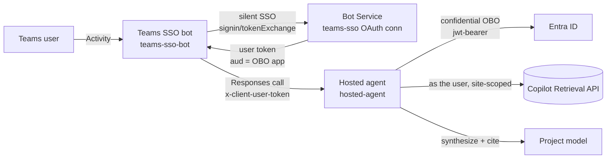
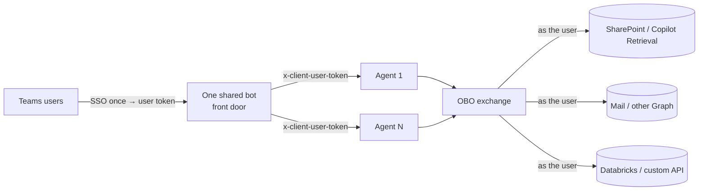

# Path B — Shared Teams bot + `x-client-user-token` (verified per-user)

The **recommended** path. A single shared Teams **bot** does Teams SSO, then forwards the signed-in
user's token to a Foundry **hosted agent** on the `x-client-user-token` header. The agent does the
On-Behalf-Of exchange **in its own code** and calls the Microsoft 365 Copilot Retrieval API **as the
user**, site-scoped — so results are permission-trimmed per caller.

**Verified per-user:** `admin` gets the document; `testuser` (no access) gets "No matching content."
Same agent, same query — only the forwarded token differs.

## Architecture

## Components

| Folder | Role |
| --- | --- |
| [`teams-sso-bot/`](teams-sso-bot/README.md) | The Teams front door — a real Bot Framework endpoint that does Teams SSO and forwards the user's token. |
| [`hosted-agent/`](hosted-agent/README.md) | The Foundry hosted agent — reads `x-client-user-token`, does in-code OBO, calls Copilot Retrieval, synthesizes a cited answer. |

**Why two components:** only a real Bot endpoint can receive the Teams sign-in token (a Foundry
hosted agent can't); the hosted agent uses that token to do the OBO. Bot = gets the token, agent =
uses it. Neither works alone. This path does **not** use an MCP-OBO gateway.

## Scaling to many agents and tools

Two things scale independently — the number of **agents** and the number of **tools** — because one
Teams-SSO token (`aud` = the OBO app) can be exchanged (OBO) into **many** downstream tokens, as long
as the OBO app holds each delegated permission (admin-consented once). The **one shared bot already
fronts many agents**; you never add a bot per agent.

### Workflow

1. The shared bot does Teams SSO **once** → user token (`aud` = OBO app); Bot Service caches it.
2. The bot routes to the chosen agent, forwarding the token on `x-client-user-token`.
3. Per tool, the agent does an **OBO exchange** — user token → the tool's resource token — and calls
   the tool **as the user**; each downstream trims to the user's permissions.
4. A multi-tool turn = several OBO exchanges in the same turn.

### Two implementation patterns

| Pattern | Where OBO runs | Best when |
| --- | --- | --- |
| **In-code per agent** (what this sample does) | Each agent embeds [`obo.py`](hosted-agent/agent/src/sharepoint-obo-responses/obo.py) | A handful of agents |
| **Shared OBO broker / gateway** | One service all agents call (e.g. the [`../pathA/obo-gateway`](../pathA/obo-gateway/README.md), **fed this path's `x-client-user-token`**) | Many agents/tools — centralizes the secret, permissions, per-user token cache, and audit |

As agents and tools grow, **evolve from in-code OBO to a shared broker**: move the `obo.py` logic
behind one service so the OBO app secret, downstream permissions, token caching, and per-user audit
live in **one place**. That broker is exactly Path A's gateway **shape**, but fed the **real
signed-in user's** token (this path's mechanism) so per-user trimming stays verified.

### Adding an agent vs. a tool

| To add… | Do this (one-time) |
| --- | --- |
| **An agent** (same tools) | Deploy it; grant the bot MI **Foundry Agent Consumer** on the agent and the agent instance identity **Foundry User** on the project; register it in the bot's routing. Reuse the bot, OBO app, and SSO connection. |
| **A tool** (e.g. mail, Databricks, a custom API) | Add the downstream **delegated permission** to the OBO app and admin-consent it; add one OBO exchange in the agent (or broker). |

### Constraints

- **One Entra tenant** — cross-tenant OBO is not supported.
- **Each downstream must support delegated (OBO) access** — pure app-only APIs don't fit.
- **OBO app blast radius** — one app accruing many delegated permissions is a concentration risk;
  rotate its secret, prefer workload-identity federation (no secret), and scope least-privilege.
- **Bot tier durability** — the single front-door bot only scales to multiple replicas with **durable
  shared Bot Framework storage** (not `MemoryStorage`), or pin it to one replica.
- **Long-term** — Microsoft's **native Teams/M365 SSO for hosted agents** will remove the shim bot;
  keep agents loosely coupled to the front door so it can slot in later.

See the [decision matrix](../../../../guides/per-user-sharepoint-obo-teams-decision-matrix.md) for how
this compares to Path A.
