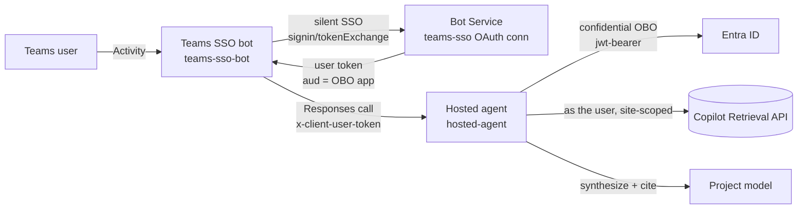

# Path B — Shared Teams bot + `x-client-user-token` (verified per-user)

The **recommended** path. A single shared Teams **bot** does Teams SSO, then forwards the signed-in
user's token to a Foundry **hosted agent** on the `x-client-user-token` header. The agent does the
On-Behalf-Of exchange **in its own code** and calls the Microsoft 365 Copilot Retrieval API **as the
user**, site-scoped — so results are permission-trimmed per caller.

**Verified per-user:** `admin` gets the document; `testuser` (no access) gets "No matching content."
Same agent, same query — only the forwarded token differs.

## Architecture

## Components

| Folder | Role |
| --- | --- |
| [`teams-sso-bot/`](teams-sso-bot/README.md) | The Teams front door — a real Bot Framework endpoint that does Teams SSO and forwards the user's token. |
| [`hosted-agent/`](hosted-agent/README.md) | The Foundry hosted agent — reads `x-client-user-token`, does in-code OBO, calls Copilot Retrieval, synthesizes a cited answer. |

**Why two components:** only a real Bot endpoint can receive the Teams sign-in token (a Foundry
hosted agent can't); the hosted agent uses that token to do the OBO. Bot = gets the token, agent =
uses it. Neither works alone. This path does **not** use an MCP-OBO gateway.

See the [decision matrix](../../../../guides/per-user-sharepoint-obo-teams-decision-matrix.md) for how
this compares to Path A.
