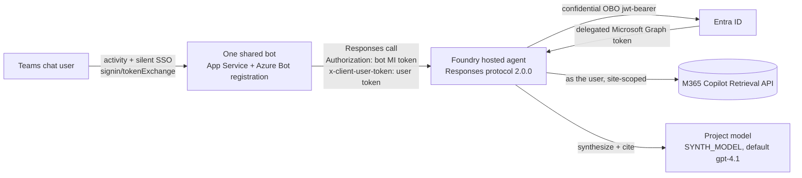

# SharePoint per-user OBO — Foundry hosted agent + one shared Teams bot

Per-user, permission-trimmed SharePoint retrieval from a Foundry **hosted agent published to
Microsoft Teams**, using **one shared bot** (not one per agent) and **no APIM**.

> **Why this design exists.** This pattern gives the application explicit control over the
> user token and supports routing through one shared bot. It obtains the Teams SSO token in a
> **real Bot Framework endpoint** (the shared bot) and forwards it to the hosted agent on
> the `x-client-user-token` header, which the Foundry gateway passes through unchanged. The agent
> does the On-Behalf-Of exchange **in its own code** (bypassing Toolbox) and calls the Microsoft
> 365 Copilot Retrieval API as the user. The application owns the delegated-token boundary;
> Foundry invocation authorization and SharePoint user permissions are separate controls.

## How it works



- The bot receives Teams activities **including** the SSO `signin/tokenExchange`; the OAuth connection yields a USER
  token whose `aud` is the OBO app.
- The bot authenticates to Foundry with its **own** managed identity (RBAC: **Foundry Agent
  Consumer** on the agent) and forwards the user token on `x-client-user-token`, which the gateway
  passes through **unchanged**.
- The agent reads the token from `context.client_headers['x-client-user-token']` (**never** from
  chat text), OBOs to a delegated Graph token, and calls Copilot Retrieval scoped to one site.

The [response handler](agent/src/sharepoint-obo-responses/main.py) retrieves content and synthesizes
citations; [obo.py](agent/src/sharepoint-obo-responses/obo.py) implements the confidential-client exchange.
One bot registration can front **many** allowed agents using in-chat routing.

### Choosing a sign-in path

The more "native" alternative is a Foundry hosted agent + a **Foundry Toolbox** wrapping an OAuth2
identity-passthrough connection (Foundry shows an "Open sign-in link" card and brokers the token
server-side; see [Path A](../../pathA/README.md)). It keeps the Foundry auto-bot and needs no custom
bot. Choose Path A when **interactive tool OAuth consent** is suitable; it is not silent Teams SSO.
Choose Path B for shared routing and explicit user-token control. Teams SSO can still require
interactive sign-in for consent, Conditional Access, or session renewal. See the
[decision guide](../../../../../guides/per-user-sharepoint-obo-teams-decision-matrix.md).

### Source and configuration

| Path | Purpose |
| --- | --- |
| [Agent source](agent/src/sharepoint-obo-responses/main.py) | Responses handler, retrieval, and cited model synthesis |
| [OBO client](agent/src/sharepoint-obo-responses/obo.py) | Confidential-client OBO (`jwt-bearer`) → Graph token |
| [Agent manifest](agent/azure.yaml) | Hosted-agent deployment; model deployment must already exist |
| [Direct invocation harness](harness/invoke_as_user.py) | Acquire a user assertion and invoke the agent independently of Teams |

---

## Prerequisites

1. **A Foundry project with hosted agents enabled** (bring-your-own container / Responses protocol
  2.0.0), with a model deployment for synthesis. The bot must reach Foundry; the container needs
  outbound egress to `login.microsoftonline.com` and `graph.microsoft.com`. Private-only operation
  requires separate validation with `publicNetworkAccess=Disabled`; private networking with public
  access enabled does not establish this behavior.
2. **Microsoft 365 Copilot license** (or the Retrieval API pay-as-you-go model) for every end user —
  required by the Microsoft 365 Copilot Retrieval API that powers SharePoint grounding. Retrieval
  API pay-as-you-go requires at least one Microsoft 365 Copilot license in the tenant.
3. **Same Microsoft Entra tenant** for the SharePoint site and the Foundry project. Cross-tenant
   token exchange is not supported.
4. **A SharePoint site** the users have (or don't have) access to, for permission-trimmed retrieval.
5. Tooling to deploy: Azure CLI, `azd` (with the `azure.ai.agents` extension), Docker, an
   authenticated Azure session, Python 3.13+.

---

### Entra application

Use **one single-tenant app** for the Azure Bot identity, Teams SSO resource, and OBO confidential
client. The bot's `MicrosoftAppId`, agent's `OBO_CLIENT_ID`, and OAuth connection client ID match.

The user assertion must be issued for this app, not for Microsoft Graph or Foundry.

| Setting | Value |
| --- | --- |
| **Expose an API** | Application ID URI `api://botid-<APP_ID>`, with delegated scope `access_as_user`. |
| **Pre-authorized applications** | Teams desktop/mobile `1fec8e78-bce4-4aaf-ab1b-5451cc387264`, Teams web `5e3ce6c0-2b1f-4285-8d4b-75ee78787346` (add M365/Outlook clients if used). Also add Azure CLI `04b07795-8ddb-461a-bbee-02f9e1bf7b46` **only if** you want to test with the device-code harness. |
| **API permissions (delegated, Microsoft Graph)** | `Files.Read.All`, `Sites.Read.All` (add `User.Read`). **Grant tenant admin consent.** |
| **Authentication → Web redirect URI** | `https://token.botframework.com/.auth/web/redirect` |
| **Token configuration** | Requested access-token version = **2**; enable ID-token + access-token issuance. |
| **Certificates & secrets** | Create a **client secret** (store in Key Vault for production). Used for the OBO exchange. |

Admin consent authorizes the delegated permissions; it does not grant users SharePoint access
or guarantee a silent sign-in under all tenant policies.

---

### Azure Bot and Teams SSO OAuth connection

1. **Create an Azure Bot** (`Microsoft.BotService/botServices`, single-tenant), messaging endpoint =
   your shim bot's `/api/messages` URL. Enable the **Microsoft Teams** channel.
2. **Create an OAuth connection** on the bot (provider **Azure Active Directory v2**) so Teams SSO
   returns a user token audienced to the OBO app:

   | Field | Value |
   | --- | --- |
   | Client ID | the **OBO app** id |
   | Client secret | the OBO app's client secret |
   | Tenant ID | your tenant |
   | Token Exchange URL | `api://botid-<APP_ID>` |
   | Scopes | `api://botid-<APP_ID>/access_as_user offline_access` |

3. **Teams manifest**: set `bots[0].botId` and `webApplicationInfo.id` to the shared app ID, set `webApplicationInfo.resource` to `api://botid-<APP_ID>`, and include `token.botframework.com` in `validDomains`. Sideload or publish to your org catalog.

The OAuth connection needs its confidential-client secret. Use the **`api://botid-<APP_ID>` resource
format** consistently in the app, connection, and manifest; a mismatch can produce `resourcematchfailed`.

---

### RBAC role assignments

Keep deployment privileges separate from runtime permissions:

| Principal | Role | Scope | Why |
| --- | --- | --- | --- |
| **Bot's managed identity** | **Foundry Agent Consumer** | Each allowed **agent** | Lets the bot interact with only the selected agents |
| **Agent's instance identity** (auto-created by Foundry) | **Foundry User** | the Foundry **project** | lets the agent call the project **model** for answer synthesis |
| **Deploying identity** | **Contributor** plus **User Access Administrator** when assigning roles | Target resource group or narrower resource scope | Create resources and assign runtime roles |

> Do **not** use `Cognitive Services *` or `Azure AI Developer` roles for Foundry agents — the docs
> ([rbac-foundry](https://learn.microsoft.com/azure/foundry/concepts/rbac-foundry)) say they don't
> apply to Foundry scenarios. Use **Foundry Agent Consumer** (call agents) and **Foundry User**
> (call models). End users' delegated SharePoint access is separate from the bot's Foundry role.
>
> `x-client-user-token` is application-defined — the Foundry platform does **not** authenticate or
> interpret it. The application owns assertion validation and trusted caller binding. Review that
> boundary before production use; do not assume header forwarding validates the user. Keep tokens
> out of model input, prompts, chat history, and logs.

---

### Setup permissions

To stand this up, the person doing the setup needs:

- **Microsoft Entra**: create app registrations, expose APIs/scopes, add federated credentials,
  create client secrets, add pre-authorized apps and redirect URIs. Roles: **Application
  Administrator** (or **Cloud Application Administrator**) or ownership of the specific apps.
- **Tenant admin consent**: grant admin consent for the delegated Microsoft Graph permissions
  (`Files.Read.All`, `Sites.Read.All`). Requires **Privileged Role Administrator** / **Global
  Administrator**, or a directory admin to run
  `az ad app permission admin-consent --id <APP_ID>` under the appropriate tenant policy.
- **Azure**: create the Foundry project (hosted agents enabled), Azure Bot, Container App/Key Vault,
  and assign the RBAC roles above. Roles: **Contributor** + **User Access Administrator** (or
  **Owner**) on the target resource group.
- **Microsoft 365**: assign Copilot licenses; ensure users have (or lack) access to the SharePoint
  site as intended.

Placeholders used below: `<APP_ID>`, `<TENANT_ID>`, `<FOUNDRY_ACCOUNT>`, `<PROJECT>`.

---

## Deploy

### Configure the agent

Review [agent/azure.yaml](agent/azure.yaml) and replace environment-specific values with your
project, app, tenant, and site. Set the azd environment's project ID and endpoint to that project,
with `USE_EXISTING_AI_PROJECT=true`, `ENABLE_HOSTED_AGENTS=true`, and `enableHostedAgentVNext=true`.
Supply `OBO_CLIENT_SECRET` securely; do not commit deployment environment files or credentials.

| Variable | Purpose |
| --- | --- |
| `OBO_CLIENT_ID` / `OBO_CLIENT_SECRET` / `OBO_TENANT_ID` | OBO confidential app and credential |
| `FOUNDRY_PROJECT_ENDPOINT` | Foundry project for model calls |
| `SYNTH_MODEL` | Existing project model deployment; default `gpt-4.1` |
| `SHAREPOINT_SITE_URL` | Full site URL; an empty value removes the site filter |
| `CLIENT_USER_TOKEN_HEADER` | Assertion header; default `x-client-user-token` |
| `GRAPH_SCOPE` | Default `https://graph.microsoft.com/.default` |
| `RETRIEVAL_API_URL` / `MAX_RESULTS` | Copilot Retrieval endpoint and result cap |

From this folder, enter the agent deployment directory:

```powershell
Set-Location agent
```

```powershell
azd deploy --no-prompt
```

### Validate directly before Teams integration

Use the [harness](harness/invoke_as_user.py) from this README's folder after configuring a Python
environment with `msal` and `httpx` installed. The invoking Azure identity needs **Foundry Agent
Consumer**; it is separate from the delegated user assertion.

```powershell
$env:OBO_CLIENT_ID = "<APP_ID>"
$env:TENANT_ID = "<TENANT_ID>"
$env:PROJECT_ENDPOINT = "https://<FOUNDRY_ACCOUNT>.services.ai.azure.com/api/projects/<PROJECT>"
$env:QUERY = "What does the onboarding guide say about MFA setup?"
```

```powershell
python ./harness/invoke_as_user.py
```

Set `AGENT_NAME` if it differs from `sp-obo-responses`. The harness caches the assertion in the
operating-system temporary directory using the OBO app ID, **not a per-user key**. Remove that
specific cache file between users, or use separate OS profiles; otherwise it can reuse the first
user's token. Do not inspect or print the cached bearer token. Complete the
[two-user checklist](../../../../../guides/per-user-sharepoint-obo-teams-decision-matrix.md#verify-per-user-isolation-either-path)
through Teams as well; a direct harness pass is not end-to-end channel validation.

## Publish to Teams

Deploy the [shared bot](../teams-sso-bot/README.md) on App Service or Container Apps and configure
the Azure Bot, Teams channel, and OAuth connection. From this README's folder, generate the package
bound to the shared app:

```powershell
./teams-app/New-TeamsAppPackage.ps1 -AppId <APP_ID>
```

Upload the generated package to Teams under your tenant's sideloading or app approval policy.
Use the custom bot's package rather than publishing this agent through the Foundry auto-bot.

---

### Runtime contract

- The Foundry gateway forwards every caller header prefixed **`x-client-`** unchanged to the
  container's `/responses` endpoint, and **drops `Authorization`**. The bot puts the user token on
  `x-client-user-token`; the agent reads `context.client_headers['x-client-user-token']`.
  See: <https://learn.microsoft.com/azure/foundry/agents/concepts/hosted-agent-contract#forward-custom-request-headers-to-your-container>
- The agent handler must return a `TextResponse(context, request, text=...)` (an AsyncIterable);
  returning a bare `str` yields HTTP 500.
- Invoke route: `{project-endpoint}/agents/{name}/endpoint/protocols/openai/responses?api-version=v1`.

## Troubleshooting

| Symptom | Cause / fix |
| --- | --- |
| Identity cannot be verified | Check that the trusted bot forwards the assertion in `x-client-user-token`, not in prompt text. |
| OBO fails | Check the assertion audience, tenant, expiry, confidential-client credential, delegated permissions, and consent. |
| `403` from Foundry | Check **Foundry Agent Consumer** on the bot identity for the selected agent. |
| Model authorization error | Check **Foundry User** on the agent instance identity at project scope. |
| Retrieval denial or no results | Check user access, licensing, consent, site filter, and query; establish a positive control before interpreting a negative result. |
| Both harness runs identify the same user | Remove the harness's app-keyed temporary token cache before switching users; verify identity without printing tokens. |

## Next steps

- [Shared Teams SSO bot](../teams-sso-bot/README.md)
- [Path comparison and customer validation](../../../../../guides/per-user-sharepoint-obo-teams-decision-matrix.md)
- [Foundry runtime RBAC](https://learn.microsoft.com/azure/foundry/concepts/rbac-foundry)
