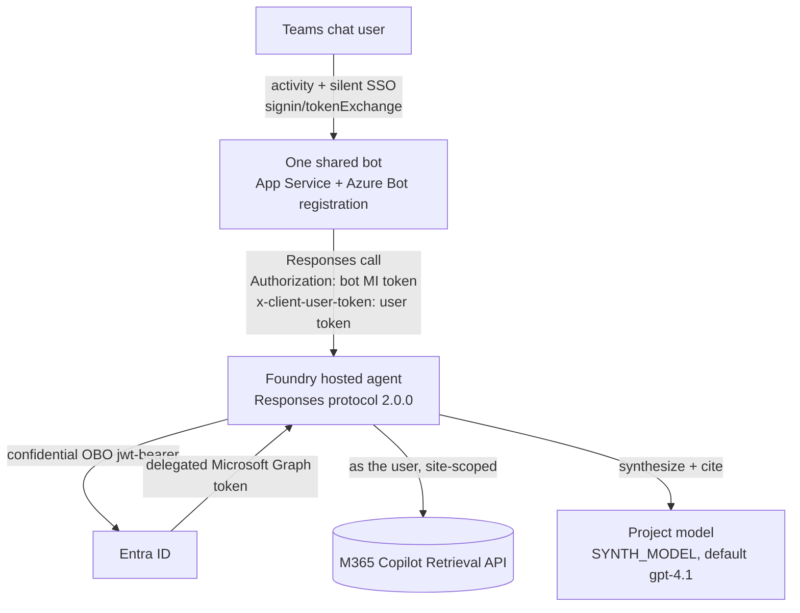

# SharePoint per-user OBO — Foundry hosted agent + one shared Teams bot

Per-user, permission-trimmed SharePoint retrieval from a Foundry **hosted agent published to
Microsoft Teams**, using **one shared bot** (not one per agent) and **no APIM**.

> **Why this design exists.** Foundry's native Teams publish forwards only chat `message`
> activities to the hosted container — it never delivers the Teams SSO round-trip, and the
> first-party SharePoint tool is explicitly documented as *"doesn't work when the agent is
> published to Microsoft Teams."* This pattern works around that by obtaining the user token in a
> **real Bot Framework endpoint** (the shared shim bot) and forwarding it to the hosted agent on
> the `x-client-user-token` header, which the Foundry gateway passes through unchanged. The agent
> does the On-Behalf-Of exchange **in its own code** (bypassing Toolbox) and calls the Microsoft
> 365 Copilot Retrieval API as the user. Verified end-to-end: `admin` gets the site document,
> `testuser` (no access) gets nothing — same agent, same query, only the forwarded token differs.

## Architecture



- The bot receives Teams activities **including** the SSO `signin/tokenExchange` (a Foundry hosted
  agent never does — that is the whole reason the bot exists); the OAuth connection yields a USER
  token whose `aud` is the OBO app.
- The bot authenticates to Foundry with its **own** managed identity (RBAC: **Foundry Agent
  Consumer** on the agent) and forwards the user token on `x-client-user-token`, which the gateway
  passes through **unchanged**.
- The agent reads the token from `context.client_headers['x-client-user-token']` (**never** from
  chat text), OBOs to a delegated Graph token, and calls Copilot Retrieval scoped to one site.

One bot registration fronts **many** agents (route in-chat or via manifest). It is never per-agent.

## Why not the Foundry Toolbox OAuth-passthrough path?

The more "native" alternative is a Foundry hosted agent + a **Foundry Toolbox** wrapping an OAuth2
identity-passthrough connection (Foundry shows an "Open sign-in link" card and brokers the token
server-side; see [`../../pathA/toolbox-agent`](../../pathA/toolbox-agent/README.md)).
It keeps the Foundry auto-bot and needs no custom bot — **but in testing it did not enforce per-user
OBO**: a `whoami` tool returned the *first-consented* identity (an admin) even when a different user
was chatting, so that user saw the admin's content and only the citation link (direct SharePoint)
denied access. That is a **shared-token** result, not per-user.

This `x-client-user-token` design forwards the **actual signed-in user's** Teams-SSO token, so the OBO
and retrieval run as *that* user and trimming is enforced at retrieval time (verified: `testuser` with
no access gets nothing, not the admin's document). Use the Toolbox path only if you confirm its
connection issues a genuinely per-user token for your tenant.

## Repository layout

| Path | Purpose |
| --- | --- |
| `agent/src/sharepoint-obo-responses/main.py` | Responses handler: read header → OBO → retrieval |
| `agent/src/sharepoint-obo-responses/obo.py` | Confidential-client OBO (`jwt-bearer`) → Graph token |
| `agent/azure.yaml` | Hosted-agent manifest (Responses protocol 2.0.0, no model) |
| `agent/.azure/<env>/.env` | azd environment (project id, OBO secret) |
| `harness/invoke_as_user.py` | Direct test: mint a real user token, call the agent with `x-client-user-token` |

---

## Prerequisites (what the customer must have)

1. **A Foundry project with hosted agents enabled** (bring-your-own container / Responses protocol
   2.0.0). Public or private networking both work; the container needs outbound egress to
   `login.microsoftonline.com` and `graph.microsoft.com` (verified working on a private-networked
   account with `publicNetworkAccess=Enabled`).
2. **Microsoft 365 Copilot license** (or the Retrieval API pay-as-you-go model) for every end user —
   required by the Microsoft 365 Copilot Retrieval API that powers SharePoint grounding.
3. **Same Microsoft Entra tenant** for the SharePoint site and the Foundry project. Cross-tenant
   token exchange is not supported.
4. **A SharePoint site** the users have (or don't have) access to, for permission-trimmed retrieval.
5. Tooling to deploy: Azure CLI, `azd` (with the `azure.ai.agents` extension), Docker, an
   authenticated Azure session, Python 3.13+.

---

## Entra app registrations

You need **two** app registrations (they can be collapsed to a shared model as noted):

### 1. The OBO app  (the audience of the user token AND the confidential client that does OBO)
This single app plays three roles: the Teams-SSO resource, the token audience, and the OBO client.

| Setting | Value |
| --- | --- |
| **Expose an API** | Application ID URI `api://<obo-app-id>`, with a delegated scope `access_as_user`. |
| **Pre-authorized applications** | Teams desktop/mobile `1fec8e78-bce4-4aaf-ab1b-5451cc387264`, Teams web `5e3ce6c0-2b1f-4285-8d4b-75ee78787346` (add M365/Outlook clients if used). Also add Azure CLI `04b07795-8ddb-461a-bbee-02f9e1bf7b46` **only if** you want to test with the device-code harness. |
| **API permissions (delegated, Microsoft Graph)** | `Files.Read.All`, `Sites.Read.All` (add `User.Read`). **Grant tenant admin consent.** |
| **Authentication → Web redirect URI** | `https://token.botframework.com/.auth/web/redirect` |
| **Token configuration** | Requested access-token version = **2**; enable ID-token + access-token issuance. |
| **Certificates & secrets** | Create a **client secret** (store in Key Vault for production). Used for the OBO exchange. |

> The delegated Graph permission is what OBO exchanges the user token into. Admin consent removes
> per-user consent prompts but keeps it a delegated flow — a token is only ever issued for a
> signed-in user, so SharePoint permission trimming still applies.

### 2. The Bot's Microsoft app  (identity of the Azure Bot / Teams channel)
The Azure Bot registration needs an app id. It can be the **same** app as the OBO app (simplest —
one app for everything), or a separate single-tenant app. If separate, that app id becomes
`bots[0].botId` in the Teams manifest.

---

## Azure Bot + Teams SSO OAuth connection

1. **Create an Azure Bot** (`Microsoft.BotService/botServices`, single-tenant), messaging endpoint =
   your shim bot's `/api/messages` URL. Enable the **Microsoft Teams** channel.
2. **Create an OAuth connection** on the bot (provider **Azure Active Directory v2**) so Teams SSO
   returns a user token audienced to the OBO app:

   | Field | Value |
   | --- | --- |
   | Client ID | the **OBO app** id |
   | Client secret | the OBO app's client secret |
   | Tenant ID | your tenant |
   | Token Exchange URL | `api://botid-<obo-app-id>` |
   | Scopes | `api://botid-<obo-app-id>/access_as_user offline_access` |

   ```powershell
   az bot authsetting create -n <botName> -g <rg> -c teams-sso `
     --client-id <obo-app-id> --client-secret <obo-app-secret> --service Aadv2 `
     --provider-scope-string "api://botid-<obo-app-id>/access_as_user offline_access" `
     --parameters tenantID=<tenant> "tokenExchangeUrl=api://botid-<obo-app-id>"
   ```
   > The connection **must** have the client secret, or Teams cannot render the sign-in card.
   > **Teams bot SSO requires the `api://botid-<appId>` resource format** (add it as an
   > identifier URI on the OBO app). Plain `api://<appId>` yields `resourcematchfailed` and no token.

3. **Teams manifest**: set `bots[0].botId` = the bot app id, `webApplicationInfo.id` = the OBO app
   id, `webApplicationInfo.resource` = `api://botid-<obo-app-id>`, and include
   `token.botframework.com` in `validDomains`. Sideload or publish to your org catalog.

---

## RBAC role assignments

There are **three** service identities (none of them are the end users):

| Principal | Role | Scope | Why |
| --- | --- | --- | --- |
| **Bot's managed identity** | **Foundry Agent Consumer** | the **agent** (`.../projects/<project>/agents/<agent>`) | least-privilege: lets the bot *interact with this agent's endpoint* only |
| **Agent's instance identity** (auto-created by Foundry) | **Foundry User** | the Foundry **project** | lets the agent call the project **model** for answer synthesis |
| **Deploying identity** | Owner/Contributor + role-assignment rights | resource group | to create the bot, app service, and assign roles |

> Do **not** use `Cognitive Services *` or `Azure AI Developer` roles for Foundry agents — the docs
> ([rbac-foundry](https://learn.microsoft.com/azure/foundry/concepts/rbac-foundry)) say they don't
> apply to Foundry scenarios. Use **Foundry Agent Consumer** (call agents) and **Foundry User**
> (call models). Role names may still appear as the old *Azure AI User/Owner/Project Manager* while
> the rename rolls out.

> `x-client-user-token` is application-defined — the Foundry platform does **not** authenticate or
> interpret it. The agent code owns validating the user token (issuer, audience) before OBO and must
> keep it out of model input, prompts, chat history, and logs.

---

## Setup permissions summary (who needs what to replicate)

To stand this up, the person doing the setup needs:

- **Microsoft Entra**: create app registrations, expose APIs/scopes, add federated credentials,
  create client secrets, add pre-authorized apps and redirect URIs. Roles: **Application
  Administrator** (or **Cloud Application Administrator**) or ownership of the specific apps.
- **Tenant admin consent**: grant admin consent for the delegated Microsoft Graph permissions
  (`Files.Read.All`, `Sites.Read.All`). Requires **Privileged Role Administrator** / **Global
  Administrator**, or a directory admin to run
  `az ad app permission admin-consent --id <obo-app-id>`.
- **Azure**: create the Foundry project (hosted agents enabled), Azure Bot, Container App/Key Vault,
  and assign the RBAC roles above. Roles: **Contributor** + **User Access Administrator** (or
  **Owner**) on the target resource group.
- **Microsoft 365**: assign Copilot licenses; ensure users have (or lack) access to the SharePoint
  site as intended.

---

## Deploy

### 1. Agent (this folder's `agent/`)
```powershell
cd agent
# .azure/<env>/.env must set AZURE_AI_PROJECT_ID / *_PROJECT_ENDPOINT to your project,
# USE_EXISTING_AI_PROJECT=true, ENABLE_HOSTED_AGENTS=true, enableHostedAgentVNext=true,
# and OBO_CLIENT_SECRET=<the OBO app secret>.  azure.yaml sets OBO_CLIENT_ID, OBO_TENANT_ID,
# SHAREPOINT_SITE_URL, CLIENT_USER_TOKEN_HEADER.
azd deploy --no-prompt
```

### 2. Verify (direct harness — no Teams needed)
```powershell
cd ..\harness
$env:OBO_CLIENT_ID   = "<obo-app-id>"
$env:TENANT_ID       = "<tenant>"
$env:PROJECT_ENDPOINT= "https://<account>.services.ai.azure.com/api/projects/<project>"
$env:QUERY           = "windows byod"
python invoke_as_user.py     # sign in at microsoft.com/devicelogin as a WORK account
```
Run once as a user **with** site access (expect the document) and once **without** (expect
"No matching content was found"). Different results = permission trimming is real.

### 3. Bot + Teams
Deploy the shared shim bot (`../teams-sso-bot`) as a Container App with the
Azure Bot + Teams channel + the `teams-sso` OAuth connection above, pointed at this agent's
Responses endpoint. Generate a package bound to your bot/SSO app and sideload it:

```powershell
cd ..\teams-app
./New-TeamsAppPackage.ps1 -AppId <obo-app-id>
```

Upload the generated `appPackage.zip` to Teams and chat.

---

## Agent runtime contract (how the token reaches the container)

- The Foundry gateway forwards every caller header prefixed **`x-client-`** unchanged to the
  container's `/responses` endpoint, and **drops `Authorization`**. The bot puts the user token on
  `x-client-user-token`; the agent reads `context.client_headers['x-client-user-token']`.
  See: <https://learn.microsoft.com/azure/foundry/agents/concepts/hosted-agent-contract#forward-custom-request-headers-to-your-container>
- The agent handler must return a `TextResponse(context, request, text=...)` (an AsyncIterable);
  returning a bare `str` yields HTTP 500.
- Invoke route: `{project-endpoint}/agents/{name}/endpoint/protocols/openai/responses?api-version=v1`.

## Environment variables (agent)

| Variable | Purpose |
| --- | --- |
| `OBO_CLIENT_ID` / `OBO_CLIENT_SECRET` / `OBO_TENANT_ID` | the OBO confidential app (= user-token audience) |
| `SHAREPOINT_SITE_URL` | e.g. `https://<tenant>.sharepoint.com/sites/<site>` — scopes retrieval to one site |
| `CLIENT_USER_TOKEN_HEADER` | header carrying the user token (default `x-client-user-token`) |
| `GRAPH_SCOPE` | default `https://graph.microsoft.com/.default` |
| `RETRIEVAL_API_URL` / `MAX_RESULTS` | Copilot Retrieval endpoint and result cap |
