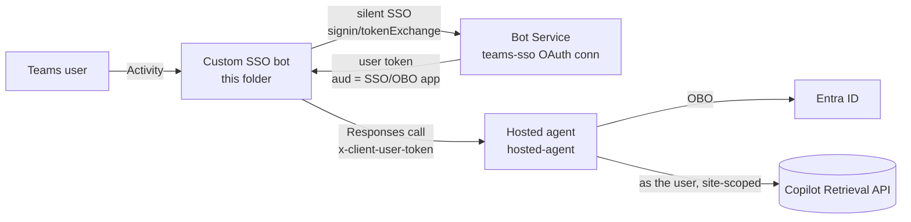

# SharePoint per-user retrieval — Teams **custom SSO bot** bridge

A Microsoft Teams **custom SSO bot** (middle tier) that authenticates each Teams user with **silent
SSO** and relays their turn to the repo's per-user hosted agent
([`../hosted-agent`](../hosted-agent)), forwarding the user's token as
`x-client-user-token`. The hosted agent does the On-Behalf-Of exchange and calls the Microsoft 365
Copilot Retrieval API **as the user**, site-scoped — so results are permission-trimmed to each caller.

## Why this exists (vs. the auto-bot variant)

The sibling [`pathA/toolbox-agent`](../../pathA/toolbox-agent) publishes on
the **Foundry auto-bot** via an OAuth2 identity-passthrough **connection**. That connection is
**shared-token** — it reuses the first consenter's identity for every caller (proven), so it does
**not** give per-user permission trimming. This folder is the **per-user** answer: it supplies each
user's *own* token via Teams SSO, which the hosted agent OBOs. Per-user trimming with this token path
is validated end-to-end (admin gets the document; a user without access gets a `403`).

> Trade-off: this replaces the Foundry auto-bot with a **custom bot** you deploy and register. It is
> the only *hosted + per-user + site-scoped* path that works today. `x-ms-user-identity` alone is
> session **isolation**, not a per-user OAuth token selector — see
> [Microsoft Q&A 12912519](https://learn.microsoft.com/answers/a/12912519).



## One app for everything (minimal infra)

Use a **single Entra app** as the bot identity **and** the Teams SSO target **and** the OBO client —
one app, one secret. The Teams SSO token's audience is that app, which is exactly the assertion the
hosted agent's OBO needs, so the agent's `APP_OBO_CLIENT_ID`, the bot's `MicrosoftAppId`, and the
`teams-sso` connection's client id are **the same app**.

Configure it once:
```powershell
# Teams silent-SSO half (identifierUri api://botid-<appId>, access_as_user, Teams preauth, token issuance):
./scripts/Configure-TeamsSso-App.ps1 -AppId <APP_ID> -AdminConsent
# then also grant this SAME app the OBO half: Graph Files.Read.All + Sites.Read.All (delegated) +
# admin consent + a client secret (used for BOTH the Bot channel and the OBO exchange).
```
The hosted agent's `APP_OBO_CLIENT_ID/SECRET/TENANT_ID` and this bot's `MicrosoftAppId/Password` both
point at this one app.

## Prerequisites

1. The per-user **hosted agent deployed** ([`../hosted-agent`](../hosted-agent),
   the `x-client-user-token` variant), with `OBO_*` set to the one app above.
2. An **Azure Bot** registration (SingleTenant) using that app as `msaAppId` — either a dedicated one,
   or **reuse the Foundry-published bot by repointing its messaging endpoint** to this container (see
   below).
3. A **Bot Service OAuth Connection Setting** named `teams-sso` (Azure AD v2): client id = the app,
   `tokenExchangeUrl = api://botid-<appId>`, scopes `api://botid-<appId>/access_as_user offline_access`.
4. The bot's identity granted **Foundry Agent Consumer** on the agent (to call it).
5. **Python 3.12+**, and a **Microsoft 365 Copilot** license (or Retrieval API pay-as-you-go) for test users.

## Configure

Copy [`bot/.env.example`](bot/.env.example) to `bot/.env` and fill in the Bot registration, the
`teams-sso` connection name, and the hosted agent's project endpoint + `AGENT_NAME`.

## Run locally

```powershell
cd bot
pip install -r requirements.txt
python app.py           # listens on :3978 /api/messages
```

Point the Bot registration's messaging endpoint at your tunnel (e.g. dev tunnel / ngrok)
`https://<tunnel>/api/messages`, side-load the Teams manifest, and chat. The first message triggers
**silent** SSO; with the SSO app configured per step 4 no consent card appears.

## Deploy

Build and push the image (`bot/Dockerfile`) to a Container App or App Service, set the same env vars,
and set the Bot registration messaging endpoint to `https://<host>/api/messages`. Keep the Azure Bot
**Teams channel** enabled.

## Verify per-user trimming

Ask a question that matches a document in the site as two different users:
- a user **with** access → the answer cites the document;
- a user **without** access → the agent reports no results (the Retrieval API returns `403` on that
  user's own token). Same bot, same question, different user = permission-trimmed.

## Reuse across agents & the Foundry auto-bot

**No per-agent bot registration.** One Azure Bot + one app + one Teams app fronts **every** agent; the
bot routes to the target agent at runtime:
- Set `AGENT_NAME` (default) and optionally `AGENTS=agent-a,agent-b,…` (the allow-list this bot can
  reach). Users switch with **`/use <name>`** and list with **`/agents`**.
- The bot's identity (**Foundry Agent Consumer**) can invoke **any** agent it is granted on. All agents
  deployed with the **same** `OBO_CLIENT_ID` (the one app) accept the same SSO token, so nothing is
  per-agent on the Foundry side either.
- **Reused across all agents:** the single SSO/OBO app, the `teams-sso` OAuth connection, this bot
  image, the Azure Bot registration, and the Teams app. **Per-agent:** just the agent existing in the
  project (and, if you want it selectable, its name in `AGENTS`).

You'd only add a second Azure Bot / Teams app if the client wants an agent to appear as a *separate*
installable Teams app (a UX choice, not a requirement).

**The Foundry auto-bot is NOT reused automatically.** Publishing an agent to Teams creates an auto-bot
pointing at the agent's `…/activityprotocol` (the shared/no-SSO relay). This custom bot is a *separate*
messaging endpoint; users install the **custom bot's** Teams app for the per-user path.

## Teams manifest notes

`webApplicationInfo.id` = the app id, `resource` = `api://botid-<appId>`, and the bot id in the manifest
= the same app id. Teams enforces the `botid-` match before issuing the silent SSO token — mismatches
yield `resourcematchfailed` and no token reaches the bot.
