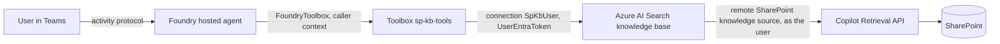

# SharePoint knowledge base hosted agent (Foundry IQ)

An Agent Framework **hosted agent** that answers questions from SharePoint through a Foundry IQ
**knowledge base** with a **remote SharePoint knowledge source**, exposed to the agent as a Foundry
**toolbox**. Retrieval runs **as the signed-in user** through the Copilot Retrieval API, so each
user only gets content they can already open in SharePoint, published to Teams.

## How it works



The agent consumes the toolbox through **`FoundryToolbox`**
([main.py](sharepoint-kb-agent/src/sharepoint-kb-agent/main.py)), which forwards the Foundry
per-request call ID so Foundry knows which user each tool call belongs to.

Three details worth knowing:

- **The connection uses `UserEntraToken`.** Foundry passes the caller's own Entra token to Azure AI
  Search, and the remote SharePoint knowledge source uses it to query SharePoint as that user. A
  remote SharePoint knowledge source **requires** the user's token, so a shared identity such as
  `ProjectManagedIdentity` does not work here.
- **Each user's token reaches Azure AI Search directly**, so every end user needs a Search data-plane
  role on the Search service.
- **No separate OAuth consent.** Unlike custom OAuth connections, users only sign in to Foundry once;
  there is no per-tool consent card.

## Prerequisites

1. A Foundry project with a `gpt-4.1` (or equivalent) model deployment.
2. An Azure AI Search service in a [region that supports agentic retrieval](https://learn.microsoft.com/azure/search/search-region-support),
   in the same Microsoft Entra tenant as your Microsoft 365 tenant.
3. A SharePoint site with the content you want the agent to answer from.
4. For the person running the setup scripts: **Search Service Contributor** on the Search service, and
   permission to create connections and toolboxes in the Foundry project.
5. For **every end user** of the agent:
   - **Search Index Data Reader** on the Search service, scoped to that service.
   - **Foundry Agent Consumer** at the narrowest supported scope, to call the agent. The agent
     identity separately needs **Foundry User** at project scope for its model calls.
   - A **Microsoft 365 Copilot license**, required for query-time access to SharePoint.
   - Access to the SharePoint content in SharePoint itself. The agent never widens access.
6. `az login` in the correct tenant, Python 3.11 or later, and `azd >= 1.27.1` with
   `azd ext install microsoft.foundry`.

Grant the Search role to a user or group:

```powershell
$SEARCH_ID = az search service show -n <SEARCH_SERVICE> -g <SEARCH_RESOURCE_GROUP> --query id -o tsv
az role assignment create --assignee <USER_OR_GROUP_OBJECT_ID> --role "Search Index Data Reader" --scope $SEARCH_ID
```

Placeholders used below: `<SUBSCRIPTION_ID>`, `<RESOURCE_GROUP>`, `<FOUNDRY_ACCOUNT>`, `<PROJECT>`,
`<SEARCH_SERVICE>`, `<SEARCH_RESOURCE_GROUP>`, `<TENANT>`, `<SITE>`, `<USER_OR_GROUP_OBJECT_ID>`,
`<path-to-repo>`.

## Deploy

**1. Configure the setup scripts**

```powershell
cd setup
python -m venv .venv
.\.venv\Scripts\Activate.ps1
python -m pip install -r requirements.txt
Copy-Item .env.example .env
```

Fill in `.env`. `KNOWLEDGE_SOURCES_JSON` takes one entry per SharePoint path, on one line.

**2. Create the knowledge base, connection and toolbox**

```powershell
python .\create_knowledge_base.py   # remote SharePoint knowledge source + knowledge base
python .\create_connection.py       # Foundry RemoteTool connection to the knowledge base MCP endpoint
python .\create_toolbox.py          # toolbox exposing knowledge_base_retrieve
```

Each script creates what is missing and validates what already exists, without overwriting.

**3. Initialize and deploy the hosted agent**

`azd ai agent init` **adopts** the sample into a new project directory, so run it from an **empty
directory** and pass an absolute path to the sample's `azure.yaml`.

```powershell
$PROJECT_ID = "/subscriptions/<SUBSCRIPTION_ID>/resourceGroups/<RESOURCE_GROUP>/providers/Microsoft.CognitiveServices/accounts/<FOUNDRY_ACCOUNT>/projects/<PROJECT>"
$SAMPLE = "<path-to-repo>/foundryagents/hostedagent/sharepoint-knowledge-base/sharepoint-kb-agent"

New-Item -ItemType Directory -Force -Path ./deploy | Out-Null
Set-Location ./deploy

azd ai agent init -m "$SAMPLE/azure.yaml" `
  --project-id $PROJECT_ID --model-deployment gpt-4.1 --no-prompt --force -e sharepoint-kb
```

Then deploy from the scaffolded folder:

```powershell
Set-Location ./sharepoint-kb-agent
azd env set enableHostedAgentVNext true -e sharepoint-kb
# Model deployment the agent uses (read by azure.yaml)
azd env set AZURE_AI_MODEL_DEPLOYMENT_NAME gpt-4.1 -e sharepoint-kb
# Same value as TOOLBOX_NAME in setup/.env
azd env set TOOLBOX_NAME sp-kb-tools -e sharepoint-kb
azd up -e sharepoint-kb
```

**4. Invoke it**

```powershell
azd ai agent invoke --new-session "What does our onboarding guide say about MFA setup?" --timeout 120
```

## Publish to Teams

Use the repo script, which points the bot at the agent's own Activity Protocol route:

```powershell
<path-to-repo>/scripts/Publish-AgentToTeams.ps1 `
    -ResourceGroup <RESOURCE_GROUP> -AgentName sharepoint-kb-agent `
    -ProjectEndpoint https://<FOUNDRY_ACCOUNT>.services.ai.azure.com/api/projects/<PROJECT> `
    -UseM365PublicEndpoint -DisplayName "SharePoint KB Agent" -PublishScope Tenant -AppVersion 1.0.0
```

Tenant scope needs Microsoft 365 admin approval before the agent appears under **Built by your org**.
On first use each user is asked to sign in to Foundry once.

## Verify

Verified in Teams with two users and one SharePoint site that only user A can open. Both asked about
the same document; both turns called `knowledge_base_retrieve` successfully.

Pick a document that **user A can open and user B cannot**, then have both ask about it in Teams:

| User | SharePoint access | Expected answer |
| --- | --- | --- |
| A | Can open the document | Answer grounded in the document, with a citation |
| B | Cannot open the document | The available sources do not contain the answer |

User B never receives content from a document they can't open, because the Copilot Retrieval API
runs as user B.

## Learn more

- [Verify per-user isolation](../../../guides/verify-per-user-isolation.md)
- [Create a remote SharePoint knowledge source](https://learn.microsoft.com/azure/search/agentic-knowledge-source-how-to-sharepoint-remote)
- [Connect a Foundry IQ knowledge base to Foundry Agent Service](https://learn.microsoft.com/azure/foundry/agents/how-to/foundry-iq-connect)
- [Toolbox authentication](https://learn.microsoft.com/azure/foundry/agents/how-to/tools/tool-authentication)

## Acknowledgements

The setup scripts are adapted from samples by **Mahya Gheini** from the Microsoft Foundry product
team. Thanks to Mahya and **Linda Li** for their guidance on Foundry toolboxes and knowledge bases.
