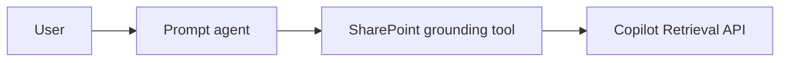
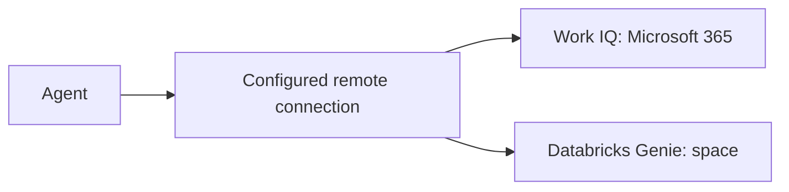
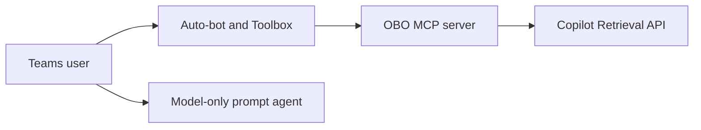

# SharePoint / enterprise-data grounding options for Foundry agents

Choose a grounding route based on **user identity**, **site scoping**, and the agent hosting model.
A container's managed identity does not grant delegated SharePoint access. Preview tool availability,
licensing, and Teams behavior must be checked for the chosen service and deployment configuration.

## Options

The native SharePoint grounding tool runs in a delegated user context; use the prompt-agent sample
for this route rather than an app-only hosted container.

Work IQ provides broad Microsoft 365 grounding. Databricks Genie serves a Genie space. Both use
remote integrations, but their connection authentication and downstream permissions are distinct;
do not infer per-user behavior from a successful answer or from another connector.

For site-scoped hosted retrieval, [SharePoint retrieval](../foundryagents/hostedagent/sharepoint-copilot-retrieval/README.md)
uses Toolbox OAuth passthrough and a gateway. A model-only prompt agent has no retrieval or document
permission-trimming layer.

## Decision matrix

The matrix describes route capabilities and constraints, not production certification. The native
SharePoint, Work IQ, and MCP integrations include preview features.

| # | Tool / route | Backed by | Prompt | Hosted | Teams | Per-user (trimmed) | Scoping | Licensing | Repo sample |
| --- | --- | --- | --- | --- | --- | --- | --- | --- | --- |
| 1 | SharePoint grounding tool (`sharepoint_grounding_preview`) | Copilot Retrieval API | Yes | Not with app-only identity | Prompt route; check channel support | Delegated user context required | Site/folder | Copilot license or Retrieval API paygo | [Prompt sample](../foundryagents/promptagent/sharepoint-agent-grounding-tool/README.md) |
| 2 | Work IQ (`work_iq_preview`) | Work IQ over M365 | Yes | Yes | Via publish | Delegated connection required | Broad M365, no per-site filter | Work IQ API paygo; connector licensing differs | [Work IQ sample](../foundryagents/hostedagent/sharepoint-agent-workiq/README.md) |
| 3 | Databricks Genie remote MCP | Databricks Genie | Yes | Yes | Via publish | Do not assume per-user; shared connection credentials do not trim by Teams caller | Genie space | Databricks | [Genie sample](../foundryagents/hostedagent/databricks-agent/README.md) |
| 4 | SharePoint retrieval: Toolbox + OBO MCP server | Copilot Retrieval API | MCP integration possible; sample is hosted | Yes | Foundry auto-bot | OAuth-passthrough token → gateway OBO | Site/path in sample | Copilot license or Retrieval API paygo | [SharePoint retrieval](../foundryagents/hostedagent/sharepoint-copilot-retrieval/README.md) |
| 5 | Basic prompt agent | Model deployment | Yes | Not this sample | Via publish | No retrieval | None | Model usage | [Prompt source](../foundryagents/promptagent/promptagent.py) |

The Retrieval API supports additional filter expressions, but these samples configure a site
`path` filter. File-type or date filtering requires an implementation change; it is not a sample setting.

## Pros / cons

| Option | Pros | Constraints |
| --- | --- | --- |
| SharePoint grounding tool | Managed grounding with site/folder scope | Requires delegated context; not an app-only hosted-container route |
| Work IQ | Broad Microsoft 365 context without a custom retrieval gateway | No site-specific scope; review connection-specific licensing and consent |
| Databricks Genie | Structured-data queries within a Genie space | Independently verify downstream caller identity; a shared credential is not per-user OBO |
| Path A | Keeps the Foundry auto-bot; centralizes OBO in a gateway | Interactive tool OAuth consent, gateway operations, and separate private-network validation |
| Model-only prompt agent | No retrieval infrastructure | Cannot provide permission-trimmed enterprise grounding |

## Recommendation

- For **hosted, site-scoped SharePoint retrieval**, use Path A: the Foundry auto-bot plus interactive tool consent. A retired shared-bot variant with silent Teams SSO is kept for reference in [deprecated/pathB](../deprecated/pathB/README.md).
- For broad Microsoft 365 grounding, consider Work IQ. For a prompt-only solution, consider the SharePoint grounding sample and confirm current Teams/channel support.
- Use **Foundry Agent Consumer** for invocation at the narrowest supported agent/project scope and **Foundry User** for the agent identity's model calls at project scope. Do not assume tenant publishing or `BotServiceRbac` removes caller authorization requirements.
- Retrieval API pay-as-you-go requires at least one Microsoft 365 Copilot license in the tenant. Work IQ billing and SharePoint-agent billing do not automatically entitle the raw Retrieval API.
- SharePoint retrieval was validated on a **private** Foundry project, and the Teams route holds with `publicNetworkAccess=Disabled`. The Toolbox-to-gateway call is egress, so keep the gateway reachable from the project. Neither route is a production certification.

## Customer validation

Complete the [two-user checklist](verify-per-user-isolation.md)
with a known document, a user who can read it, and a user who cannot. Compare authenticated tool
identities and raw retrieval outcomes in separate sessions; do not use a model answer or blocked
citation link as proof of permission trimming. Repeat for each connection and target network posture.
