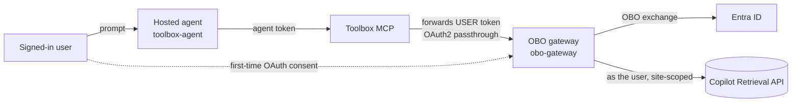
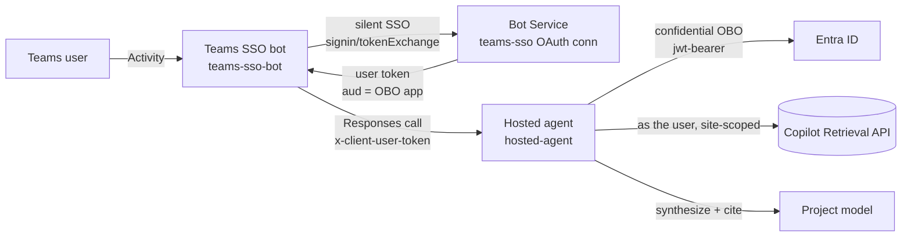

# Per-user SharePoint OBO from a Teams-published Foundry hosted agent — decision matrix

**Problem.** You want a Foundry **hosted agent** published to **Microsoft Teams** to answer from
SharePoint **trimmed to each signed-in user's permissions** (true On-Behalf-Of). A hosted container
runs as its **own** identity, so it can't natively hold the user's token — and Foundry's native Teams
publish doesn't deliver the Bot-Framework silent-SSO round-trip to the container. Two architectures
were built and tested to solve this. This guide compares them.

The two paths share the same downstream (Microsoft 365 **Copilot Retrieval API**, site-scoped) and the
same **MCP-OBO gateway** concept; they differ in **how the user's identity reaches the retrieval call**.

---

## Path A — Foundry Toolbox OAuth identity-passthrough (Foundry-managed sign-in)

Hosted agent (Agent Framework) → a **Foundry Toolbox** wrapping an **OAuth2 identity-passthrough
connection** → the **MCP-OBO gateway** → Copilot Retrieval. Foundry renders an *"Open sign-in link"*
consent card in Teams and brokers the user's token server-side. Keeps the **Foundry auto-bot** (no
custom bot); published via the APIM bridge.

- Repo: [`.../pathA/toolbox-agent`](../foundryagents/hostedagent/sharepoint-copilot-retrieval/pathA/toolbox-agent/README.md) + [`.../pathA/obo-gateway`](../foundryagents/hostedagent/sharepoint-copilot-retrieval/pathA/obo-gateway/README.md) (overview: [`pathA/`](../foundryagents/hostedagent/sharepoint-copilot-retrieval/pathA/README.md))

**Observed in testing:** sign-in worked, but **per-user OBO was NOT enforced** — a `whoami` tool
returned the **first-consented (admin) identity** even when a different user was chatting, so that user
saw the admin's content; only the citation link (direct SharePoint) denied access. Treat Path A as a
**shared-token** result until you verify per-user isolation for your tenant/connection.

## Path B — Shared Teams bot + `x-client-user-token` (in-code OBO)

A single **shared Teams bot** (App Service, real Bot Framework endpoint) does **Teams SSO**, then calls
the hosted agent forwarding the user's token on the **`x-client-user-token`** header (the Foundry
gateway passes any `x-client-*` header through unchanged). The agent reads it and does a
**confidential-client OBO in code** → Copilot Retrieval as the user → a model synthesizes a cited
answer. The Toolbox is bypassed.

- Repo: [`.../pathB/hosted-agent`](../foundryagents/hostedagent/sharepoint-copilot-retrieval/pathB/hosted-agent/README.md) (agent) + [`.../pathB/teams-sso-bot`](../foundryagents/hostedagent/sharepoint-copilot-retrieval/pathB/teams-sso-bot/README.md) (bot) (overview: [`pathB/`](../foundryagents/hostedagent/sharepoint-copilot-retrieval/pathB/README.md))

**Observed in testing:** **genuinely per-user** — `admin` got the document, `testuser` (no access) got
"No matching content." Same agent, same query; only the forwarded token differs.

---

## Decision matrix

| Dimension | Path A — Toolbox passthrough | Path B — Shared bot + `x-client-user-token` |
| --- | --- | --- |
| Teams sign-in | Foundry-managed **button** consent ("Open sign-in link") | **Silent** Teams SSO (OAuth card, no click) |
| **Per-user OBO (verified)** | ❌ **Not** in testing — returned admin/first-consented token | ✅ **Yes** — real signed-in user's token |
| Data-leak risk | ⚠️ user can see another user's content until validated | ✅ trimmed at retrieval time |
| Custom bot registration | **None** (Foundry auto-bot) | **One shared** bot (never per-agent) |
| APIM required | Yes (Teams publish via bridge) | No |
| Agent style | No-code-ish (Toolbox + connection) | Bring-your-own container (in-code OBO) |
| Works for tools where Toolbox can't inject a token (e.g. Databricks MCP) | ❌ | ✅ (agent does OBO itself) |
| Token owner | Foundry (stored + refreshed) | The agent (per-turn, not stored) |
| Output quality | Native Agent Framework **inline citations** | Model synthesis + **Sources** footer |
| Setup complexity | Lower (connection + toolbox) | Higher (bot + Bot OAuth connection + manifest) |
| Moving parts to operate | Foundry connection, APIM, auto-bot | App Service bot, Bot registration, Teams manifest, OBO app |

## Pros / cons

**Path A — Toolbox passthrough**
- ➕ No custom bot; most "native"; nicer built-in citations; simplest to stand up.
- ➖ **Did not enforce per-user OBO in testing** (shared/first-consented token) — the headline risk.
- ➖ Still needs APIM for Teams publish; depends on the OAuth2 passthrough connection (which has had
  provisioning regressions for custom MCP).

**Path B — Shared bot + `x-client-user-token`**
- ➕ **Genuinely per-user** (verified); works for any downstream incl. custom tools (Databricks);
  one shared bot for many agents; no APIM.
- ➖ You own a bot (App Service + Bot registration + Teams SSO connection + manifest); more setup;
  Teams bot SSO requires the `api://botid-<appId>` resource format.

## Recommendation

- If you need **verified per-user trimming** (compliance/data-isolation is a requirement) or per-user
  auth to **custom tools (Databricks/MCP)** → **Path B**.
- If you want the **lowest-infra, most-native** option and can **independently verify** that the
  Toolbox connection issues a genuinely per-user token in your tenant → **Path A**.
- Do **not** assume Path A is per-user because it shows a sign-in card — confirm with a `whoami`-style
  check across two different users before shipping.

## Product-group guidance & roadmap (Sept 2026)

Feedback from the Foundry engineering team on exactly these scenarios:

- **Native Teams/M365 SSO is in progress — ~4–6 weeks out, top priority.** It will "naturally connect
  to tool OAuth," i.e. a Foundry hosted agent published to Teams will get a full user SSO flow without
  a custom bot. **Both paths here are interim**; once native SSO lands, Path B's custom bot becomes
  unnecessary for most cases and Path A's Toolbox OAuth connects to it directly — **this is the change
  expected to make Path A genuinely per-user** (still verify against the token-caching bug below).
- **The token-sharing behavior in Path A is a bug, not by design.** The team's guidance: *"if we're
  incorrectly caching tokens [different Teams users getting the same response], please file an ICM."*
  Our observation (a `whoami` returning the admin/first-consented identity for a different user) is
  exactly this — **file an ICM** rather than treating it as expected.
- **RBAC may be avoidable — but wasn't in testing.** PG says role assignments should be avoidable using
  the **`BotServiceRbac`** (tenant-wide access) auth policy. In our testing, however, RBAC was **still
  required** after setting `BotServiceRbac`/`BotServiceTenant` — so this is unresolved; **file an ICM**.
  PG also notes agents can access project resources in their **own namespace** without RBAC to call
  models, so the model-inference role we assigned may become unnecessary; a persistent `401` for
  in-namespace resources is ICM-worthy too.
- **Known gaps being worked on:** response **streaming / progress indicators** in Teams (protocol
  limits for long-running requests), and **Code Interpreter file download/upload** from Teams (no
  native `/files` ↔ Activity Protocol bridge yet).

Net: treat this whole space as **pre-GA**. Path B is the robust interim answer when you need verified
per-user isolation today; plan to migrate to native Foundry Teams SSO when it ships.

## Verify per-user isolation (either path)

Ask the same question as two users — one **with** and one **without** access to a target document:
- Correct: the with-access user gets the content; the no-access user gets "no matching content."
- Broken (shared token): both see the same content, or a `whoami` tool returns the same identity for
  both users.
